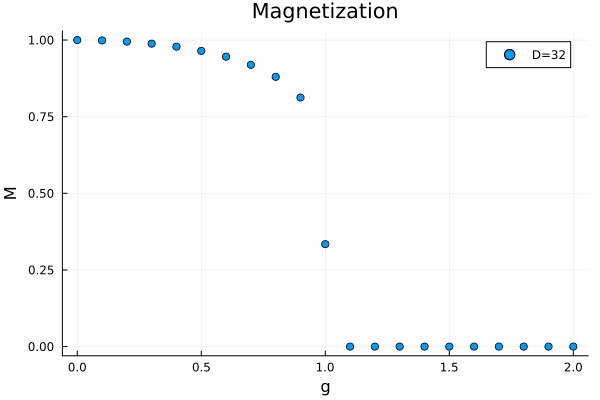

# MPSKit.jl

[![][docs-stable-img]][docs-stable-url] [![][docs-dev-img]][docs-dev-url] [![DOI][doi-img]][doi-url]
[![CI][ci-img]][ci-url] [![PkgEval][pkgeval-img]][pkgeval-url] [![Codecov][codecov-img]][codecov-url]

Tensor network algorithms based on matrix product states (MPS) and matrix product operators (MPO), for (quasi) one-dimensional quantum lattices and two-dimensional statistical mechanics models, as well as quantum circuit simulation or boundary-MPS methods.
This library highlights support for both finite systems and systems directly in the thermodynamic limit, and both have a large variety of implemented algorithms.

MPSKit builds on [TensorKit.jl](https://github.com/QuantumKitHub/TensorKit.jl) for its tensors, which makes abelian, non-abelian, fermionic and anyonic symmetries available throughout.
The toolbox covers ground states and leading boundary states, real and imaginary time evolution, excitation spectra, and more.

The [documentation](https://QuantumKitHub.github.io/MPSKit.jl/stable) contains the manual and the full API reference.
The [examples](https://QuantumKitHub.github.io/MPSKit.jl/dev/examples/) work through complete calculations, from ground states to dynamical correlators.

## Installation

MPSKit is registered in the Julia general registry, and often is best combined with TensorKit.jl and MPSKitModels.jl.

```julia-repl
pkg> add MPSKit TensorKit MPSKitModels
```

[TensorKit.jl](https://github.com/QuantumKitHub/TensorKit.jl) provides the tensors and their symmetry sectors, and [MPSKitModels.jl](https://github.com/QuantumKitHub/MPSKitModels.jl) a library of common operators, Hamiltonians and statistical mechanics models.
Symmetries beyond the ones TensorKit itself ships with come from extension packages, such as [SUNRepresentations.jl](https://github.com/QuantumKitHub/SUNRepresentations.jl) for SU(N).

## Quickstart

Sweeping the transverse field of the Ising model in the thermodynamic limit and measuring the magnetization:

```julia
using MPSKit, MPSKitModels, TensorKit
using ProgressMeter, Plots # for demonstration purposes

D = 4 # bonddimension
init_state = InfiniteMPS(ℂ^2, ℂ^D)

g_values = 0.1:0.1:2

M = @showprogress map(g_values) do g
    H = transverse_field_ising(; g=g)
    groundstate, environment, δ = find_groundstate(init_state, H, VUMPS(; verbosity=0))
    return abs(expectation_value(groundstate, 1 => σᶻ()))
end

scatter(g_values, M, xlabel="g", ylabel="M", label="D=$D", title="Magnetization")
```



The order parameter vanishes at `g ≥ 1`, where the chain becomes critical and transitions to the disordered phase.
Replacing the `InfiniteMPS` with a `FiniteMPS` and the ground-state algorithm to `DMRG` runs the same sweep on a finite chain instead; the [examples](https://QuantumKitHub.github.io/MPSKit.jl/dev/examples/) cover that case along with time evolution, excitations and two-dimensional partition functions.

## Getting help and contributing

MPSKit is under active development and new algorithms are added regularly.
Questions and general discussion belong on [GitHub Discussions](https://github.com/QuantumKitHub/MPSKit.jl/discussions), bug reports and feature requests in the [issue tracker](https://github.com/QuantumKitHub/MPSKit.jl/issues).
See [`CONTRIBUTING.md`](CONTRIBUTING.md) if you would like to contribute code or documentation.

## Citing

If you use MPSKit.jl in your research, please cite it.
See [`CITATION.cff`](CITATION.cff) for the up-to-date citation metadata, or use the BibTeX entry below.

Please consider citing [TensorKit.jl](https://github.com/QuantumKitHub/TensorKit.jl) as well.
It provides the (symmetric) tensors that MPSKit is built on, and does much of the heavy lifting behind every algorithm here.

```bibtex
@software{mpskitjl,
  author  = {Devos, Lukas and Van Damme, Maarten and Haegeman, Jutho},
  title   = {{MPSKit.jl}},
  version = {v0.13.13},
  doi     = {10.5281/zenodo.10654900},
  url     = {https://github.com/QuantumKitHub/MPSKit.jl},
  year    = {2026}
}

@article{tensorkitjl,
  author  = {Devos, Lukas and Haegeman, Jutho},
  title   = {{TensorKit.jl}: A Julia package for large-scale tensor computations, with a hint of category theory},
  journal = {arXiv preprint arXiv:2508.10076},
  doi     = {10.48550/arXiv.2508.10076},
  year    = {2025}
}
```

[docs-stable-img]: https://img.shields.io/badge/docs-stable-blue.svg
[docs-stable-url]: https://QuantumKitHub.github.io/MPSKit.jl/stable

[docs-dev-img]: https://img.shields.io/badge/docs-dev-blue.svg
[docs-dev-url]: https://QuantumKitHub.github.io/MPSKit.jl/dev

[doi-img]: https://zenodo.org/badge/DOI/10.5281/zenodo.10654900.svg
[doi-url]: https://doi.org/10.5281/zenodo.10654900

[codecov-img]: https://codecov.io/gh/QuantumKitHub/MPSKit.jl/branch/master/graph/badge.svg?token=rmp3bu7qn3
[codecov-url]: https://codecov.io/gh/QuantumKitHub/MPSKit.jl

[ci-img]: https://github.com/QuantumKitHub/MPSKit.jl/actions/workflows/Tests.yml/badge.svg
[ci-url]: https://github.com/QuantumKitHub/MPSKit.jl/actions/workflows/Tests.yml

[pkgeval-img]: https://JuliaCI.github.io/NanosoldierReports/pkgeval_badges/M/MPSKit.svg
[pkgeval-url]: https://JuliaCI.github.io/NanosoldierReports/pkgeval_badges/M/MPSKit.html
