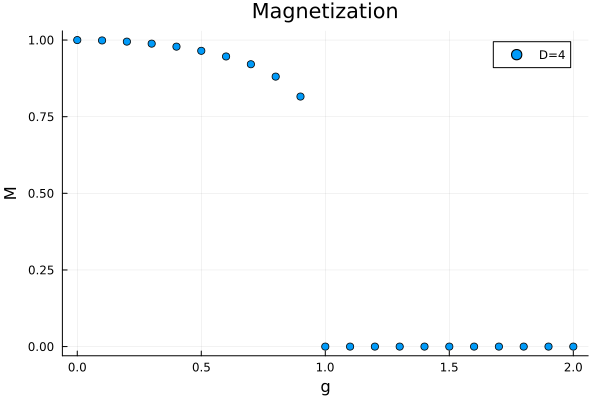
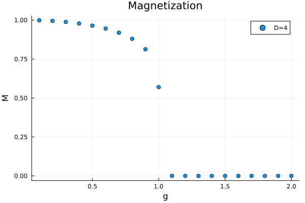

# MPSKit.jl

[![docs][docs-dev-img]][docs-dev-url] [![codecov][codecov-img]][codecov-url] ![CI][ci-url]

[docs-dev-img]: https://img.shields.io/badge/docs-dev-blue.svg
[docs-dev-url]: https://maartenvd.github.io/MPSKit.jl/dev/

[codecov-img]: https://codecov.io/gh/maartenvd/MPSKit.jl/branch/master/graph/badge.svg
[codecov-url]: https://codecov.io/gh/maartenvd/MPSKit.jl

[ci-url]: https://github.com/maartenvd/MPSKit.jl/workflows/CI/badge.svg

Contains code for tackling one-dimensional quantum and two-dimensional statistical mechanics
problems using tensor network algorithms. The main focus is on matrix product states (MPS)
and matrix product operators (MPO), both finite and infinite.

Additionally, the framework is built upon
[TensorKit.jl](https://github.com/jutho/TensorKit.jl), which provides functionality for
generic symmetries.

The toolbox contains different algorithms for finding MPS representations of groundstates or
leading boundary states, performing time evolution, finding excitations and much more. Check
out the [examples](https://maartenvd.github.io/MPSKit.jl/dev/examples/) for concrete
use-cases.

This package is under active development and new algorithms are added regularly.
Nevertheless, the documentation is quite terse, so feel free to open an issue if you have
any questions.

## Installation

The package can be installed through the Julia general registry, via the package manager:

```julia-repl
pkg> add MPSKit
```

Because of the heavy use of [TensorKit.jl](https://github.com/jutho/TensorKit.jl), it is
recommended to install the latest version of this package as well. Additionally, several
extension packages exist that provide additional symmetries, which should all be compatible
with MPSKit. For example, to install the package with support for SU(N) symmetries,
[SUNRepresentations.jl](https://github.com/maartenvd/SUNRepresentations.jl) can be used.

```julia-repl
pkg> add TensorKit
```

Finally, several pre-defined operators, hamiltonians and statistical mechanics models are available in [MPSKitModels.jl](https://github.com/maartenvd/MPSKitModels.jl). It is recommended to install this package too.

```julia-repl
pkg> add MPSKitModels
```

## Quickstart

After following the installation process, it should now be possible to load the packages and
start simulating. For example, to obtain the groundstate of the 1D Ising model, we can use
the following code:

```julia
using MPSKit, MPSKitModels, TensorKit
using ProgressMeter, Plots # for demonstration purposes

L = 16 # length of the chain
D = 4 # bonddimension
init_state = FiniteMPS(L, ℂ^2, ℂ^D)

g_values = 0:0.1:2
Z = @mpoham sum(σᶻ(){i} for i in vertices(FiniteChain(L)))

M = @showprogress map(g_values) do g
    H = periodic_boundary_conditions(transverse_field_ising(; g=g), L)
    groundstate, environment, δ = find_groundstate(init_state, H; verbose=false)
    return abs(sum(expectation_value(groundstate, Z))) / L
end

scatter(g_values, M, xlabel="g", ylabel="M", label="D=$D", title="Magnetization")
```



Similarly, these simulations can be carried out directly in the thermodynamic limit, with
very minor code-changes:

```julia
using MPSKit, MPSKitModels, TensorKit
using ProgressMeter, Plots # for demonstration purposes

D = 4 # bonddimension
init_state = InfiniteMPS(ℂ^2, ℂ^D)

g_values = 0.1:0.1:2
Z = @mpoham sum(σᶻ(){i} for i in vertices(InfiniteChain()))

M = @showprogress map(g_values) do g
    H = transverse_field_ising(; g=g)
    groundstate, environment, δ = find_groundstate(init_state, H, VUMPS(; verbose=false))
    return abs(sum(expectation_value(groundstate, Z)))
end

scatter(g_values, M, xlabel="g", ylabel="M", label="D=$D", title="Magnetization")
```

