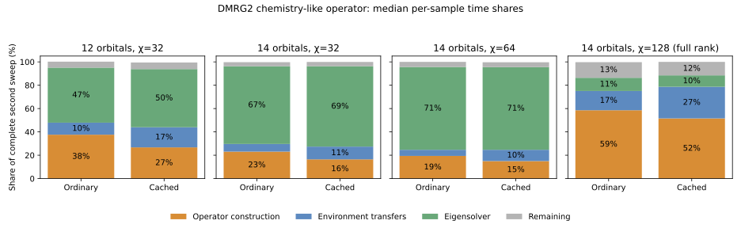
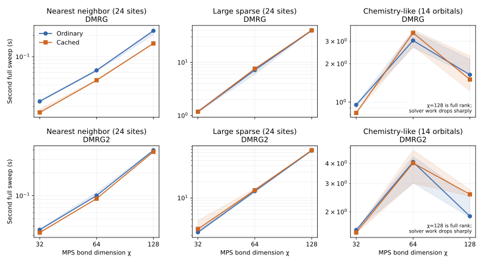

DMRG cache benchmarks: larger bonds and separated construction costs (2026-10-06).

The chemistry-like test does spend substantial time constructing effective operators. Caching reduces repeated assembly, but still has to prepare operators as the environments change. Those preparations, environment transfers, and eigensolver applications determine whether the complete sweep gets faster. The tables below separate that question from the cost of the final constructor call.

**Does the chemistry case exercise operator construction?**

Yes. These DMRG2 measurements explicitly update ordinary GL/GR before timing effective assembly. Cached construction includes one-site preparation, two-site preparation, and final assembly. Raw GL/GR transfers are counted separately. Each entry is the median of three samples; percentages are medians of per-sample fractions of the complete second sweep.

| Chemistry case | Path | Operator construction | Environment transfers | Eigensolver | Remaining | Profiled sweep total (s) | Eigensolver matvecs |
|---|---|---:|---:|---:|---:|---:|---:|
| 12 orbitals, χ=32 | Ordinary | 161 ms (38%) | 44 ms (10%) | 200 ms (47%) | 22 ms (5%) | 0.426 | 146 |
| 12 orbitals, χ=32 | Cached | 107 ms (27%) | 71 ms (17%) | 200 ms (50%) | 23 ms (6%) | 0.400 | 146 |
| 14 orbitals, χ=32 | Ordinary | 318 ms (23%) | 89 ms (7%) | 905 ms (67%) | 48 ms (4%) | 1.352 | 370 |
| 14 orbitals, χ=32 | Cached | 215 ms (16%) | 145 ms (11%) | 899 ms (69%) | 47 ms (4%) | 1.306 | 370 |
| 14 orbitals, χ=64 | Ordinary | 589 ms (19%) | 159 ms (5%) | 2151 ms (71%) | 132 ms (4%) | 3.032 | 163 |
| 14 orbitals, χ=64 | Cached | 466 ms (15%) | 295 ms (10%) | 2166 ms (71%) | 129 ms (4%) | 3.076 | 163 |
| 14 orbitals, χ=128 | Ordinary | 986 ms (59%) | 270 ms (17%) | 191 ms (11%) | 223 ms (13%) | 1.684 | 25 |
| 14 orbitals, χ=128 | Cached | 998 ms (52%) | 525 ms (27%) | 191 ms (10%) | 218 ms (12%) | 1.936 | 25 |

“Remaining” includes gauging, residual/Galerkin calculations, and sweep overhead. Independent medians need not add to exactly 100%. The benchmark-only profiling adapter is checked against each unmodified production path for state overlap, local errors, and identical eigensolver matvec counts. Its runs request GC immediately before the second sweep, so use this table to locate costs; use the following unwrapped measurements to compare wall time.

At 14 orbitals, χ=128 spans the full bond space. The first sweep has already converged strongly, leaving only one eigensolver application per local update on the second sweep. The 12-orbital χ=64 scaling case has the same limitation. This changes the relative costs: use the χ=32 and 64 cases on the fixed 14-orbital MPO to assess workloads with substantial iterative solve work; the full-rank cases chiefly expose transfer and preparation overhead.

The previous report’s ordinary `AC2_hamiltonian` timer included lazy environment transfers. Its roughly-half-of-the-sweep figure therefore described transfers plus construction. The isolated construction fractions above correct that interpretation. A nearly free cached final constructor means work has moved into preparation; it does not mean construction has disappeared.

At 14 orbitals and χ=64, the cached construction cost consists of roughly 250 ms of one-site preparation and 217 ms of pair preparation; final assembly is only about 0.2 ms. Construction saves approximately 123 ms against the ordinary path, while transfers cost approximately 136 ms more. This accounts for the small complete-sweep difference without implying that the expensive contractions have become free.



**Does the whole sweep get faster as χ increases?**

Each measurement is a complete forward/backward second sweep of the same algorithm from the same seeded initial state. Times include GC. DMRG denotes single-site optimization; DMRG2 denotes two-site optimization. All requested bond dimensions were attained.

| Operator | χ | Algorithm | Ordinary sweep (s) | Cached sweep (s) | Cached elapsed-time change | Eigensolver matvecs ordinary/cached |
|---|---:|---|---:|---:|---:|---:|
| Nearest neighbor (24 sites) | 64 | DMRG | 0.064 | 0.047 | 27.4% faster | 57/57 |
| Nearest neighbor (24 sites) | 64 | DMRG2 | 0.100 | 0.092 | 8.7% faster | 48/48 |
| Nearest neighbor (24 sites) | 128 | DMRG | 0.232 | 0.154 | 33.7% faster | 46/46 |
| Nearest neighbor (24 sites) | 128 | DMRG2 | 0.396 | 0.378 | 4.5% faster | 45/45 |
| Large sparse (24 sites) | 64 | DMRG | 7.167 | 7.612 | 6.2% slower | 790/790 |
| Large sparse (24 sites) | 64 | DMRG2 | 13.396 | 13.923 | 3.9% slower | 870/870 |
| Large sparse (24 sites) | 128 | DMRG | 39.841 | 39.982 | 0.4% slower | 677/677 |
| Large sparse (24 sites) | 128 | DMRG2 | 76.149 | 77.307 | 1.5% slower | 756/756 |
| Chemistry-like (12 orbitals) | 64 | DMRG | 0.306 | 0.249 | 18.5% faster | 22/22 |
| Chemistry-like (12 orbitals) | 64 | DMRG2 | 0.310 | 0.334 | 7.7% slower | 21/21 |
| Chemistry-like (14 orbitals) | 32 | DMRG | 0.953 | 0.824 | 13.5% faster | 289/289 |
| Chemistry-like (14 orbitals) | 32 | DMRG2 | 1.542 | 1.487 | 3.6% faster | 370/370 |
| Chemistry-like (14 orbitals) | 64 | DMRG | 3.046 | 3.498 | 14.8% slower | 218/218 |
| Chemistry-like (14 orbitals) | 64 | DMRG2 | 4.086 | 4.022 | 1.6% faster | 163/163 |
| Chemistry-like (14 orbitals) | 128 | DMRG | 1.642 | 1.507 | 8.2% faster | 26/26 |
| Chemistry-like (14 orbitals) | 128 | DMRG2 | 1.878 | 2.572 | 36.9% slower | 25/25 |

Nearest-neighbor single-site gains persist at larger χ. The sparse operator shows no consistent complete-sweep improvement. Chemistry gains depend on solver work and GC, and the two-site cache does not consistently improve elapsed time. These are whole-algorithm measurements: operator reuse is useful, but preparation overhead can absorb the saving.



The plot connects measurements of the same operator. Its χ=32 nearest-neighbor and sparse points come from the previous five-sample run; the new points use three samples. Shading shows observed minimum–maximum times, not confidence intervals. Chemistry curves use the same 14-orbital operator at every bond dimension. The 12-orbital system cannot exceed χ=64 and is listed separately above.

**Where the larger cached sweeps spend their time.**

These percentages come from the ordinary stage timers in the unwrapped measurements, rather than CPU-sampler durations. In single-site DMRG, the solve timer includes effective assembly. In DMRG2, the final assembly is separate and negligible; preparation occurs while advancing environments.

| Operator | χ | Algorithm | Transfer + operator preparation | Eigensolve timer | Gauging | Residual + remaining |
|---|---:|---|---:|---:|---:|---:|
| Nearest neighbor (24 sites) | 128 | DMRG | 41% | 16% | 15% | 27% |
| Nearest neighbor (24 sites) | 128 | DMRG2 | 23% | 12% | 42% | 19% |
| Large sparse (24 sites) | 128 | DMRG | 23% | 74% | 0% | 3% |
| Large sparse (24 sites) | 128 | DMRG2 | 15% | 83% | 0% | 2% |
| Chemistry-like (12 orbitals) | 64 | DMRG | 85% | 7% | 1% | 8% |
| Chemistry-like (12 orbitals) | 64 | DMRG2 | 84% | 6% | 1% | 7% |
| Chemistry-like (14 orbitals) | 128 | DMRG | 78% | 11% | 0% | 11% |
| Chemistry-like (14 orbitals) | 128 | DMRG2 | 84% | 7% | 1% | 8% |

For nearest-neighbor DMRG2 at χ=128, gauging alone takes about 156 ms, roughly 41% of the cached sweep. By contrast, the large sparse single-site solve timer consumes about 74% at χ=128. These workloads leave different amounts of room for construction caching to help.

CPU sampling identifies dense matrix multiplication in tensor contractions as a major cost for the large operators. In cached single-site sparse sweeps, `prepare_right_AC` and its dense GR conversion are visible hotspots; in two-site sweeps, the CA/AB preparation contractions are more relevant. This supports auditing the extra prepared/fused one-site products built during DMRG2 advancement. Raw one-site ingredients also feed transfers and pair preparation, so simply removing all one-site preparation would be incorrect.

Sampling was performed separately after warming and is qualitative: its overhead is substantial, and the daemon’s idle thread appears in the raw stacks. Inclusive stack counts overlap. No CPU-profile sweep duration is used as a benchmark time.

**GC and initialization.**

GC can obscure small speed differences, especially for the sparse MPO. The raw files record allocations and GC for every sample. Subtracting GC below is a diagnostic, not a separate run with GC disabled. Those times are medians of each sample’s elapsed-minus-GC value, which need not equal differences of the displayed medians. Initialization is included in the two-sweep totals; that column is the median of setup + first + second for each sample, rather than a sum of separate medians.

| Operator | χ | Algorithm | Ordinary → cached second-sweep GC (s) | Ordinary → cached second sweep excluding recorded GC (s) | Ordinary → cached setup + two sweeps (s) |
|---|---:|---|---:|---:|---:|
| Nearest neighbor (24 sites) | 64 | DMRG | 0.000 → 0.000 | 0.064 → 0.047 | 0.452 → 0.425 |
| Nearest neighbor (24 sites) | 64 | DMRG2 | 0.000 → 0.000 | 0.100 → 0.092 | 0.763 → 0.754 |
| Nearest neighbor (24 sites) | 128 | DMRG | 0.000 → 0.000 | 0.220 → 0.154 | 1.565 → 1.448 |
| Nearest neighbor (24 sites) | 128 | DMRG2 | 0.021 → 0.017 | 0.377 → 0.361 | 3.143 → 3.090 |
| Large sparse (24 sites) | 64 | DMRG | 1.515 → 1.599 | 5.888 → 6.013 | 16.043 → 17.038 |
| Large sparse (24 sites) | 64 | DMRG2 | 1.550 → 1.740 | 12.416 → 11.995 | 29.719 → 33.126 |
| Large sparse (24 sites) | 128 | DMRG | 5.167 → 4.967 | 34.481 → 34.780 | 94.704 → 94.207 |
| Large sparse (24 sites) | 128 | DMRG2 | 5.756 → 5.590 | 70.600 → 71.717 | 168.332 → 169.953 |
| Chemistry-like (12 orbitals) | 64 | DMRG | 0.038 → 0.037 | 0.267 → 0.213 | 0.847 → 0.768 |
| Chemistry-like (12 orbitals) | 64 | DMRG2 | 0.000 → 0.036 | 0.303 → 0.298 | 0.799 → 0.862 |
| Chemistry-like (14 orbitals) | 32 | DMRG | 0.077 → 0.058 | 0.876 → 0.767 | 2.084 → 1.934 |
| Chemistry-like (14 orbitals) | 32 | DMRG2 | 0.065 → 0.056 | 1.477 → 1.432 | 3.191 → 3.133 |
| Chemistry-like (14 orbitals) | 64 | DMRG | 0.268 → 1.036 | 2.592 → 2.647 | 6.449 → 7.185 |
| Chemistry-like (14 orbitals) | 64 | DMRG2 | 1.052 → 1.055 | 3.035 → 2.982 | 8.201 → 8.315 |
| Chemistry-like (14 orbitals) | 128 | DMRG | 0.286 → 0.259 | 1.355 → 1.240 | 9.501 → 9.574 |
| Chemistry-like (14 orbitals) | 128 | DMRG2 | 0.277 → 0.867 | 1.584 → 1.678 | 8.877 → 10.148 |

**Scope and reproducibility.**

The 24-site nearest-neighbor MPO has maximum virtual bond 3; the 24-site large sparse MPO has maximum bond 126. The chemistry-like MPOs contain seeded onsite, all-pairs hopping/density, and four-orbital fermionic interactions with Jordan–Wigner strings: 1200 terms/max bond 365 at 12 orbitals, and 2289 terms/max bond 613 at 14 orbitals. They are synthetic spinless-orbital surrogates; these results do not establish performance for molecular integrals or specialized complementary-operator MPOs.

Xeon Gold 6244; Julia 1.13.1; TensorKit 0.17.2; BlockTensorKit 0.3.20; Float64 planar trivial tensors; one numerical Julia thread and one BLAS thread; serial scheduler. The operator remains fixed, with no disk offloading. Lanczos uses fixed tolerance 1e-8, Krylov dimension 20, maxiter 4. Hamiltonian construction and initial-state copying are excluded. Paths alternate between samples, with GC requested before setup. Timed samples have timers enabled but no CPU sampling. All 16 warm comparisons pass overlap tolerance 1e-8 and local-error tolerance 1e-7. Solver counts are in the agreement CSV; differing work must be considered when interpreting small changes.

The cache implementation is unchanged by these benchmarks. Benchmark instrumentation commits: `5d96e468`, `a3539763`, `3204103e`. The previous [`remainder` microbenchmark](dmrg_cache_results.md) isolates a one-time initialization improvement; the sweep comparisons here measure the complete cache.

Scripts: [scaling benchmark](dmrg_cache_scaling.jl), [isolated construction profiler](dmrg_operator_profile.jl). Data: [complete sweep samples](dmrg_cache_scaling_results.csv), [stage samples](dmrg_cache_scaling_results_stages.csv), [numerical agreement and solver counts](dmrg_cache_scaling_results_agreement.csv), [CPU samples](dmrg_cache_scaling_results_profile.txt), [isolated construction samples](dmrg_operator_construction_results.csv).

```sh
jld --project=test --name=dmrg-bench --idle-timeout=2h --timeout=7200 eval --scratch 'include("benchmark/dmrg_cache_scaling.jl"); benchmark_dmrg_cache_scaling(); nothing'
jld --project=test --name=dmrg-bench --idle-timeout=2h --timeout=1800 eval --scratch 'include("benchmark/dmrg_operator_profile.jl"); benchmark_dmrg_operator_construction(); nothing'
```
