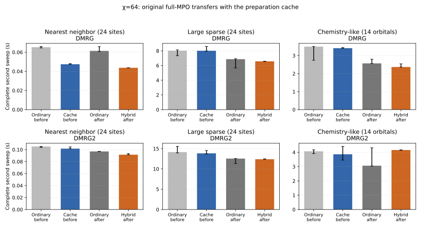

Full-MPO transfers with the DMRG preparation cache, 2026-10-07.

Environment advancement now uses the original full-MPO `TransferMatrix` contractions. The sweep iterator still explicitly prepares and publishes each new operator record, and repeated effective-Hamiltonian assembly still reads those records. One-site and two-site preparation calculations are unchanged. The specialized transfer helpers and now-unused Jordan `remainder` metadata have been removed.

The previous cache is measured at `b0c8184a`, immediately before the production change. New measurements use the hybrid implementation committed in `a637e853`, with 572 focused DMRG cache assertions passing. Ordinary environments were measured in both runs as a control. The six cases cover single-site DMRG and two-site DMRG2 at χ=64; each path has three timed samples. All comparisons use the same seeded initial state, fixed operator, solver settings, and two complete sweeps.

The separated chemistry profile supports this transfer change: transfer time falls from 329 ms to 163 ms, matching ordinary environments, while cached operator construction remains cheaper (445 ms versus 580 ms in the same run). Complete-sweep results are mixed. The hybrid beats its ordinary control in five cases, but chemistry DMRG2 has a slower median wall time because its measured sweeps spend considerably more time in GC. The sequential ordinary controls also changed substantially, so raw before/after sweep differences cannot all be attributed to the implementation.

**Complete second sweeps.** Times include GC. The benefit column compares each cache with its ordinary control in the same run. The ordinary before/after values help show variation between the sequential runs; small differences in three samples are inconclusive.

| Operator | Algorithm | Ordinary before → after (s) | Previous cached transfers (s) | Full-MPO transfers + cache (s) | Cache benefit vs ordinary, before → hybrid | Eigensolver applications |
|---|---|---:|---:|---:|---:|---:|
| Nearest neighbor (24 sites) | DMRG | 0.065 → 0.061 | 0.047 | 0.044 | 27.3% faster → 28.8% faster | 57 |
| Nearest neighbor (24 sites) | DMRG2 | 0.105 → 0.097 | 0.102 | 0.091 | 3.4% faster → 5.6% faster | 48 |
| Large sparse (24 sites) | DMRG | 8.027 → 6.865 | 8.015 | 6.575 | 0.1% faster → 4.2% faster | 790 |
| Large sparse (24 sites) | DMRG2 | 14.137 → 12.537 | 13.831 | 12.384 | 2.2% faster → 1.2% faster | 870 |
| Chemistry-like (14 orbitals) | DMRG | 3.496 → 2.565 | 3.411 | 2.365 | 2.4% faster → 7.8% faster | 218 |
| Chemistry-like (14 orbitals) | DMRG2 | 4.071 → 3.065 | 3.861 | 4.156 | 5.1% faster → 35.6% slower | 163 |



The plot shows medians and observed minimum–maximum ranges, not confidence intervals, with ordinary controls alongside each run's cache. Every path attained the requested χ=64, and all three implementations use identical eigensolver counts for each case. State overlaps agree within 1e-8 and local errors within 1e-7 in all twelve before/after warm comparisons.

**Separated chemistry costs.** This DMRG2 profile uses the same 14-orbital χ=64 case. GL/GR transfers are timed separately from one-site preparation, two-site preparation, and final effective assembly. These profiling-only runs request GC immediately before the measured second sweep and are checked against the corresponding unwrapped production path for state overlap, local errors, and identical solver counts. Their totals are separate from the wall-time experiment above.

| Run / implementation | Transfers (ms) | Operator construction (ms) | Eigensolve (ms) | Profiled total (s) | Eigensolver applications |
|---|---:|---:|---:|---:|---:|
| Before / ordinary | 168 | 597 | 2388 | 3.288 | 163 |
| Before / cached reuse | 329 | 484 | 2319 | 3.232 | 163 |
| After / ordinary | 163 | 580 | 2206 | 3.092 | 163 |
| After / hybrid | 163 | 445 | 2164 | 2.899 | 163 |

In this profile, ordinary operator construction accounts for about 19% of the sweep. The hybrid reduces that cost by about 23%, and its profiled total is about 6% lower. This supports retaining the preparation cache independently of transfer reuse. It does not resolve the GC sensitivity of complete sweeps: in the main chemistry DMRG2 experiment, ordinary elapsed-minus-GC has a median of 2.966 s and the hybrid 2.873 s, whereas the corresponding wall-time medians are 3.065 s and 4.156 s. Hybrid GC takes roughly 1.3 s in every sample; ordinary samples have GC times of 0.063 s, 0.081 s, and 1.349 s. Three samples are insufficient to establish a stable end-to-end benefit for this case.

Cached construction includes all operator preparation, not just the final constructor call. Stage medians need not sum to the median total. The raw construction CSV separates one-site and two-site preparation. Preparation was deliberately kept unchanged so this experiment isolates the transfer choice; some products that were previously consumed by transfers may now be candidates for removal.

**GC, allocations, and initialization.** Allocations are cumulative bytes, not retained memory. GC-subtracted times are medians of each sample’s elapsed-minus-GC value; they are a diagnostic, not a GC-disabled experiment. Setup includes initialization of the cache but excludes Hamiltonian construction and the initial MPS copy. Removing the obsolete remainder affects setup, while switching the contractions affects subsequent sweeps.

| Operator | Algorithm | Previous → hybrid allocations (MiB) | Previous → hybrid GC (s) | Previous → hybrid elapsed minus GC (s) | Previous → hybrid setup + two sweeps (s) |
|---|---|---:|---:|---:|---:|
| Nearest neighbor (24 sites) | DMRG | 35 → 36 | 0.000 → 0.000 | 0.047 → 0.044 | 0.439 → 0.403 |
| Nearest neighbor (24 sites) | DMRG2 | 73 → 74 | 0.000 → 0.000 | 0.102 → 0.091 | 0.819 → 0.741 |
| Large sparse (24 sites) | DMRG | 1862 → 1553 | 1.149 → 1.311 | 6.874 → 5.264 | 17.994 → 14.703 |
| Large sparse (24 sites) | DMRG2 | 2667 → 2357 | 1.750 → 1.331 | 12.277 → 11.063 | 31.205 → 28.460 |
| Chemistry-like (14 orbitals) | DMRG | 779 → 616 | 0.828 → 0.035 | 2.583 → 2.331 | 6.773 → 5.563 |
| Chemistry-like (14 orbitals) | DMRG2 | 1126 → 964 | 0.651 → 1.288 | 3.236 → 2.873 | 8.824 → 8.317 |

Hardware and methods match the preceding benchmarks: Xeon Gold 6244; Julia 1.13.1; Float64 planar trivial tensors; one numerical Julia thread, one BLAS thread, serial scheduler. Krylov tolerance 1e-8, dimension 20, maxiter 4, adaptive tolerance disabled. No disk offloading. Timed samples contain stage timers but no CPU sampling or debug counters; separate warm runs collect solver counts. Path order alternates, with GC requested before setup. The chemistry operator is a seeded spinless surrogate with 2289 terms and maximum MPO bond 613, not molecular integrals or a specialized complementary-operator MPO.

The ordinary controls and prior reused-transfer cache are preserved in [sweep samples](dmrg_full_transfer_results.csv), [stage samples](dmrg_full_transfer_stages.csv), [agreement and solver counts](dmrg_full_transfer_agreement.csv), and [separated construction samples](dmrg_full_transfer_construction.csv). The [current benchmark driver](dmrg_full_transfer.jl) reproduces the after-run measurements:

```sh
jld --project=test --name=dmrg-bench --idle-timeout=2h --timeout=1800 eval --scratch 'include("benchmark/dmrg_full_transfer.jl"); benchmark_dmrg_full_transfer(); nothing'
```

For the before-run baseline, use checkout `b0c8184a` and the existing scaling harness with `models=cache_benchmark_models(; chemistry_sites=14)`, `dims=(64,)`, and `sample_cpu=false`; the construction profiler uses `cases=((14,64),)`. The historical [larger-bond report](dmrg_cache_scaling_results.md) describes the previous cache implementation.
