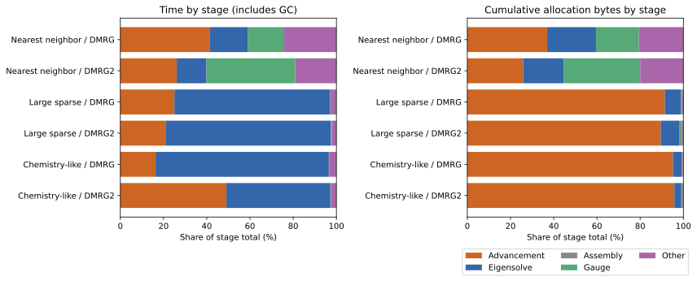

Hybrid DMRG cleanup and sweep profiles, 2026-10-07.

The production cleanup is committed in `575b73bd`; all 572 focused cache assertions pass. Transfers continue to use the full MPO. Generic MPO records now store the existing derivative helpers' fused results directly, removing the intermediate wrapper. Jordan unfused contractions are transient inputs to pair preparation instead of fields in every snapshot. Right-side `O * GR` preparation is skipped when no pair contribution is needed. Raw/prepared Jordan views remain independent to preserve snapshot safety and unprepared-operator support.

The main remaining costs differ: eigensolving occupies about 80–88% of numerical CPU samples in the large-operator cases, while advancement accounts for about 90–96% of allocated bytes. The cleanup reduces single-site allocation volume, but DMRG2 remains GC-sensitive. Over eight consecutive chemistry DMRG2 sweeps, the hybrid saves 1.110 s excluding measured GC yet spends 3.407 s more in GC, leaving total sweep time 2.296 s higher. This supports the numerical benefit of caching and shows that collection overhead is a continuing optimization target, rather than just one pause falling on a measurement boundary.

Three timed second sweeps per path use ordinary environments as controls. Both paths attain χ=64 and agree in state overlap (within 1e-8), local errors (within 1e-7), and eigensolver application counts for all six cases. Timings include GC and use the established protocol: GC before setup, then two consecutive sweeps. CPU and allocation sampling run separately and do not contribute to these measurements.

| Operator | Algorithm | Ordinary time (s) | Hybrid time (s) | Ordinary → hybrid allocations (MiB) | Ordinary → hybrid GC (s) |
|---|---|---:|---:|---:|---:|
| Nearest neighbor | DMRG | 0.070 | 0.049 | 48 → 36 | 0.000 → 0.000 |
| Nearest neighbor | DMRG2 | 0.109 | 0.105 | 73 → 74 | 0.000 → 0.000 |
| Large sparse | DMRG | 7.766 | 7.191 | 2024 → 1354 | 1.506 → 1.454 |
| Large sparse | DMRG2 | 14.149 | 17.155 | 2101 → 2357 | 1.975 → 4.157 |
| Chemistry-like | DMRG | 3.100 | 2.650 | 772 → 556 | 0.266 → 0.054 |
| Chemistry-like | DMRG2 | 3.233 | 4.771 | 835 → 964 | 0.073 → 1.717 |

Exact stage measurements for the hybrid follow. Each cell gives median milliseconds / cumulative MiB allocated. Advancement includes transfers and all preparation for the next window. Eigensolve includes operator applications and Krylov work. The other column includes error evaluation and bookkeeping; for DMRG2 this includes an extra Hamiltonian application used to calculate the local error. Stage timers include any GC pauses inside them. Their medians need not sum to the median total.

| Operator | Algorithm | Advancement (ms / MiB) | Eigensolve (ms / MiB) | Assembly (ms / MiB) | Gauge (ms / MiB) | Other (ms / MiB) |
|---|---|---:|---:|---:|---:|---:|
| Nearest neighbor | DMRG | 20.0 / 13.2 | 8.6 / 8.1 | 0.0 / 0.0 | 8.1 / 7.1 | 11.7 / 7.4 |
| Nearest neighbor | DMRG2 | 27.4 / 19.1 | 14.4 / 13.9 | 0.1 / 0.0 | 43.0 / 26.1 | 20.0 / 14.8 |
| Large sparse | DMRG | 1802.9 / 1238.0 | 5188.8 / 101.5 | 0.0 / 0.0 | 11.6 / 7.1 | 194.4 / 7.5 |
| Large sparse | DMRG2 | 3585.8 / 2110.4 | 13131.2 / 205.8 | 0.3 / 0.0 | 60.7 / 26.1 | 376.5 / 14.8 |
| Chemistry-like | DMRG | 427.6 / 529.2 | 2100.9 / 22.8 | 0.0 / 0.0 | 3.4 / 1.9 | 88.2 / 2.2 |
| Chemistry-like | DMRG2 | 2334.1 / 923.7 | 2289.6 / 30.9 | 0.1 / 0.0 | 11.5 / 5.4 | 119.2 / 3.8 |



CPU stack sampling splits advancement into preparation and transfers. Idle daemon I/O stacks are excluded; these are percentages of sampled stacks with an MPSKit owner, with each stack assigned to one stage. They are approximate location diagnostics, not independently timed percentages. Collection frames are classified separately; allocation functions themselves are not classified as GC. Very short nearest-neighbor sweeps have few CPU samples and should be interpreted using the exact stage timings above.

| Operator | Algorithm | CPU samples | Preparation | Transfers | Eigensolve | GC | Other stages |
|---|---|---:|---:|---:|---:|---:|---:|
| Nearest neighbor | DMRG | 99 | 15.2% | 24.2% | 19.2% | 0.0% | 41.4% |
| Nearest neighbor | DMRG2 | 245 | 16.3% | 10.6% | 13.9% | 0.0% | 59.2% |
| Large sparse | DMRG | 20594 | 3.6% | 4.5% | 88.4% | 0.7% | 2.8% |
| Large sparse | DMRG2 | 47332 | 4.3% | 2.1% | 82.9% | 7.9% | 2.7% |
| Chemistry-like | DMRG | 8512 | 6.1% | 6.8% | 84.4% | 0.0% | 2.7% |
| Chemistry-like | DMRG2 | 10757 | 11.3% | 4.9% | 80.0% | 0.0% | 3.8% |

Allocation stack sampling is uniform by allocation event at rate 0.002. It locates frequently allocating call sites; it can miss rare large buffers, so sampled bytes are not a substitute for the exact stage totals. The table lists the three most frequent MPSKit owner sites for the chemistry hybrid. An owner site is the innermost MPSKit frame. The broad samples retain the original allocation-hook leaf frames; the denser chemistry samples below resolve Julia/library frames. Recorded MPSKit line numbers are daemon debug locations and can precede line-only edits under Revise; function names identify the current implementation.

| Algorithm | Owner call site | Sampled events | Share of sampled events |
|---|---|---:|---:|
| DMRG | `src/transfermatrix/transfer.jl:133` (`#transfer_right#319`) | 1283 | 36.6% |
| DMRG | `src/transfermatrix/transfer.jl:130` (`#transfer_left#318`) | 893 | 25.5% |
| DMRG | `src/algorithms/derivatives/hamiltonian_derivatives.jl:665` (`_contract_GL_O`) | 513 | 14.6% |
| DMRG2 | `src/transfermatrix/transfer.jl:133` (`#transfer_right#319`) | 1192 | 28.4% |
| DMRG2 | `src/transfermatrix/transfer.jl:130` (`#transfer_left#318`) | 627 | 14.9% |
| DMRG2 | `src/algorithms/derivatives/hamiltonian_derivatives.jl:665` (`_contract_GL_O`) | 541 | 12.9% |

A separate chemistry DMRG2 adapter measures advancement costs without CPU or allocation sampling. It is checked against the unwrapped production path for state overlap, local errors, and identical eigensolver counts (163 applications). GC is requested before the second sweep; three samples per path give the following stage medians. This diagnostic is separate from the complete-sweep experiment above.

| Stage | Ordinary ms / MiB | Hybrid ms / MiB |
|---|---:|---:|
| Transfers | 171.0 / 84.4 | 170.1 / 111.6 |
| One-site ingredients and preparation | 0.0 / 0.0 | 262.8 / 469.4 |
| Pair preparation | 0.0 / 0.0 | 221.4 / 342.6 |
| Final assembly / ordinary operator construction | 571.7 / 710.6 | 0.1 / 0.0 |
| Eigensolve | 2219.2 / 30.9 | 2220.0 / 30.9 |

Hybrid construction totals about 484 ms and 812 MiB, versus ordinary construction at 572 ms and 711 MiB. It is cheaper in time but allocates more. The hybrid adapter's median total is 3.004 s, versus 3.143 s for ordinary environments. Transfer allocations also differ (112 versus 84 MiB); both paths use the same full-MPO contraction kernels, and these profiles do not establish the cause of the allocation excess. Update counts and allocator state are candidates to check separately from preparation.

The denser chemistry allocation sample uses rate 0.02, independently of the timing runs. It confirms the frequency hotspots. For hybrid DMRG2, there are 42,447 sampled allocation events; approximately 53% originate in preparation and 44% in transfers. The library-site table is ranked by event count, not by bytes:

| Library function | Sampled events | Share of sampled events |
|---|---:|---:|
| `TensorKit.taskforeach` | 9138 | 21.5% |
| `LRUCache._unsafe_getindex` | 8830 | 20.8% |
| `Strided._mapreduce_block!` | 7326 | 17.3% |
| `LRUCache.get!` | 6509 | 15.3% |
| `LRUCache._unsafe_haskey` | 2355 | 5.5% |

Source inspection gives concrete candidates behind these event counts. The installed LRUCache `get!` allocates an eviction vector before checking for a hit. TensorKit's `taskforeach` collects non-array iterables and enters atomic-counter/synchronization setup even with one worker. Empty eviction vectors, tensor-space cache keys, task bookkeeping, and degeneracy structures are frequent sampled types. This identifies object churn as well as large tensor buffers; it does not prove how much GC time each kind of object causes. These are candidates for separate dependency changes.

The consecutive-sweep check uses chemistry DMRG2 from the same initial state, with GC before setup and no forced collections between eight complete sweeps. It is a progression toward convergence, not eight independent samples of the same sweep. The two final states agree. Setup is excluded from the table; both sequences include their first sweep.

| Path | Eight sweeps total (s) | Total GC (s) | Time excluding measured GC (s) | Cumulative allocations (GiB) |
|---|---:|---:|---:|---:|
| Ordinary | 31.634 | 5.697 | 25.937 | 7.051 |
| Hybrid | 33.930 | 9.103 | 24.827 | 7.638 |

The next implementation targets, in order, are:

1. Separate pair ingredients from completed one-site preparation in plain DMRG2. Pair construction needs the raw B/C/I/E pieces and the unfused continuing contraction, but it does not consume the prepared one-site side or its fused continuing matrix. An explicit preparation mode can avoid this extra folding and fusion while keeping both forms for single-site DMRG with expansion. The 469 MiB one-site stage includes necessary pair ingredients, so it is not all removable.
2. Reduce metadata allocation in the dependency fast paths above, and inspect the explicit-transfer allocation excess. Use both allocation-event counts and exact byte totals: cutting small-object churn may reduce collection overhead even when numerical buffers dominate the bytes.
3. Investigate effective-Hamiltonian matvecs for time improvement. The large-operator CPU profiles are dominated by BLAS multiplication and packing. One candidate is pruning unused single-site continuing channels, analogous to the existing pair-channel restriction; another is contraction order when the two virtual dimensions differ. These require numerical validation and benchmarks and are not established speedups.

Persistent prepared buffers should retain snapshot ownership: reusing mutable storage must preserve operators already handed to a solver or caller. The current tests deliberately retain such operators across updates.

The reproducible harness is [dmrg_hybrid_profile.jl](dmrg_hybrid_profile.jl). Measurements use Julia 1.13.1 on Xeon Gold 6244, Float64 trivial planar tensors, one Julia numerical thread, one BLAS thread, and the serial scheduler. Solver settings remain tol=1e-8, krylovdim=20, maxiter=4, adaptive tolerance disabled. The operator classes are 24-site nearest-neighbor and sparse long-range operators, plus the seeded 14-orbital spinless chemistry surrogate (2289 terms, maximum MPO bond 613). CPU and allocation profiles each use a fresh iterator, one warming sweep, and GC immediately before the measured second sweep. No disk offloading is used.

Raw results: [timings](dmrg_hybrid_profile_results.csv), [exact stages](dmrg_hybrid_profile_results_stages.csv), [agreement](dmrg_hybrid_profile_results_agreement.csv), [CPU attribution](dmrg_hybrid_profile_results_cpu.csv), [flat CPU stacks](dmrg_hybrid_profile_results_cpu.txt), [allocation attribution](dmrg_hybrid_profile_results_allocations.csv), and [consecutive sweeps](dmrg_hybrid_profile_results_continuous.csv), [separated construction](dmrg_hybrid_profile_construction.csv), and [detailed chemistry allocations](dmrg_hybrid_chemistry_allocations.csv). The [previous hybrid report](dmrg_full_transfer_results.md) preserves the pre-cleanup measurements. Sequential-run wall times should not be used as an isolated causal comparison; the within-run ordinary controls and deterministic allocation counts are more informative.

```sh
jld --project=test --name=dmrg-profile --idle-timeout=2h --timeout=2400 eval --scratch 'include("benchmark/dmrg_hybrid_profile.jl"); benchmark_dmrg_hybrid_profile(); benchmark_chemistry_allocations(); nothing'
```

The separated construction diagnostic is reproduced with `include("benchmark/dmrg_operator_profile.jl"); benchmark_dmrg_operator_construction(; cases=((14,64),), output_prefix="benchmark/results/dmrg_hybrid_profile_construction")` in a separate scratch request.
