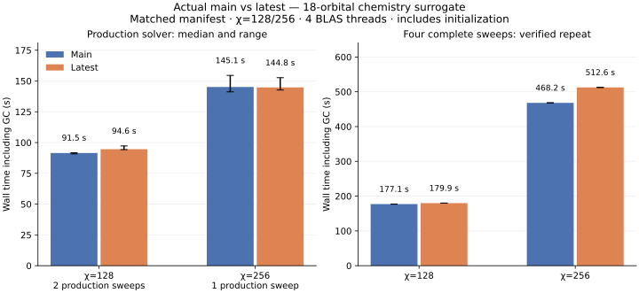

# Latest versus actual main: large-bond chemistry DMRG2

The latest implementation does **not demonstrate an overall runtime improvement** over actual main in this experiment. At χ=128 it is slightly slower in the three primary full-call samples; at χ=256 the medians are essentially tied. Allocation volume is consistently higher on latest. Longer fixed-sweep sequences show appreciable timing variation despite matching solver work and zero measured compilation.

This comparison uses fetched main `a02070dc7acb750e13daa9eccc8113856ea8e706` and latest production code `fceb462510bd82acb8a0e3b60c7367b32021bdc0`. Benchmark-only commits after that point do not change the implementation being measured. Unlike the previous internal controls, the baseline here is the main branch itself.

## Production `find_groundstate!`

Both branches load the same serialized initial state and operator. The input is an **18-orbital spinless chemistry surrogate**, with 6597 terms and maximum MPO bond dimension 1413. It includes all-pairs hopping and density interactions and four-orbital fermionic terms, but uses neither molecular integrals nor a specialized chemistry MPO. Requested MPS bond dimensions are 128 and 256, both attained by the input states.

Three alternating-order sample pairs include environment/cache initialization and the complete public solver call. Initial-state copying and forced GC before the call are excluded. Times include GC; ranges are observed sample ranges, not confidence intervals.

| MPS bond χ | Completed sweeps, both branches | Main median [range], s | Latest median [range], s | Latest change | Main / latest allocation, GiB |
|---|---:|---:|---:|---:|---:|
| 128 | 2 | 91.50 [90.80–91.70] | 94.64 [94.26–97.29] | +3.4% | 21.60 / 24.58 |
| 256 | 1 | 145.14 [141.20–154.55] | 144.80 [142.65–152.67] | −0.2% | 34.03 / 37.39 |

The solver has a four-sweep cap and tolerance zero, but its truncation-based stopping criterion remains active. Consequently, these results compare two completed sweeps at χ=128 and one at χ=256, rather than assuming every call executes the cap. Local solver settings are identical: tolerance 1e−8, Krylov dimension 20, maximum iterations 4, adaptive control and dynamic tolerances disabled.

GC helps explain the χ=128 result: median measured GC is 7.96 s on main versus 12.57 s on latest. The medians of each sample's time excluding GC are 83.14 versus 84.16 s. At χ=256 they are 135.39 versus 134.74 s, again close. Allocations increase by 13.8% and 9.9%, respectively. These are cumulative allocated bytes, not retained or peak memory.

A separate fourth pair checks compilation explicitly, after warming every measurement helper on a small fixture of the same types. Both branches report zero compilation and recompilation. Its full-call times are 97.24 / 91.46 s at χ=128 and 139.72 / 143.31 s at χ=256, demonstrating why the small primary differences should not be treated as precise, stable speedup estimates. This audit pair is included in the raw data but excluded from the three-sample primary medians above.

## Four-sweep cache lifetime

To examine a longer cache lifetime, separate drivers execute exactly four complete sweeps from the same initial states, ignoring the public solver's stopping criterion. Setup is included; no forced GC occurs between sweeps. Main calls its production local-update loop, while latest uses its production sweep iterator. Both drivers were checked against their respective public solvers.

The repeated sequence below records identical local-update and eigensolver application counts on both branches, and zero compilation or recompilation in setup and every sweep.

| χ | Main / latest total, s | Main / latest GC, s | Main / latest time excluding GC, s | Main / latest allocation, GiB |
|---|---:|---:|---:|---:|
| 128 | 177.08 / 179.90 | 16.63 / 22.43 | 160.45 / 157.47 | 36.90 / 43.18 |
| 256 | 468.19 / 512.60 | 20.16 / 34.86 | 448.03 / 477.74 | 90.20 / 108.25 |

At χ=128, latest saves about 3.0 s outside GC but adds 5.8 s of collection time, leaving the complete sequence 2.8 s slower. At χ=256, the extra GC explains only part of the slowdown; the non-GC difference remains. The four sweep application counts are 683, 440, 428, 433 at χ=128 and 615, 350, 247, 220 at χ=256. Every sweep has 33 local updates on both branches.

The initial four-sweep trials were 209.38 / 183.59 s at χ=128 and 466.70 / 540.89 s at χ=256. Some individual sweeps vary substantially across trials. The repeated trials rule out different solver application counts and compilation as explanations for their differences, but do **not** establish the cause of the remaining wall-time variation. Both trials are retained in the raw data; two sequences are insufficient to assign a stable percentage to the long-run effect.



## Where the second sweep spends time

Each profile starts a fresh driver, warms one complete sweep, forces GC, then measures the second sweep with identical application counts. On main, the `AC2_hamiltonian` timer includes implicit environment updates and operator construction. On latest, most of that work is in `advance_env`, with cached operator assembly in `AC2_hamiltonian`. The table combines those sections to compare equivalent work.

| χ | Main / latest transfers + preparation, s | Main / latest GC within that work, s | Main / latest preparation excluding GC, s | Main / latest preparation allocation, GiB | Main / latest eigensolve, s |
|---|---:|---:|---:|---:|---:|
| 128 | 10.64 / 11.38 | 2.81 / 4.74 | 7.84 / 6.64 | 7.28 / 8.93 | 31.19 / 31.15 |
| 256 | 29.61 / 23.35 | 3.91 / 5.57 | 25.71 / 17.79 | 18.00 / 22.89 | 138.14 / 99.88 |

Cached assembly itself takes about 0.00014 s per sweep and allocates 19 KB, but that does not include the work moved into explicit preparation. Preparation remains substantial, at roughly one fifth to one quarter of the measured sweep. At χ=128 its non-GC cost drops by about 1.2 s, while additional collection more than absorbs that saving. The eigensolve is the largest section.

The χ=256 stage timing also illustrates the observed variability: main's initial profile spent 23.43 s in construction/transfers and 99.44 s eigensolving; its GC-aware repeat spent 29.61 s and 138.14 s. Both perform 350 eigensolver applications and have almost identical allocation volume. Latest's corresponding initial/repeated eigensolve times are 100.97 / 99.88 s. Thus the χ=256 stage ratio is not a reliable estimate of a stable construction speedup. Both measurements are published, and all stage compilation audits are zero.

The repeat's combined preparation allocations are approximately 23% higher at χ=128 and 27% higher at χ=256. These are costs incurred while advancing and preparing environments, even though final cached assembly is cheap. Identifying the precise sources of those additional allocations would be the next optimization investigation; this measurement does not establish their cause.

## Dependency and numerical checks

Both snapshots use byte-identical manifests and preferences. The driver audits **all 280 non-MPSKit dependency entries**, including versions, tree hashes, and source paths. Both use Julia 1.13.1, the same ILP64 OpenBLAS, one numerical Julia thread, four BLAS threads, a serial scheduler, and affinity to the same four physical cores on one NUMA node. Requests execute sequentially.

All 14 main/latest final-state pairs agree to a normalized overlap within approximately 3e−15 of one. Maximum local-error difference is below 1e−12. The stage diagnostics and repeated four-sweep sequences also have matching eigensolver application counts. No production code or dependency versions were changed for this experiment.

The practical result is that the current cache has an observable allocation cost and does not deliver a demonstrated end-to-end speedup for this large-MPO case. Reducing effective-operator assembly alone is insufficient evidence of a faster sweep; initialization, transfers/preparation, GC, and eigensolver application all need to be included.

## Data and reproduction

- [Public-call samples](dmrg_main_comparison_results.csv): samples 1–3 are primary; sample 4 is the compilation audit.
- [Setup and individual sweeps](dmrg_main_comparison_continuous.csv): both fixed-sequence trials.
- [Stage times, allocations, and GC](dmrg_main_comparison_stages.csv), [stage compilation audit](dmrg_main_comparison_stage_compilation.csv).
- [State agreement](dmrg_main_comparison_agreement.csv), [resolved dependency inventory](dmrg_main_comparison_dependencies.csv), [configuration and checksums](dmrg_main_comparison_metadata.json).
- [Julia harness](dmrg_main_comparison.jl), [sequential Python driver](dmrg_main_comparison.py), [frozen manifest](dmrg_main_comparison_manifest.toml).

The harness uses two isolated snapshots with an identical workspace manifest and preferences. The compared production code is frozen at main `a02070dc7acb750e13daa9eccc8113856ea8e706` and latest `fceb462510bd82acb8a0e3b60c7367b32021bdc0`; subsequent commits only add the benchmark harness and results.

To prepare a fresh scratch directory, archive each commit into `main/` and `latest/`, copy [the saved manifest](dmrg_main_comparison_manifest.toml) to `Manifest.toml` in both roots, and copy the repository's `LocalPreferences.toml` to both roots. Use the same Julia executable for both daemons. This run uses Julia 1.13.1 with `--compiled-modules=existing`; a small wrapper supplies that option to `jld`. Set `JULIA_NUM_THREADS=1` before creating either daemon.

Include [dmrg_main_comparison.jl](dmrg_main_comparison.jl) in the latest daemon, set BLAS to one thread, and call `comparison_inputs("<scratch>/input.jls")` once. Both processes deserialize this same file. Input construction and compilation are excluded from timings. The Python driver then sets four BLAS threads and pins all daemon threads to CPU cores 0–3, which are four physical cores on NUMA node 0 on this machine. Adjust the affinity for other hardware while keeping both processes identical.

```sh
python benchmark/dmrg_main_comparison.py --root <scratch> --phase warm
python benchmark/dmrg_main_comparison.py --root <scratch> --phase measure --samples 3 --continuous-reps 1 --continuous-sweeps 4
python benchmark/dmrg_main_comparison.py --root <scratch> --phase diagnostics
python benchmark/dmrg_main_comparison.py --root <scratch> --phase verify --samples 3 --continuous-reps 1
```

The driver audits all resolved package entries before measuring; it requires identical manifests and matching versions, tree hashes, and source paths for every dependency other than MPSKit. The saved dependency inventory covers 280 matching entries. TensorKit is 0.17.2, BlockTensorKit 0.3.20, TensorOperations 5.8.2, MatrixAlgebraKit 0.6.9, KrylovKit 0.10.4, LRUCache 1.6.2, and Strided 2.6.4. Both processes use the same ILP64 OpenBLAS library. No package resolution or dependency updates occur between branches.

The 18-orbital input is the established seeded spinless chemistry surrogate, with all-pairs hopping/density interactions and four-orbital fermionic terms. It has 6597 terms and maximum MPO bond 1413. These are not molecular integrals or a specialized complementary-operator chemistry MPO. Both initial MPSs are Float64 with trivial planar symmetry and reach the requested maximum bond dimensions 128 and 256. No disk offloading is used.

Local solver settings are fixed at tol=1e-8, krylovdim=20, maxiter=4, with adaptive control and dynamic tolerances disabled. Production `find_groundstate!` has a four-sweep cap and tol=0. Its truncation-based convergence criterion remains active: the recorded production solves stop after two sweeps at χ=128 and one sweep at χ=256 on both branches. Full-call timings include environment creation and cache initialization; copying the initial MPS and forced GC immediately before each solve are excluded. Three pairs alternate main/latest order. The ranges are observed ranges from three samples, not confidence intervals.

The separate fixed four-sweep sequences use the same initial states, GC before setup, and no forced collection between sweeps. Main's driver calls the production `local_update!` loop; latest uses its production complete-sweep iterator. Each driver is checked against its own public solver for state agreement and local errors. Setup and sweep costs are recorded separately. The fixed sequences ignore the public solver's stopping criterion to measure a longer cache lifetime. A debug logger counts local updates and eigensolver applications; logging has no sampling profiler attached.

Stage measurements use separate fresh drivers, one warming sweep, and GC before the measured second sweep. CPU stack sampling and allocation sampling do not contribute to the timing experiment. Reported allocated bytes are cumulative allocation volume, not retained or peak memory. Total time includes measured GC; time excluding GC subtracts each sample's measured collection time before taking medians. Stage totals and medians can differ from complete-call medians.

The additional public-call audit uses `comparison_public_sample(...; sweeps=4)` with suffix `solve_4`. The fixed-sequence repeat uses `comparison_continuous(...; sweeps=4)` with suffix `continuous_2`. Execute each main/latest request sequentially. After those extras, run `--phase verify --samples 4 --continuous-reps 2`. The first stage measurement predates per-section GC recording; both its wall-time/allocation rows and the subsequent GC-aware repeat are saved. Blank compilation/count/GC fields mean the original measurement did not record that quantity, rather than zero.
