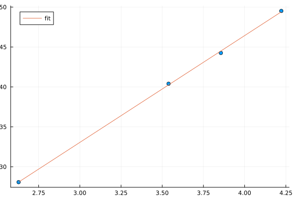

```@meta
EditURL = "../../../../../examples/classic2d/1.hard-hexagon/main.jl"
```

[](https://mybinder.org/v2/gh/QuantumKitHub/MPSKit.jl/gh-pages?filepath=dev/examples/classic2d/1.hard-hexagon/main.ipynb)
[](https://nbviewer.jupyter.org/github/QuantumKitHub/MPSKit.jl/blob/gh-pages/dev/examples/classic2d/1.hard-hexagon/main.ipynb)
[](https://minhaskamal.github.io/DownGit/#/home?url=https://github.com/QuantumKitHub/MPSKit.jl/examples/tree/gh-pages/dev/examples/classic2d/1.hard-hexagon)

# The Hard Hexagon model


Tensor networks are a natural way to do statistical mechanics on a lattice.
As an example of this we will extract the central charge of the hard hexagon model.
This model is known to have central charge 0.8, and has very peculiar non-local (anyonic) symmetries.
Because TensorKit supports anyonic symmetries, so does MPSKit.
To follow the tutorial you need the following packages.

````julia
using MPSKit, MPSKitModels, TensorKit, Plots, Polynomials
````

The [hard hexagon model](https://en.wikipedia.org/wiki/Hard_hexagon_model) is a 2-dimensional lattice model of a gas, where particles are allowed to be on the vertices of a triangular lattice, but no two particles may be adjacent.
This can be encoded in a transfer matrix with a local MPO tensor using anyonic symmetries, and the resulting MPO has been implemented in MPSKitModels.

In order to use these anyonic symmetries, we need to generalise the notion of the bond dimension and define how it interacts with the symmetry. Thus, we implement away of converting integers to symmetric spaces of the given dimension, which provides a crude guess for how the final MPS would distribute its Schmidt spectrum.

````julia
mpo = hard_hexagon()
P = physicalspace(mpo, 1)
function virtual_space(D::Integer)
    _D = round(Int, D / sum(dim, values(FibonacciAnyon)))
    return Vect[FibonacciAnyon](sector => _D for sector in (:I, :τ))
end

@assert isapprox(dim(virtual_space(100)), 100; atol = 3)
````

## The leading boundary

One way to study statistical mechanics in infinite systems with tensor networks is by approximating the dominant eigenvector of the transfer matrix by an MPS.
This dominant eigenvector contains a lot of hidden information.
For example, the free energy can be extracted by computing the expectation value of the mpo.
Additionally, we can compute the entanglement entropy as well as the correlation length of the state:

````julia
D = 10
V = virtual_space(D)
ψ₀ = InfiniteMPS([P], [V])
ψ, envs, = leading_boundary(
    ψ₀, mpo,
    VUMPS(; verbosity = 0, alg_eigsolve = MPSKit.Defaults.alg_eigsolve(; ishermitian = false))
) # use non-hermitian eigensolver
F = real(expectation_value(ψ, mpo))
S = real(first(entropy(ψ)))
ξ = correlation_length(ψ)
println("F = $F\tS = $S\tξ = $ξ")
````

````
F = 0.8839037051703852	S = 1.280782962156832	ξ = 13.849682579815157

````

## The scaling hypothesis

The dominant eigenvector is of course only an approximation. The finite bond dimension enforces a finite correlation length, which effectively introduces a length scale in the system. This can be exploited to formulate a scaling hypothesis [pollmann2009](@cite), which in turn allows to extract the central charge.

First we need to know the entropy and correlation length at a bunch of different bond dimensions. Our approach will be to re-use the previous approximated dominant eigenvector, and then expanding its bond dimension and re-running VUMPS.
According to the scaling hypothesis we should have ``S \propto \frac{c}{6} log(ξ)``. Therefore we should find ``c`` using

````julia
function scaling_simulations(
        ψ₀, mpo, Ds; verbosity = 0, tol = 1.0e-6,
        alg_eigsolve = MPSKit.Defaults.alg_eigsolve(; ishermitian = false)
    )
    entropies = similar(Ds, Float64)
    correlations = similar(Ds, Float64)
    alg = VUMPS(; verbosity, tol, alg_eigsolve)

    ψ, envs, = leading_boundary(ψ₀, mpo, alg)
    entropies[1] = real(entropy(ψ)[1])
    correlations[1] = correlation_length(ψ)

    for (i, d) in enumerate(diff(Ds))
        ψ, envs = changebonds(ψ, mpo, OptimalExpand(; trscheme = truncrank(d)), envs)
        ψ, envs, = leading_boundary(ψ, mpo, alg, envs)
        entropies[i + 1] = real(entropy(ψ)[1])
        correlations[i + 1] = correlation_length(ψ)
    end
    return entropies, correlations
end

bond_dimensions = 10:5:25
ψ₀ = InfiniteMPS([P], [virtual_space(bond_dimensions[1])])
Ss, ξs = scaling_simulations(ψ₀, mpo, bond_dimensions)

f = fit(log.(ξs), 6 * Ss, 1)
c = f.coeffs[2]
````

````
0.802523415438401
````

````julia
p = plot(; xlabel = "logarithmic correlation length", ylabel = "entanglement entropy")
p = plot(log.(ξs), Ss; seriestype = :scatter, label = nothing)
plot!(p, ξ -> f(ξ) / 6; label = "fit")
````



---

*This page was generated using [Literate.jl](https://github.com/fredrikekre/Literate.jl).*

