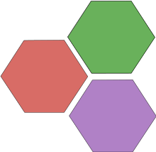

```@meta
EditURL = "../../../../../examples/classic2d/1.hard-hexagon/main.jl"
```

[](https://mybinder.org/v2/gh/QuantumKitHub/MPSKit.jl/gh-pages?filepath=dev/examples/classic2d/1.hard-hexagon/main.ipynb)
[](https://nbviewer.jupyter.org/github/QuantumKitHub/MPSKit.jl/blob/gh-pages/dev/examples/classic2d/1.hard-hexagon/main.ipynb)
[](https://minhaskamal.github.io/DownGit/#/home?url=https://github.com/QuantumKitHub/MPSKit.jl/examples/tree/gh-pages/dev/examples/classic2d/1.hard-hexagon)

# [The Hard Hexagon model](@id demo_hardhexagon)



Tensor networks are a natural way to do statistical mechanics on a lattice.
As an example of this we will extract the central charge of the hard hexagon model.
This model is known to have central charge 0.8, and has very peculiar non-local (anyonic) symmetries.
Because TensorKit supports anyonic symmetries, so does MPSKit.
To follow the tutorial you need the following packages.

````julia
using MPSKit, MPSKitModels, TensorKit, Plots, Polynomials
````

The [hard hexagon model](https://en.wikipedia.org/wiki/Hard_hexagon_model) is a 2-dimensional lattice model of a gas, where particles are allowed to be on the vertices of a triangular lattice, but no two particles may be adjacent.
This can be encoded in a transfer matrix with a local MPO tensor using anyonic symmetries, and the resulting MPO has been implemented in MPSKitModels.

In order to use these anyonic symmetries, we need to generalise the notion of the bond dimension and define how it interacts with the symmetry. Thus, we implement away of converting integers to symmetric spaces of the given dimension, which provides a crude guess for how the final MPS would distribute its Schmidt spectrum.

````julia
mpo = hard_hexagon()
P = physicalspace(mpo, 1)
function virtual_space(D::Integer)
    _D = round(Int, D / sum(dim, values(FibonacciAnyon)))
    return Vect[FibonacciAnyon](sector => _D for sector in (:I, :τ))
end

@assert isapprox(dim(virtual_space(100)), 100; atol=3)
````

## The leading boundary

One way to study statistical mechanics in infinite systems with tensor networks is by approximating the dominant eigenvector of the transfer matrix by an MPS.
This dominant eigenvector contains a lot of hidden information.
For example, the free energy can be extracted by computing the expectation value of the mpo.
Additionally, we can compute the entanglement entropy as well as the correlation length of the state:

````julia
D = 10
V = virtual_space(D)
ψ₀ = InfiniteMPS([P], [V])
ψ, envs, = leading_boundary(ψ₀, mpo,
                            VUMPS(; verbosity=0,
                                  alg_eigsolve=MPSKit.Defaults.alg_eigsolve(;
                                                                            ishermitian=false))) # use non-hermitian eigensolver
F = real(expectation_value(ψ, mpo))
S = real(first(entropy(ψ)))
ξ = correlation_length(ψ)
println("F = $F\tS = $S\tξ = $ξ")
````

````
F = 0.8839037051703852	S = 1.2807829622066444	ξ = 13.849682583029384

````

## The scaling hypothesis

The dominant eigenvector is of course only an approximation. The finite bond dimension enforces a finite correlation length, which effectively introduces a length scale in the system. This can be exploited to formulate a scaling hypothesis [pollmann2009](@cite), which in turn allows to extract the central charge.

First we need to know the entropy and correlation length at a bunch of different bond dimensions. Our approach will be to re-use the previous approximated dominant eigenvector, and then expanding its bond dimension and re-running VUMPS.
According to the scaling hypothesis we should have ``S \propto \frac{c}{6} log(ξ)``. Therefore we should find ``c`` using

````julia
function scaling_simulations(ψ₀, mpo, Ds; verbosity=0, tol=1e-6,
                             alg_eigsolve=MPSKit.Defaults.alg_eigsolve(; ishermitian=false))
    entropies = similar(Ds, Float64)
    correlations = similar(Ds, Float64)
    alg = VUMPS(; verbosity, tol, alg_eigsolve)

    ψ, envs, = leading_boundary(ψ₀, mpo, alg)
    entropies[1] = real(entropy(ψ)[1])
    correlations[1] = correlation_length(ψ)

    for (i, d) in enumerate(diff(Ds))
        ψ, envs = changebonds(ψ, mpo, OptimalExpand(; trscheme=truncdim(d)), envs)
        ψ, envs, = leading_boundary(ψ, mpo, alg, envs)
        entropies[i + 1] = real(entropy(ψ)[1])
        correlations[i + 1] = correlation_length(ψ)
    end
    return entropies, correlations
end

bond_dimensions = 10:5:25
ψ₀ = InfiniteMPS([P], [virtual_space(bond_dimensions[1])])
Ss, ξs = scaling_simulations(ψ₀, mpo, bond_dimensions)

f = fit(log.(ξs), 6 * Ss, 1)
c = f.coeffs[2]
````

````
0.8025249301530266
````

````julia
p = plot(; xlabel="logarithmic correlation length", ylabel="entanglement entropy")
p = plot(log.(ξs), Ss; seriestype=:scatter, label=nothing)
plot!(p, ξ -> f(ξ) / 6; label="fit")
````

```@raw html
<?xml version="1.0" encoding="utf-8"?>
<svg xmlns="http://www.w3.org/2000/svg" xmlns:xlink="http://www.w3.org/1999/xlink" width="600" height="400" viewBox="0 0 2400 1600">
<defs>
  <clipPath id="clip970">
    <rect x="0" y="0" width="2400" height="1600"/>
  </clipPath>
</defs>
<path clip-path="url(#clip970)" d="M0 1600 L2400 1600 L2400 0 L0 0  Z" fill="#ffffff" fill-rule="evenodd" fill-opacity="1"/>
<defs>
  <clipPath id="clip971">
    <rect x="480" y="0" width="1681" height="1600"/>
  </clipPath>
</defs>
<path clip-path="url(#clip970)" d="M184.191 1486.45 L2352.76 1486.45 L2352.76 47.2441 L184.191 47.2441  Z" fill="#ffffff" fill-rule="evenodd" fill-opacity="1"/>
<defs>
  <clipPath id="clip972">
    <rect x="184" y="47" width="2170" height="1440"/>
  </clipPath>
</defs>
<polyline clip-path="url(#clip972)" style="stroke:#000000; stroke-linecap:round; stroke-linejoin:round; stroke-width:2; stroke-opacity:0.1; fill:none" points="401.771,1486.45 401.771,47.2441 "/>
<polyline clip-path="url(#clip972)" style="stroke:#000000; stroke-linecap:round; stroke-linejoin:round; stroke-width:2; stroke-opacity:0.1; fill:none" points="722.556,1486.45 722.556,47.2441 "/>
<polyline clip-path="url(#clip972)" style="stroke:#000000; stroke-linecap:round; stroke-linejoin:round; stroke-width:2; stroke-opacity:0.1; fill:none" points="1043.34,1486.45 1043.34,47.2441 "/>
<polyline clip-path="url(#clip972)" style="stroke:#000000; stroke-linecap:round; stroke-linejoin:round; stroke-width:2; stroke-opacity:0.1; fill:none" points="1364.13,1486.45 1364.13,47.2441 "/>
<polyline clip-path="url(#clip972)" style="stroke:#000000; stroke-linecap:round; stroke-linejoin:round; stroke-width:2; stroke-opacity:0.1; fill:none" points="1684.91,1486.45 1684.91,47.2441 "/>
<polyline clip-path="url(#clip972)" style="stroke:#000000; stroke-linecap:round; stroke-linejoin:round; stroke-width:2; stroke-opacity:0.1; fill:none" points="2005.7,1486.45 2005.7,47.2441 "/>
<polyline clip-path="url(#clip972)" style="stroke:#000000; stroke-linecap:round; stroke-linejoin:round; stroke-width:2; stroke-opacity:0.1; fill:none" points="2326.49,1486.45 2326.49,47.2441 "/>
<polyline clip-path="url(#clip972)" style="stroke:#000000; stroke-linecap:round; stroke-linejoin:round; stroke-width:2; stroke-opacity:0.1; fill:none" points="184.191,1324.01 2352.76,1324.01 "/>
<polyline clip-path="url(#clip972)" style="stroke:#000000; stroke-linecap:round; stroke-linejoin:round; stroke-width:2; stroke-opacity:0.1; fill:none" points="184.191,1007.35 2352.76,1007.35 "/>
<polyline clip-path="url(#clip972)" style="stroke:#000000; stroke-linecap:round; stroke-linejoin:round; stroke-width:2; stroke-opacity:0.1; fill:none" points="184.191,690.692 2352.76,690.692 "/>
<polyline clip-path="url(#clip972)" style="stroke:#000000; stroke-linecap:round; stroke-linejoin:round; stroke-width:2; stroke-opacity:0.1; fill:none" points="184.191,374.033 2352.76,374.033 "/>
<polyline clip-path="url(#clip972)" style="stroke:#000000; stroke-linecap:round; stroke-linejoin:round; stroke-width:2; stroke-opacity:0.1; fill:none" points="184.191,57.3727 2352.76,57.3727 "/>
<polyline clip-path="url(#clip970)" style="stroke:#000000; stroke-linecap:round; stroke-linejoin:round; stroke-width:4; stroke-opacity:1; fill:none" points="184.191,1486.45 2352.76,1486.45 "/>
<polyline clip-path="url(#clip970)" style="stroke:#000000; stroke-linecap:round; stroke-linejoin:round; stroke-width:4; stroke-opacity:1; fill:none" points="401.771,1486.45 401.771,1467.55 "/>
<polyline clip-path="url(#clip970)" style="stroke:#000000; stroke-linecap:round; stroke-linejoin:round; stroke-width:4; stroke-opacity:1; fill:none" points="722.556,1486.45 722.556,1467.55 "/>
<polyline clip-path="url(#clip970)" style="stroke:#000000; stroke-linecap:round; stroke-linejoin:round; stroke-width:4; stroke-opacity:1; fill:none" points="1043.34,1486.45 1043.34,1467.55 "/>
<polyline clip-path="url(#clip970)" style="stroke:#000000; stroke-linecap:round; stroke-linejoin:round; stroke-width:4; stroke-opacity:1; fill:none" points="1364.13,1486.45 1364.13,1467.55 "/>
<polyline clip-path="url(#clip970)" style="stroke:#000000; stroke-linecap:round; stroke-linejoin:round; stroke-width:4; stroke-opacity:1; fill:none" points="1684.91,1486.45 1684.91,1467.55 "/>
<polyline clip-path="url(#clip970)" style="stroke:#000000; stroke-linecap:round; stroke-linejoin:round; stroke-width:4; stroke-opacity:1; fill:none" points="2005.7,1486.45 2005.7,1467.55 "/>
<polyline clip-path="url(#clip970)" style="stroke:#000000; stroke-linecap:round; stroke-linejoin:round; stroke-width:4; stroke-opacity:1; fill:none" points="2326.49,1486.45 2326.49,1467.55 "/>
<path clip-path="url(#clip970)" d="M358.426 1544.91 L374.745 1544.91 L374.745 1548.85 L352.801 1548.85 L352.801 1544.91 Q355.463 1542.16 360.046 1537.53 Q364.653 1532.88 365.833 1531.53 Q368.079 1529.01 368.958 1527.27 Q369.861 1525.51 369.861 1523.82 Q369.861 1521.07 367.917 1519.33 Q365.995 1517.6 362.893 1517.6 Q360.694 1517.6 358.241 1518.36 Q355.81 1519.13 353.032 1520.68 L353.032 1515.95 Q355.856 1514.82 358.31 1514.24 Q360.764 1513.66 362.801 1513.66 Q368.171 1513.66 371.366 1516.35 Q374.56 1519.03 374.56 1523.52 Q374.56 1525.65 373.75 1527.57 Q372.963 1529.47 370.856 1532.07 Q370.278 1532.74 367.176 1535.95 Q364.074 1539.15 358.426 1544.91 Z" fill="#000000" fill-rule="nonzero" fill-opacity="1" /><path clip-path="url(#clip970)" d="M384.56 1542.97 L389.444 1542.97 L389.444 1548.85 L384.56 1548.85 L384.56 1542.97 Z" fill="#000000" fill-rule="nonzero" fill-opacity="1" /><path clip-path="url(#clip970)" d="M398.449 1514.29 L420.671 1514.29 L420.671 1516.28 L408.125 1548.85 L403.24 1548.85 L415.046 1518.22 L398.449 1518.22 L398.449 1514.29 Z" fill="#000000" fill-rule="nonzero" fill-opacity="1" /><path clip-path="url(#clip970)" d="M429.837 1514.29 L448.194 1514.29 L448.194 1518.22 L434.12 1518.22 L434.12 1526.7 Q435.138 1526.35 436.157 1526.19 Q437.175 1526 438.194 1526 Q443.981 1526 447.361 1529.17 Q450.74 1532.34 450.74 1537.76 Q450.74 1543.34 447.268 1546.44 Q443.796 1549.52 437.476 1549.52 Q435.3 1549.52 433.032 1549.15 Q430.787 1548.78 428.379 1548.04 L428.379 1543.34 Q430.462 1544.47 432.685 1545.03 Q434.907 1545.58 437.384 1545.58 Q441.388 1545.58 443.726 1543.48 Q446.064 1541.37 446.064 1537.76 Q446.064 1534.15 443.726 1532.04 Q441.388 1529.94 437.384 1529.94 Q435.509 1529.94 433.634 1530.35 Q431.782 1530.77 429.837 1531.65 L429.837 1514.29 Z" fill="#000000" fill-rule="nonzero" fill-opacity="1" /><path clip-path="url(#clip970)" d="M688.784 1530.21 Q692.14 1530.93 694.015 1533.2 Q695.913 1535.47 695.913 1538.8 Q695.913 1543.92 692.395 1546.72 Q688.876 1549.52 682.395 1549.52 Q680.219 1549.52 677.904 1549.08 Q675.612 1548.66 673.159 1547.81 L673.159 1543.29 Q675.103 1544.43 677.418 1545.01 Q679.733 1545.58 682.256 1545.58 Q686.654 1545.58 688.946 1543.85 Q691.26 1542.11 691.26 1538.8 Q691.26 1535.75 689.108 1534.03 Q686.978 1532.3 683.159 1532.3 L679.131 1532.3 L679.131 1528.45 L683.344 1528.45 Q686.793 1528.45 688.621 1527.09 Q690.45 1525.7 690.45 1523.11 Q690.45 1520.45 688.552 1519.03 Q686.677 1517.6 683.159 1517.6 Q681.237 1517.6 679.038 1518.01 Q676.839 1518.43 674.2 1519.31 L674.2 1515.14 Q676.862 1514.4 679.177 1514.03 Q681.515 1513.66 683.575 1513.66 Q688.899 1513.66 692.001 1516.09 Q695.103 1518.5 695.103 1522.62 Q695.103 1525.49 693.459 1527.48 Q691.816 1529.45 688.784 1530.21 Z" fill="#000000" fill-rule="nonzero" fill-opacity="1" /><path clip-path="url(#clip970)" d="M704.779 1542.97 L709.663 1542.97 L709.663 1548.85 L704.779 1548.85 L704.779 1542.97 Z" fill="#000000" fill-rule="nonzero" fill-opacity="1" /><path clip-path="url(#clip970)" d="M729.848 1517.37 Q726.237 1517.37 724.408 1520.93 Q722.603 1524.47 722.603 1531.6 Q722.603 1538.71 724.408 1542.27 Q726.237 1545.82 729.848 1545.82 Q733.482 1545.82 735.288 1542.27 Q737.117 1538.71 737.117 1531.6 Q737.117 1524.47 735.288 1520.93 Q733.482 1517.37 729.848 1517.37 M729.848 1513.66 Q735.658 1513.66 738.714 1518.27 Q741.792 1522.85 741.792 1531.6 Q741.792 1540.33 738.714 1544.94 Q735.658 1549.52 729.848 1549.52 Q724.038 1549.52 720.959 1544.94 Q717.904 1540.33 717.904 1531.6 Q717.904 1522.85 720.959 1518.27 Q724.038 1513.66 729.848 1513.66 Z" fill="#000000" fill-rule="nonzero" fill-opacity="1" /><path clip-path="url(#clip970)" d="M760.01 1517.37 Q756.399 1517.37 754.57 1520.93 Q752.765 1524.47 752.765 1531.6 Q752.765 1538.71 754.57 1542.27 Q756.399 1545.82 760.01 1545.82 Q763.644 1545.82 765.45 1542.27 Q767.278 1538.71 767.278 1531.6 Q767.278 1524.47 765.45 1520.93 Q763.644 1517.37 760.01 1517.37 M760.01 1513.66 Q765.82 1513.66 768.876 1518.27 Q771.954 1522.85 771.954 1531.6 Q771.954 1540.33 768.876 1544.94 Q765.82 1549.52 760.01 1549.52 Q754.2 1549.52 751.121 1544.94 Q748.066 1540.33 748.066 1531.6 Q748.066 1522.85 751.121 1518.27 Q754.2 1513.66 760.01 1513.66 Z" fill="#000000" fill-rule="nonzero" fill-opacity="1" /><path clip-path="url(#clip970)" d="M1010.07 1530.21 Q1013.42 1530.93 1015.3 1533.2 Q1017.2 1535.47 1017.2 1538.8 Q1017.2 1543.92 1013.68 1546.72 Q1010.16 1549.52 1003.68 1549.52 Q1001.5 1549.52 999.188 1549.08 Q996.896 1548.66 994.442 1547.81 L994.442 1543.29 Q996.387 1544.43 998.701 1545.01 Q1001.02 1545.58 1003.54 1545.58 Q1007.94 1545.58 1010.23 1543.85 Q1012.54 1542.11 1012.54 1538.8 Q1012.54 1535.75 1010.39 1534.03 Q1008.26 1532.3 1004.44 1532.3 L1000.41 1532.3 L1000.41 1528.45 L1004.63 1528.45 Q1008.08 1528.45 1009.91 1527.09 Q1011.73 1525.7 1011.73 1523.11 Q1011.73 1520.45 1009.84 1519.03 Q1007.96 1517.6 1004.44 1517.6 Q1002.52 1517.6 1000.32 1518.01 Q998.123 1518.43 995.484 1519.31 L995.484 1515.14 Q998.146 1514.4 1000.46 1514.03 Q1002.8 1513.66 1004.86 1513.66 Q1010.18 1513.66 1013.28 1516.09 Q1016.39 1518.5 1016.39 1522.62 Q1016.39 1525.49 1014.74 1527.48 Q1013.1 1529.45 1010.07 1530.21 Z" fill="#000000" fill-rule="nonzero" fill-opacity="1" /><path clip-path="url(#clip970)" d="M1026.06 1542.97 L1030.95 1542.97 L1030.95 1548.85 L1026.06 1548.85 L1026.06 1542.97 Z" fill="#000000" fill-rule="nonzero" fill-opacity="1" /><path clip-path="url(#clip970)" d="M1045.16 1544.91 L1061.48 1544.91 L1061.48 1548.85 L1039.53 1548.85 L1039.53 1544.91 Q1042.2 1542.16 1046.78 1537.53 Q1051.39 1532.88 1052.57 1531.53 Q1054.81 1529.01 1055.69 1527.27 Q1056.59 1525.51 1056.59 1523.82 Q1056.59 1521.07 1054.65 1519.33 Q1052.73 1517.6 1049.63 1517.6 Q1047.43 1517.6 1044.97 1518.36 Q1042.54 1519.13 1039.77 1520.68 L1039.77 1515.95 Q1042.59 1514.82 1045.04 1514.24 Q1047.5 1513.66 1049.53 1513.66 Q1054.9 1513.66 1058.1 1516.35 Q1061.29 1519.03 1061.29 1523.52 Q1061.29 1525.65 1060.48 1527.57 Q1059.7 1529.47 1057.59 1532.07 Q1057.01 1532.74 1053.91 1535.95 Q1050.81 1539.15 1045.16 1544.91 Z" fill="#000000" fill-rule="nonzero" fill-opacity="1" /><path clip-path="url(#clip970)" d="M1071.34 1514.29 L1089.7 1514.29 L1089.7 1518.22 L1075.62 1518.22 L1075.62 1526.7 Q1076.64 1526.35 1077.66 1526.19 Q1078.68 1526 1079.7 1526 Q1085.48 1526 1088.86 1529.17 Q1092.24 1532.34 1092.24 1537.76 Q1092.24 1543.34 1088.77 1546.44 Q1085.3 1549.52 1078.98 1549.52 Q1076.8 1549.52 1074.53 1549.15 Q1072.29 1548.78 1069.88 1548.04 L1069.88 1543.34 Q1071.96 1544.47 1074.19 1545.03 Q1076.41 1545.58 1078.89 1545.58 Q1082.89 1545.58 1085.23 1543.48 Q1087.57 1541.37 1087.57 1537.76 Q1087.57 1534.15 1085.23 1532.04 Q1082.89 1529.94 1078.89 1529.94 Q1077.01 1529.94 1075.14 1530.35 Q1073.28 1530.77 1071.34 1531.65 L1071.34 1514.29 Z" fill="#000000" fill-rule="nonzero" fill-opacity="1" /><path clip-path="url(#clip970)" d="M1330.36 1530.21 Q1333.71 1530.93 1335.59 1533.2 Q1337.49 1535.47 1337.49 1538.8 Q1337.49 1543.92 1333.97 1546.72 Q1330.45 1549.52 1323.97 1549.52 Q1321.79 1549.52 1319.48 1549.08 Q1317.18 1548.66 1314.73 1547.81 L1314.73 1543.29 Q1316.67 1544.43 1318.99 1545.01 Q1321.3 1545.58 1323.83 1545.58 Q1328.23 1545.58 1330.52 1543.85 Q1332.83 1542.11 1332.83 1538.8 Q1332.83 1535.75 1330.68 1534.03 Q1328.55 1532.3 1324.73 1532.3 L1320.7 1532.3 L1320.7 1528.45 L1324.92 1528.45 Q1328.36 1528.45 1330.19 1527.09 Q1332.02 1525.7 1332.02 1523.11 Q1332.02 1520.45 1330.12 1519.03 Q1328.25 1517.6 1324.73 1517.6 Q1322.81 1517.6 1320.61 1518.01 Q1318.41 1518.43 1315.77 1519.31 L1315.77 1515.14 Q1318.43 1514.4 1320.75 1514.03 Q1323.09 1513.66 1325.15 1513.66 Q1330.47 1513.66 1333.57 1516.09 Q1336.67 1518.5 1336.67 1522.62 Q1336.67 1525.49 1335.03 1527.48 Q1333.39 1529.45 1330.36 1530.21 Z" fill="#000000" fill-rule="nonzero" fill-opacity="1" /><path clip-path="url(#clip970)" d="M1346.35 1542.97 L1351.23 1542.97 L1351.23 1548.85 L1346.35 1548.85 L1346.35 1542.97 Z" fill="#000000" fill-rule="nonzero" fill-opacity="1" /><path clip-path="url(#clip970)" d="M1361.47 1514.29 L1379.82 1514.29 L1379.82 1518.22 L1365.75 1518.22 L1365.75 1526.7 Q1366.77 1526.35 1367.79 1526.19 Q1368.8 1526 1369.82 1526 Q1375.61 1526 1378.99 1529.17 Q1382.37 1532.34 1382.37 1537.76 Q1382.37 1543.34 1378.9 1546.44 Q1375.42 1549.52 1369.11 1549.52 Q1366.93 1549.52 1364.66 1549.15 Q1362.42 1548.78 1360.01 1548.04 L1360.01 1543.34 Q1362.09 1544.47 1364.31 1545.03 Q1366.54 1545.58 1369.01 1545.58 Q1373.02 1545.58 1375.36 1543.48 Q1377.69 1541.37 1377.69 1537.76 Q1377.69 1534.15 1375.36 1532.04 Q1373.02 1529.94 1369.01 1529.94 Q1367.14 1529.94 1365.26 1530.35 Q1363.41 1530.77 1361.47 1531.65 L1361.47 1514.29 Z" fill="#000000" fill-rule="nonzero" fill-opacity="1" /><path clip-path="url(#clip970)" d="M1401.58 1517.37 Q1397.97 1517.37 1396.14 1520.93 Q1394.34 1524.47 1394.34 1531.6 Q1394.34 1538.71 1396.14 1542.27 Q1397.97 1545.82 1401.58 1545.82 Q1405.22 1545.82 1407.02 1542.27 Q1408.85 1538.71 1408.85 1531.6 Q1408.85 1524.47 1407.02 1520.93 Q1405.22 1517.37 1401.58 1517.37 M1401.58 1513.66 Q1407.39 1513.66 1410.45 1518.27 Q1413.53 1522.85 1413.53 1531.6 Q1413.53 1540.33 1410.45 1544.94 Q1407.39 1549.52 1401.58 1549.52 Q1395.77 1549.52 1392.69 1544.94 Q1389.64 1540.33 1389.64 1531.6 Q1389.64 1522.85 1392.69 1518.27 Q1395.77 1513.66 1401.58 1513.66 Z" fill="#000000" fill-rule="nonzero" fill-opacity="1" /><path clip-path="url(#clip970)" d="M1651.64 1530.21 Q1655 1530.93 1656.87 1533.2 Q1658.77 1535.47 1658.77 1538.8 Q1658.77 1543.92 1655.25 1546.72 Q1651.73 1549.52 1645.25 1549.52 Q1643.07 1549.52 1640.76 1549.08 Q1638.47 1548.66 1636.01 1547.81 L1636.01 1543.29 Q1637.96 1544.43 1640.27 1545.01 Q1642.59 1545.58 1645.11 1545.58 Q1649.51 1545.58 1651.8 1543.85 Q1654.12 1542.11 1654.12 1538.8 Q1654.12 1535.75 1651.96 1534.03 Q1649.83 1532.3 1646.01 1532.3 L1641.99 1532.3 L1641.99 1528.45 L1646.2 1528.45 Q1649.65 1528.45 1651.48 1527.09 Q1653.31 1525.7 1653.31 1523.11 Q1653.31 1520.45 1651.41 1519.03 Q1649.53 1517.6 1646.01 1517.6 Q1644.09 1517.6 1641.89 1518.01 Q1639.69 1518.43 1637.06 1519.31 L1637.06 1515.14 Q1639.72 1514.4 1642.03 1514.03 Q1644.37 1513.66 1646.43 1513.66 Q1651.75 1513.66 1654.86 1516.09 Q1657.96 1518.5 1657.96 1522.62 Q1657.96 1525.49 1656.32 1527.48 Q1654.67 1529.45 1651.64 1530.21 Z" fill="#000000" fill-rule="nonzero" fill-opacity="1" /><path clip-path="url(#clip970)" d="M1667.63 1542.97 L1672.52 1542.97 L1672.52 1548.85 L1667.63 1548.85 L1667.63 1542.97 Z" fill="#000000" fill-rule="nonzero" fill-opacity="1" /><path clip-path="url(#clip970)" d="M1681.52 1514.29 L1703.75 1514.29 L1703.75 1516.28 L1691.2 1548.85 L1686.31 1548.85 L1698.12 1518.22 L1681.52 1518.22 L1681.52 1514.29 Z" fill="#000000" fill-rule="nonzero" fill-opacity="1" /><path clip-path="url(#clip970)" d="M1712.91 1514.29 L1731.27 1514.29 L1731.27 1518.22 L1717.19 1518.22 L1717.19 1526.7 Q1718.21 1526.35 1719.23 1526.19 Q1720.25 1526 1721.27 1526 Q1727.06 1526 1730.43 1529.17 Q1733.81 1532.34 1733.81 1537.76 Q1733.81 1543.34 1730.34 1546.44 Q1726.87 1549.52 1720.55 1549.52 Q1718.37 1549.52 1716.11 1549.15 Q1713.86 1548.78 1711.45 1548.04 L1711.45 1543.34 Q1713.54 1544.47 1715.76 1545.03 Q1717.98 1545.58 1720.46 1545.58 Q1724.46 1545.58 1726.8 1543.48 Q1729.14 1541.37 1729.14 1537.76 Q1729.14 1534.15 1726.8 1532.04 Q1724.46 1529.94 1720.46 1529.94 Q1718.58 1529.94 1716.71 1530.35 Q1714.86 1530.77 1712.91 1531.65 L1712.91 1514.29 Z" fill="#000000" fill-rule="nonzero" fill-opacity="1" /><path clip-path="url(#clip970)" d="M1971.26 1518.36 L1959.45 1536.81 L1971.26 1536.81 L1971.26 1518.36 M1970.03 1514.29 L1975.91 1514.29 L1975.91 1536.81 L1980.84 1536.81 L1980.84 1540.7 L1975.91 1540.7 L1975.91 1548.85 L1971.26 1548.85 L1971.26 1540.7 L1955.65 1540.7 L1955.65 1536.19 L1970.03 1514.29 Z" fill="#000000" fill-rule="nonzero" fill-opacity="1" /><path clip-path="url(#clip970)" d="M1988.57 1542.97 L1993.46 1542.97 L1993.46 1548.85 L1988.57 1548.85 L1988.57 1542.97 Z" fill="#000000" fill-rule="nonzero" fill-opacity="1" /><path clip-path="url(#clip970)" d="M2013.64 1517.37 Q2010.03 1517.37 2008.2 1520.93 Q2006.39 1524.47 2006.39 1531.6 Q2006.39 1538.71 2008.2 1542.27 Q2010.03 1545.82 2013.64 1545.82 Q2017.27 1545.82 2019.08 1542.27 Q2020.91 1538.71 2020.91 1531.6 Q2020.91 1524.47 2019.08 1520.93 Q2017.27 1517.37 2013.64 1517.37 M2013.64 1513.66 Q2019.45 1513.66 2022.51 1518.27 Q2025.58 1522.85 2025.58 1531.6 Q2025.58 1540.33 2022.51 1544.94 Q2019.45 1549.52 2013.64 1549.52 Q2007.83 1549.52 2004.75 1544.94 Q2001.7 1540.33 2001.7 1531.6 Q2001.7 1522.85 2004.75 1518.27 Q2007.83 1513.66 2013.64 1513.66 Z" fill="#000000" fill-rule="nonzero" fill-opacity="1" /><path clip-path="url(#clip970)" d="M2043.8 1517.37 Q2040.19 1517.37 2038.36 1520.93 Q2036.56 1524.47 2036.56 1531.6 Q2036.56 1538.71 2038.36 1542.27 Q2040.19 1545.82 2043.8 1545.82 Q2047.44 1545.82 2049.24 1542.27 Q2051.07 1538.71 2051.07 1531.6 Q2051.07 1524.47 2049.24 1520.93 Q2047.44 1517.37 2043.8 1517.37 M2043.8 1513.66 Q2049.61 1513.66 2052.67 1518.27 Q2055.75 1522.85 2055.75 1531.6 Q2055.75 1540.33 2052.67 1544.94 Q2049.61 1549.52 2043.8 1549.52 Q2037.99 1549.52 2034.91 1544.94 Q2031.86 1540.33 2031.86 1531.6 Q2031.86 1522.85 2034.91 1518.27 Q2037.99 1513.66 2043.8 1513.66 Z" fill="#000000" fill-rule="nonzero" fill-opacity="1" /><path clip-path="url(#clip970)" d="M2292.54 1518.36 L2280.73 1536.81 L2292.54 1536.81 L2292.54 1518.36 M2291.31 1514.29 L2297.19 1514.29 L2297.19 1536.81 L2302.12 1536.81 L2302.12 1540.7 L2297.19 1540.7 L2297.19 1548.85 L2292.54 1548.85 L2292.54 1540.7 L2276.94 1540.7 L2276.94 1536.19 L2291.31 1514.29 Z" fill="#000000" fill-rule="nonzero" fill-opacity="1" /><path clip-path="url(#clip970)" d="M2309.85 1542.97 L2314.74 1542.97 L2314.74 1548.85 L2309.85 1548.85 L2309.85 1542.97 Z" fill="#000000" fill-rule="nonzero" fill-opacity="1" /><path clip-path="url(#clip970)" d="M2328.95 1544.91 L2345.27 1544.91 L2345.27 1548.85 L2323.33 1548.85 L2323.33 1544.91 Q2325.99 1542.16 2330.57 1537.53 Q2335.18 1532.88 2336.36 1531.53 Q2338.6 1529.01 2339.48 1527.27 Q2340.39 1525.51 2340.39 1523.82 Q2340.39 1521.07 2338.44 1519.33 Q2336.52 1517.6 2333.42 1517.6 Q2331.22 1517.6 2328.77 1518.36 Q2326.34 1519.13 2323.56 1520.68 L2323.56 1515.95 Q2326.38 1514.82 2328.84 1514.24 Q2331.29 1513.66 2333.33 1513.66 Q2338.7 1513.66 2341.89 1516.35 Q2345.09 1519.03 2345.09 1523.52 Q2345.09 1525.65 2344.28 1527.57 Q2343.49 1529.47 2341.38 1532.07 Q2340.8 1532.74 2337.7 1535.95 Q2334.6 1539.15 2328.95 1544.91 Z" fill="#000000" fill-rule="nonzero" fill-opacity="1" /><path clip-path="url(#clip970)" d="M2355.13 1514.29 L2373.49 1514.29 L2373.49 1518.22 L2359.41 1518.22 L2359.41 1526.7 Q2360.43 1526.35 2361.45 1526.19 Q2362.47 1526 2363.49 1526 Q2369.28 1526 2372.66 1529.17 Q2376.03 1532.34 2376.03 1537.76 Q2376.03 1543.34 2372.56 1546.44 Q2369.09 1549.52 2362.77 1549.52 Q2360.59 1549.52 2358.33 1549.15 Q2356.08 1548.78 2353.67 1548.04 L2353.67 1543.34 Q2355.76 1544.47 2357.98 1545.03 Q2360.2 1545.58 2362.68 1545.58 Q2366.68 1545.58 2369.02 1543.48 Q2371.36 1541.37 2371.36 1537.76 Q2371.36 1534.15 2369.02 1532.04 Q2366.68 1529.94 2362.68 1529.94 Q2360.8 1529.94 2358.93 1530.35 Q2357.08 1530.77 2355.13 1531.65 L2355.13 1514.29 Z" fill="#000000" fill-rule="nonzero" fill-opacity="1" /><polyline clip-path="url(#clip970)" style="stroke:#000000; stroke-linecap:round; stroke-linejoin:round; stroke-width:4; stroke-opacity:1; fill:none" points="184.191,1486.45 184.191,47.2441 "/>
<polyline clip-path="url(#clip970)" style="stroke:#000000; stroke-linecap:round; stroke-linejoin:round; stroke-width:4; stroke-opacity:1; fill:none" points="184.191,1324.01 203.088,1324.01 "/>
<polyline clip-path="url(#clip970)" style="stroke:#000000; stroke-linecap:round; stroke-linejoin:round; stroke-width:4; stroke-opacity:1; fill:none" points="184.191,1007.35 203.088,1007.35 "/>
<polyline clip-path="url(#clip970)" style="stroke:#000000; stroke-linecap:round; stroke-linejoin:round; stroke-width:4; stroke-opacity:1; fill:none" points="184.191,690.692 203.088,690.692 "/>
<polyline clip-path="url(#clip970)" style="stroke:#000000; stroke-linecap:round; stroke-linejoin:round; stroke-width:4; stroke-opacity:1; fill:none" points="184.191,374.033 203.088,374.033 "/>
<polyline clip-path="url(#clip970)" style="stroke:#000000; stroke-linecap:round; stroke-linejoin:round; stroke-width:4; stroke-opacity:1; fill:none" points="184.191,57.3727 203.088,57.3727 "/>
<path clip-path="url(#clip970)" d="M51.6634 1337.36 L59.3023 1337.36 L59.3023 1310.99 L50.9921 1312.66 L50.9921 1308.4 L59.256 1306.73 L63.9319 1306.73 L63.9319 1337.36 L71.5707 1337.36 L71.5707 1341.29 L51.6634 1341.29 L51.6634 1337.36 Z" fill="#000000" fill-rule="nonzero" fill-opacity="1" /><path clip-path="url(#clip970)" d="M81.0151 1335.41 L85.8993 1335.41 L85.8993 1341.29 L81.0151 1341.29 L81.0151 1335.41 Z" fill="#000000" fill-rule="nonzero" fill-opacity="1" /><path clip-path="url(#clip970)" d="M110.251 1322.66 Q113.608 1323.38 115.483 1325.64 Q117.381 1327.91 117.381 1331.25 Q117.381 1336.36 113.862 1339.16 Q110.344 1341.96 103.862 1341.96 Q101.686 1341.96 99.3715 1341.52 Q97.0798 1341.11 94.6262 1340.25 L94.6262 1335.74 Q96.5706 1336.87 98.8854 1337.45 Q101.2 1338.03 103.723 1338.03 Q108.121 1338.03 110.413 1336.29 Q112.728 1334.56 112.728 1331.25 Q112.728 1328.19 110.575 1326.48 Q108.446 1324.74 104.626 1324.74 L100.598 1324.74 L100.598 1320.9 L104.811 1320.9 Q108.26 1320.9 110.089 1319.53 Q111.918 1318.14 111.918 1315.55 Q111.918 1312.89 110.02 1311.48 Q108.145 1310.04 104.626 1310.04 Q102.705 1310.04 100.506 1310.46 Q98.3067 1310.88 95.6678 1311.75 L95.6678 1307.59 Q98.3298 1306.85 100.645 1306.48 Q102.983 1306.11 105.043 1306.11 Q110.367 1306.11 113.469 1308.54 Q116.57 1310.94 116.57 1315.07 Q116.57 1317.94 114.927 1319.93 Q113.283 1321.89 110.251 1322.66 Z" fill="#000000" fill-rule="nonzero" fill-opacity="1" /><path clip-path="url(#clip970)" d="M136.246 1309.81 Q132.635 1309.81 130.807 1313.38 Q129.001 1316.92 129.001 1324.05 Q129.001 1331.15 130.807 1334.72 Q132.635 1338.26 136.246 1338.26 Q139.881 1338.26 141.686 1334.72 Q143.515 1331.15 143.515 1324.05 Q143.515 1316.92 141.686 1313.38 Q139.881 1309.81 136.246 1309.81 M136.246 1306.11 Q142.056 1306.11 145.112 1310.71 Q148.191 1315.3 148.191 1324.05 Q148.191 1332.77 145.112 1337.38 Q142.056 1341.96 136.246 1341.96 Q130.436 1341.96 127.357 1337.38 Q124.302 1332.77 124.302 1324.05 Q124.302 1315.3 127.357 1310.71 Q130.436 1306.11 136.246 1306.11 Z" fill="#000000" fill-rule="nonzero" fill-opacity="1" /><path clip-path="url(#clip970)" d="M52.6588 1020.7 L60.2976 1020.7 L60.2976 994.331 L51.9875 995.998 L51.9875 991.739 L60.2513 990.072 L64.9272 990.072 L64.9272 1020.7 L72.5661 1020.7 L72.5661 1024.63 L52.6588 1024.63 L52.6588 1020.7 Z" fill="#000000" fill-rule="nonzero" fill-opacity="1" /><path clip-path="url(#clip970)" d="M82.0105 1018.75 L86.8947 1018.75 L86.8947 1024.63 L82.0105 1024.63 L82.0105 1018.75 Z" fill="#000000" fill-rule="nonzero" fill-opacity="1" /><path clip-path="url(#clip970)" d="M111.246 1006 Q114.603 1006.72 116.478 1008.98 Q118.376 1011.25 118.376 1014.59 Q118.376 1019.7 114.858 1022.5 Q111.339 1025.3 104.858 1025.3 Q102.682 1025.3 100.367 1024.86 Q98.0752 1024.45 95.6215 1023.59 L95.6215 1019.08 Q97.566 1020.21 99.8808 1020.79 Q102.196 1021.37 104.719 1021.37 Q109.117 1021.37 111.408 1019.63 Q113.723 1017.9 113.723 1014.59 Q113.723 1011.53 111.571 1009.82 Q109.441 1008.08 105.621 1008.08 L101.594 1008.08 L101.594 1004.24 L105.807 1004.24 Q109.256 1004.24 111.084 1002.87 Q112.913 1001.48 112.913 998.891 Q112.913 996.229 111.015 994.817 Q109.14 993.382 105.621 993.382 Q103.7 993.382 101.501 993.799 Q99.3021 994.216 96.6632 995.095 L96.6632 990.929 Q99.3252 990.188 101.64 989.817 Q103.978 989.447 106.038 989.447 Q111.362 989.447 114.464 991.878 Q117.566 994.285 117.566 998.405 Q117.566 1001.28 115.922 1003.27 Q114.279 1005.23 111.246 1006 Z" fill="#000000" fill-rule="nonzero" fill-opacity="1" /><path clip-path="url(#clip970)" d="M127.288 990.072 L145.644 990.072 L145.644 994.007 L131.57 994.007 L131.57 1002.48 Q132.589 1002.13 133.607 1001.97 Q134.626 1001.78 135.644 1001.78 Q141.431 1001.78 144.811 1004.96 Q148.191 1008.13 148.191 1013.54 Q148.191 1019.12 144.718 1022.22 Q141.246 1025.3 134.927 1025.3 Q132.751 1025.3 130.482 1024.93 Q128.237 1024.56 125.83 1023.82 L125.83 1019.12 Q127.913 1020.26 130.135 1020.81 Q132.357 1021.37 134.834 1021.37 Q138.839 1021.37 141.177 1019.26 Q143.515 1017.16 143.515 1013.54 Q143.515 1009.93 141.177 1007.83 Q138.839 1005.72 134.834 1005.72 Q132.959 1005.72 131.084 1006.14 Q129.232 1006.55 127.288 1007.43 L127.288 990.072 Z" fill="#000000" fill-rule="nonzero" fill-opacity="1" /><path clip-path="url(#clip970)" d="M51.6634 704.037 L59.3023 704.037 L59.3023 677.672 L50.9921 679.338 L50.9921 675.079 L59.256 673.412 L63.9319 673.412 L63.9319 704.037 L71.5707 704.037 L71.5707 707.972 L51.6634 707.972 L51.6634 704.037 Z" fill="#000000" fill-rule="nonzero" fill-opacity="1" /><path clip-path="url(#clip970)" d="M81.0151 702.093 L85.8993 702.093 L85.8993 707.972 L81.0151 707.972 L81.0151 702.093 Z" fill="#000000" fill-rule="nonzero" fill-opacity="1" /><path clip-path="url(#clip970)" d="M108.932 677.486 L97.1261 695.935 L108.932 695.935 L108.932 677.486 M107.705 673.412 L113.584 673.412 L113.584 695.935 L118.515 695.935 L118.515 699.824 L113.584 699.824 L113.584 707.972 L108.932 707.972 L108.932 699.824 L93.3299 699.824 L93.3299 695.31 L107.705 673.412 Z" fill="#000000" fill-rule="nonzero" fill-opacity="1" /><path clip-path="url(#clip970)" d="M136.246 676.491 Q132.635 676.491 130.807 680.056 Q129.001 683.597 129.001 690.727 Q129.001 697.833 130.807 701.398 Q132.635 704.94 136.246 704.94 Q139.881 704.94 141.686 701.398 Q143.515 697.833 143.515 690.727 Q143.515 683.597 141.686 680.056 Q139.881 676.491 136.246 676.491 M136.246 672.787 Q142.056 672.787 145.112 677.394 Q148.191 681.977 148.191 690.727 Q148.191 699.454 145.112 704.06 Q142.056 708.644 136.246 708.644 Q130.436 708.644 127.357 704.06 Q124.302 699.454 124.302 690.727 Q124.302 681.977 127.357 677.394 Q130.436 672.787 136.246 672.787 Z" fill="#000000" fill-rule="nonzero" fill-opacity="1" /><path clip-path="url(#clip970)" d="M52.6588 387.377 L60.2976 387.377 L60.2976 361.012 L51.9875 362.678 L51.9875 358.419 L60.2513 356.753 L64.9272 356.753 L64.9272 387.377 L72.5661 387.377 L72.5661 391.313 L52.6588 391.313 L52.6588 387.377 Z" fill="#000000" fill-rule="nonzero" fill-opacity="1" /><path clip-path="url(#clip970)" d="M82.0105 385.433 L86.8947 385.433 L86.8947 391.313 L82.0105 391.313 L82.0105 385.433 Z" fill="#000000" fill-rule="nonzero" fill-opacity="1" /><path clip-path="url(#clip970)" d="M109.927 360.827 L98.1215 379.276 L109.927 379.276 L109.927 360.827 M108.7 356.753 L114.58 356.753 L114.58 379.276 L119.51 379.276 L119.51 383.164 L114.58 383.164 L114.58 391.313 L109.927 391.313 L109.927 383.164 L94.3252 383.164 L94.3252 378.651 L108.7 356.753 Z" fill="#000000" fill-rule="nonzero" fill-opacity="1" /><path clip-path="url(#clip970)" d="M127.288 356.753 L145.644 356.753 L145.644 360.688 L131.57 360.688 L131.57 369.16 Q132.589 368.813 133.607 368.651 Q134.626 368.465 135.644 368.465 Q141.431 368.465 144.811 371.637 Q148.191 374.808 148.191 380.225 Q148.191 385.803 144.718 388.905 Q141.246 391.984 134.927 391.984 Q132.751 391.984 130.482 391.613 Q128.237 391.243 125.83 390.502 L125.83 385.803 Q127.913 386.938 130.135 387.493 Q132.357 388.049 134.834 388.049 Q138.839 388.049 141.177 385.942 Q143.515 383.836 143.515 380.225 Q143.515 376.614 141.177 374.507 Q138.839 372.401 134.834 372.401 Q132.959 372.401 131.084 372.817 Q129.232 373.234 127.288 374.114 L127.288 356.753 Z" fill="#000000" fill-rule="nonzero" fill-opacity="1" /><path clip-path="url(#clip970)" d="M51.6634 70.7176 L59.3023 70.7176 L59.3023 44.352 L50.9921 46.0186 L50.9921 41.7594 L59.256 40.0927 L63.9319 40.0927 L63.9319 70.7176 L71.5707 70.7176 L71.5707 74.6527 L51.6634 74.6527 L51.6634 70.7176 Z" fill="#000000" fill-rule="nonzero" fill-opacity="1" /><path clip-path="url(#clip970)" d="M81.0151 68.7731 L85.8993 68.7731 L85.8993 74.6527 L81.0151 74.6527 L81.0151 68.7731 Z" fill="#000000" fill-rule="nonzero" fill-opacity="1" /><path clip-path="url(#clip970)" d="M96.1308 40.0927 L114.487 40.0927 L114.487 44.0279 L100.413 44.0279 L100.413 52.5001 Q101.432 52.1529 102.45 51.9908 Q103.469 51.8056 104.487 51.8056 Q110.274 51.8056 113.654 54.9769 Q117.033 58.1482 117.033 63.5648 Q117.033 69.1435 113.561 72.2453 Q110.089 75.324 103.77 75.324 Q101.594 75.324 99.3252 74.9537 Q97.0798 74.5833 94.6724 73.8426 L94.6724 69.1435 Q96.7558 70.2778 98.978 70.8333 Q101.2 71.3889 103.677 71.3889 Q107.682 71.3889 110.02 69.2824 Q112.358 67.1759 112.358 63.5648 Q112.358 59.9537 110.02 57.8473 Q107.682 55.7408 103.677 55.7408 Q101.802 55.7408 99.927 56.1575 Q98.0752 56.5741 96.1308 57.4538 L96.1308 40.0927 Z" fill="#000000" fill-rule="nonzero" fill-opacity="1" /><path clip-path="url(#clip970)" d="M136.246 43.1714 Q132.635 43.1714 130.807 46.7362 Q129.001 50.2779 129.001 57.4075 Q129.001 64.5139 130.807 68.0787 Q132.635 71.6203 136.246 71.6203 Q139.881 71.6203 141.686 68.0787 Q143.515 64.5139 143.515 57.4075 Q143.515 50.2779 141.686 46.7362 Q139.881 43.1714 136.246 43.1714 M136.246 39.4677 Q142.056 39.4677 145.112 44.0742 Q148.191 48.6575 148.191 57.4075 Q148.191 66.1343 145.112 70.7407 Q142.056 75.324 136.246 75.324 Q130.436 75.324 127.357 70.7407 Q124.302 66.1343 124.302 57.4075 Q124.302 48.6575 127.357 44.0742 Q130.436 39.4677 136.246 39.4677 Z" fill="#000000" fill-rule="nonzero" fill-opacity="1" /><circle clip-path="url(#clip972)" cx="245.565" cy="1445.72" r="14.4" fill="#009af9" fill-rule="evenodd" fill-opacity="1" stroke="#000000" stroke-opacity="1" stroke-width="3.2"/>
<circle clip-path="url(#clip972)" cx="1413.11" cy="665.507" r="14.4" fill="#009af9" fill-rule="evenodd" fill-opacity="1" stroke="#000000" stroke-opacity="1" stroke-width="3.2"/>
<circle clip-path="url(#clip972)" cx="1820.61" cy="421.251" r="14.4" fill="#009af9" fill-rule="evenodd" fill-opacity="1" stroke="#000000" stroke-opacity="1" stroke-width="3.2"/>
<circle clip-path="url(#clip972)" cx="2291.38" cy="87.9763" r="14.4" fill="#009af9" fill-rule="evenodd" fill-opacity="1" stroke="#000000" stroke-opacity="1" stroke-width="3.2"/>
<polyline clip-path="url(#clip972)" style="stroke:#e26f46; stroke-linecap:round; stroke-linejoin:round; stroke-width:4; stroke-opacity:1; fill:none" points="245.565,1445.4 266.686,1431.46 390.386,1349.8 447.931,1311.81 525.063,1260.89 588.798,1218.81 648.066,1179.68 722.466,1130.57 789.204,1086.51 865.595,1036.08 922.697,998.381 995.731,950.166 1062.39,906.16 1138.26,856.076 1198.4,816.373 1273.11,767.047 1330.33,729.271 1411.01,676.013 1471.29,636.214 1539.85,590.954 1607.75,546.131 1682.45,496.817 1739.51,459.15 1811.51,411.617 1878.1,367.654 1946.78,322.314 2016.39,276.357 2089.08,228.368 2146.35,190.566 2276.75,104.477 2291.38,94.8185 "/>
<path clip-path="url(#clip970)" d="M256.476 198.898 L519.559 198.898 L519.559 95.2176 L256.476 95.2176  Z" fill="#ffffff" fill-rule="evenodd" fill-opacity="1"/>
<polyline clip-path="url(#clip970)" style="stroke:#000000; stroke-linecap:round; stroke-linejoin:round; stroke-width:4; stroke-opacity:1; fill:none" points="256.476,198.898 519.559,198.898 519.559,95.2176 256.476,95.2176 256.476,198.898 "/>
<polyline clip-path="url(#clip970)" style="stroke:#e26f46; stroke-linecap:round; stroke-linejoin:round; stroke-width:4; stroke-opacity:1; fill:none" points="280.571,147.058 425.142,147.058 "/>
<path clip-path="url(#clip970)" d="M465.742 128.319 L465.742 131.861 L461.668 131.861 Q459.376 131.861 458.474 132.787 Q457.594 133.713 457.594 136.12 L457.594 138.412 L464.608 138.412 L464.608 141.722 L457.594 141.722 L457.594 164.338 L453.312 164.338 L453.312 141.722 L449.238 141.722 L449.238 138.412 L453.312 138.412 L453.312 136.606 Q453.312 132.278 455.325 130.31 Q457.339 128.319 461.714 128.319 L465.742 128.319 Z" fill="#000000" fill-rule="nonzero" fill-opacity="1" /><path clip-path="url(#clip970)" d="M469.307 138.412 L473.566 138.412 L473.566 164.338 L469.307 164.338 L469.307 138.412 M469.307 128.319 L473.566 128.319 L473.566 133.713 L469.307 133.713 L469.307 128.319 Z" fill="#000000" fill-rule="nonzero" fill-opacity="1" /><path clip-path="url(#clip970)" d="M486.691 131.051 L486.691 138.412 L495.464 138.412 L495.464 141.722 L486.691 141.722 L486.691 155.796 Q486.691 158.967 487.548 159.87 Q488.427 160.773 491.089 160.773 L495.464 160.773 L495.464 164.338 L491.089 164.338 Q486.159 164.338 484.284 162.509 Q482.409 160.657 482.409 155.796 L482.409 141.722 L479.284 141.722 L479.284 138.412 L482.409 138.412 L482.409 131.051 L486.691 131.051 Z" fill="#000000" fill-rule="nonzero" fill-opacity="1" /></svg>

```

---

*This page was generated using [Literate.jl](https://github.com/fredrikekre/Literate.jl).*

