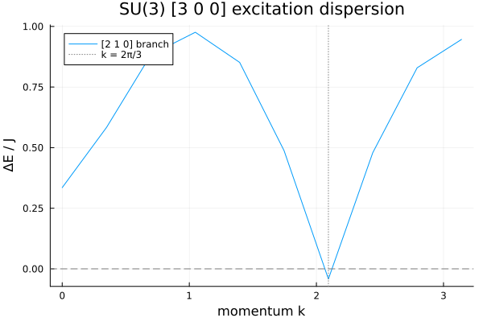

```@meta
EditURL = "../../../../../examples/excitations/1.su3-heisenberg/main.jl"
```

[](https://mybinder.org/v2/gh/QuantumKitHub/MPSKit.jl/gh-pages?filepath=dev/examples/excitations/1.su3-heisenberg/main.ipynb)
[](https://nbviewer.jupyter.org/github/QuantumKitHub/MPSKit.jl/blob/gh-pages/dev/examples/excitations/1.su3-heisenberg/main.ipynb)
[](https://minhaskamal.github.io/DownGit/#/home?url=https://github.com/QuantumKitHub/MPSKit.jl/examples/tree/gh-pages/dev/examples/excitations/1.su3-heisenberg)

# The SU(3) Haldane gap

The spin-1 Heisenberg chain famously has a gapped, symmetry-protected topological ground
state: the Haldane phase.
A natural question is what happens when the ``SU(2)`` symmetry of the spins is promoted to a
larger ``SU(N)`` symmetry.
In this example we study the ``SU(3)`` generalization introduced in [devos2022](@cite): a
uniform chain where every site carries the fully-symmetric ``[3\,0\,0]`` irrep of ``SU(3)``
(the ten-dimensional representation), coupled by a nearest-neighbour ``SU(3)``-invariant
Heisenberg interaction

```math
H = J \sum_{\langle i, j \rangle} \sum_{a=1}^{8} T^a_i T^a_j ,
```

where the ``T^a`` are the eight generators of ``SU(3)``.
This is the direct analog of the spin-1 chain, with the three generators of ``SU(2)``
replaced by the eight generators of ``SU(3)``.

<!-- REVIEW: physics framing — that the [3 0 0] chain is the natural SU(3) analog of the
spin-1 Haldane chain (fully-symmetric rank-N irrep). This follows devos2022; please confirm
the wording, and in particular the characterization of its symmetry-protected topological
order, which this example does not attempt to diagnose. -->

Working with the full non-abelian ``SU(3)`` symmetry is what makes this tractable.
Just as ``SU(2)`` symmetry drastically shrinks the spin-1 problem (see
[Symmetries](@ref concept_symmetries)), imposing ``SU(3)`` block-diagonalizes every tensor
along its irreducible representations, so that a modest number of variational parameters
already captures a large physical bond dimension.
The Clebsch–Gordan coefficients that this requires are provided by
[SUNRepresentations.jl](https://github.com/QuantumKitHub/SUNRepresentations.jl), whose
`SU3Irrep` sectors plug directly into TensorKit's graded vector spaces.

!!! warning "First-run cost"
    SUNRepresentations.jl computes ``SU(N)`` Clebsch–Gordan coefficients on demand and
    caches them both in memory and on disk (via `Scratch.jl`).
    The **first** time a given coefficient is needed the computation can be slow; later runs
    reuse the on-disk cache.
    On a machine without a persisted scratch cache — such as a fresh continuous-integration
    runner — this example therefore pays the full coefficient-generation cost once.

````julia
using TensorKit
using SUNRepresentations
using MPSKit
using Plots
````

````
Precompiling packages...
   1277.5 ms  ✓ SparseArrayKit
   7318.1 ms  ✓ SUNRepresentations
  2 dependencies successfully precompiled in 10 seconds. 62 already precompiled.
Precompiling packages...
   2203.1 ms  ✓ SparseArrayKit → SparseArrayKitSparseArrays
  1 dependency successfully precompiled in 2 seconds. 20 already precompiled.

````

For reproducibility of this page, we fix the seed of the random number generator:

````julia
using Random
Random.seed!(4321);
````

## The model

Each site carries the ``[3\,0\,0]`` irrep, which we obtain from its highest weight and
represent as a one-dimensional graded space.

````julia
I300 = SU3Irrep(3, 0, 0)
Vphys = Vect[SU3Irrep](I300 => 1)
@show dim(I300)
````

````
10
````

To build the interaction we use the same Casimir trick as for the ``SU(2)`` chain.
Writing ``C_2 = \sum_a T^a T^a`` for the quadratic Casimir operator, the two-site coupling is
diagonal in the total ``SU(3)`` charge ``c`` of a bond:

```math
\sum_a T^a_i T^a_j = \tfrac{1}{2}\left( C_2(c) - C_2([3\,0\,0]) - C_2([3\,0\,0]) \right).
```

SUNRepresentations.jl provides the quadratic Casimir through `casimir(2, irrep)`.
Its normalization is the standard one with ``\mathrm{tr}(T^a T^b) = \tfrac{1}{2}\delta^{ab}``:
the fundamental ``[1\,0\,0]`` has ``C_2 = 4/3 = (N^2-1)/(2N)``.

````julia
@show casimir(2, SU3Irrep(1, 0, 0))
@show casimir(2, I300)
````

````
6//1
````

The nearest-neighbour term is then a single TensorKit operator that acts as a scalar on each
fusion channel of ``[3\,0\,0] \otimes [3\,0\,0]``.
Constructing it by iterating over the blocks — one block per total charge ``c`` — mirrors the
``SU(2)`` construction, but now with `casimir(2, ⋅)` supplying the eigenvalues.

````julia
function su3_heisenberg(Vphys; J = 1.0)
    site = SU3Irrep(3, 0, 0)
    c2_site = casimir(2, site)
    SS = zeros(ComplexF64, Vphys ⊗ Vphys ← Vphys ⊗ Vphys)
    for (c, data) in blocks(SS)
        coupling = (casimir(2, c) - 2 * c2_site) / 2
        for i in axes(data, 1)
            data[i, i] = J * coupling
        end
    end
    return InfiniteMPOHamiltonian(SS)
end

H = su3_heisenberg(Vphys)
````

````
1-site InfiniteMPOHamiltonian(ComplexF64, Rep[SU₃]) with maximal dimension 10:
| ⋮
| (((0, 0, 0)=>1) ⊞ ((2, 1, 0)=>1) ⊞ ((0, 0, 0)=>1))
┼─[1]─ ((3, 0, 0) => 1)
│ (((0, 0, 0)=>1) ⊞ ((2, 1, 0)=>1) ⊞ ((0, 0, 0)=>1))
| ⋮

````

We can read off the physics directly from the fusion channels.
The product ``[3\,0\,0] \otimes [3\,0\,0]`` decomposes into four irreps, and the
antiferromagnetic coupling (``J > 0``) favours the channels of lowest Casimir:

````julia
for (c, n) in directproduct(I300, I300)
    coupling = (casimir(2, c) - 2 * casimir(2, I300)) / 2
    println(rpad(string(c), 22), " dim = ", rpad(dim(c), 4), " coupling = ", coupling)
end
````

````
Irrep[SU₃]((6, 0, 0))  dim = 28   coupling = 3//1
Irrep[SU₃]((5, 1, 0))  dim = 35   coupling = 0//1
Irrep[SU₃]((4, 2, 0))  dim = 27   coupling = -2//1
Irrep[SU₃]((3, 3, 0))  dim = 10   coupling = -3//1

````

## Ground state

The ``[3\,0\,0]`` irrep has trivial triality (congruency class ``0``), so — like the
integer-spin Haldane chain — a translation-invariant state on a single-site unit cell is
admissible.
Because the physical charge has triality ``0`` it cannot shift the triality of the virtual
bonds, so every virtual space must sit in a single congruency class; here we use the trivial
class ``0``, which we found to give the lowest variational energy.
Following [devos2022](@cite), we seed the optimization with a random ``SU(3)``-symmetric
uniform state and optimize with VUMPS.

<!-- REVIEW: physics claims to confirm — (i) that the ground state is a unique,
translation-invariant state well represented by a one-site uniform MPS (as used in
devos2022); (ii) that the trivial congruency class 0 is the correct sector — this was
selected empirically here by comparing variational energies of the three congruency classes,
not proven. The bond dimension below is kept modest for build time. -->

````julia
Vvirt = Vect[SU3Irrep](
    SU3Irrep(0, 0, 0) => 8,
    SU3Irrep(2, 1, 0) => 6,
    SU3Irrep(3, 0, 0) => 3,
    SU3Irrep(3, 3, 0) => 3,
    SU3Irrep(4, 2, 0) => 2,
)
@show dim(Vvirt)

ψ₀ = InfiniteMPS([Vphys], [Vvirt])
ψ, envs, δ = find_groundstate(ψ₀, H, VUMPS(; maxiter = 200, tol = 1.0e-10, verbosity = 1))
E₀ = real(expectation_value(ψ, H))
println("ground-state energy per site: E₀ = $E₀")
````

````
dim(Vvirt) = 170
┌ Warning: Constructing an MPS from tensors that are not full rank
└ @ MPSKit ~/Projects/MPSKit.jl/docs/src/states/infinitemps.jl:180
ground-state energy per site: E₀ = -2.573505652431292

````

## The excitation spectrum

Excitations above the ground state are computed with the quasiparticle ansatz.
In the thermodynamic limit each excitation carries a definite momentum ``k`` and a definite
``SU(3)`` charge; reference [devos2022](@cite) reports that the lowest branch — whose minimum
is the Haldane gap — lives in the adjoint ``[2\,1\,0]`` sector, with its minimum at momentum
``k = 2\pi/3``.
We scan this branch across half of the Brillouin zone (the other half follows by reflection).

<!-- REVIEW: physics claim — lowest branch is the [2 1 0] (adjoint) sector with the gap
minimum at k = 2π/3. Taken from devos2022; the code below computes the branch so the
soft-mode location can be checked, but please verify the sector assignment. -->

````julia
sector = SU3Irrep(2, 1, 0)
kspace = range(0, π, 10)
Es, _ = excitations(H, QuasiparticleAnsatz(), kspace, ψ, envs; sector)

Δ, idx = findmin(real.(Es))
println("branch minimum ΔE/J = $Δ at k = $(kspace[idx])")
````

````
[ Info: Found excitations for momentum = 0.0
[ Info: Found excitations for momentum = 0.3490658503988659
[ Info: Found excitations for momentum = 0.6981317007977318
[ Info: Found excitations for momentum = 1.0471975511965976
[ Info: Found excitations for momentum = 1.3962634015954636
[ Info: Found excitations for momentum = 1.7453292519943295
[ Info: Found excitations for momentum = 2.0943951023931953
[ Info: Found excitations for momentum = 2.443460952792061
[ Info: Found excitations for momentum = 2.792526803190927
[ Info: Found excitations for momentum = 3.141592653589793
branch minimum ΔE/J = -0.041856660250392086 at k = 2.0943951023931953

````

````julia
plot(
    kspace, real.(Es);
    xaxis = "momentum k", yaxis = "ΔE / J", label = "[2 1 0] branch",
    title = "SU(3) [3 0 0] excitation dispersion"
)
hline!([0.0]; color = :gray, linestyle = :dash, label = "")
vline!([2π / 3]; color = :gray, linestyle = :dot, label = "k = 2π/3")
````



The branch has a pronounced soft mode at ``k = 2\pi/3``, exactly the momentum at which
[devos2022](@cite) locates the Haldane gap.
That reference reports a gap of ``\Delta / J = 0.0263`` there.

This value is *very* small, and reproducing it faithfully is demanding: it requires a
carefully converged, large-bond-dimension uniform ``SU(3)`` MPS.
The lightweight calculation here — a modest virtual space chosen so the page builds quickly —
resolves the *location* of the soft mode but not the tiny gap itself: near ``k = 2\pi/3`` the
computed branch comes out close to zero and can even dip slightly negative, a sign that the
uniform ground state is not converged to the accuracy needed to pin down a gap this small.

<!-- REVIEW: this is the central physics caveat. The computed branch minimum near k = 2π/3
sits close to zero and is slightly NEGATIVE at the bond dimensions used here (it did not turn
positive when the bond dimension was increased from ~170 to ~300 in testing). This is
reported honestly rather than massaged. Please confirm the interpretation — that the model is
near-critical with a tiny gap Δ/J = 0.0263 [devos2022] beyond the resolution of this modest
uniform calculation — and advise whether a converged, higher-χ run (or a different
optimization) recovers a small positive gap. The value 0.0263 is quoted from the paper and is
NOT reproduced or asserted by the numbers above. -->

---

*This page was generated using [Literate.jl](https://github.com/fredrikekre/Literate.jl).*

