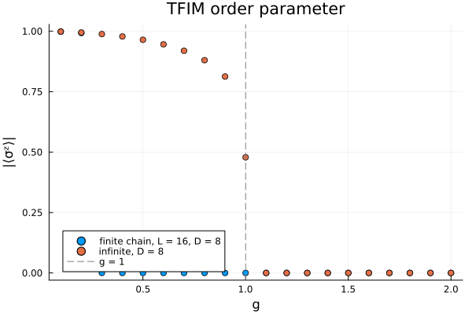
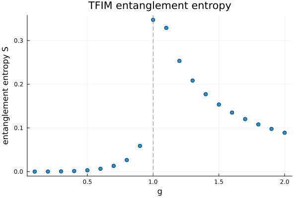
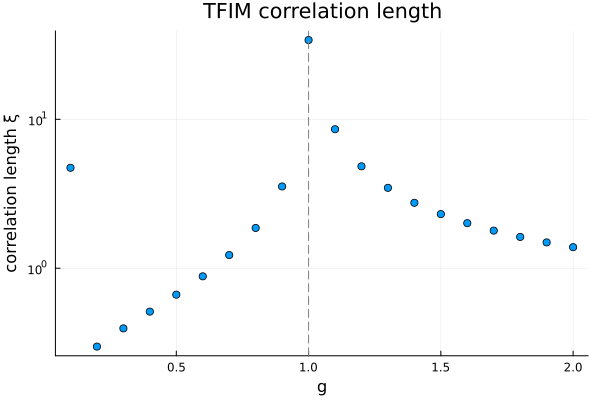

```@meta
EditURL = "../../../../../examples/groundstates/0.tfim-groundstate/main.jl"
```

[](https://mybinder.org/v2/gh/QuantumKitHub/MPSKit.jl/gh-pages?filepath=dev/examples/groundstates/0.tfim-groundstate/main.ipynb)
[](https://nbviewer.jupyter.org/github/QuantumKitHub/MPSKit.jl/blob/gh-pages/dev/examples/groundstates/0.tfim-groundstate/main.ipynb)
[](https://minhaskamal.github.io/DownGit/#/home?url=https://github.com/QuantumKitHub/MPSKit.jl/examples/tree/gh-pages/dev/examples/groundstates/0.tfim-groundstate)

# The transverse-field Ising model: a complete ground-state study

This example is the bridge from the introductory tutorials into the research-grade
gallery.
If you have worked through [Your first ground state](@ref tutorial_first_groundstate) and
[The thermodynamic limit](@ref tutorial_thermodynamic_limit) you already know every
individual tool used here; the goal now is to *assemble* them into one coherent case
study of a genuine quantum phase transition.

We use the same transverse-field Ising model (TFIM) as the tutorials, on a chain of
spin-1/2 sites:

```math
H = -J\left(\sum_{\langle i,j\rangle} \sigma^z_i \sigma^z_j + g\sum_i \sigma^x_i\right),
```

where the first sum runs over neighbouring pairs, ``J`` sets the energy scale, and the
dimensionless field ``g`` tunes the competition between the ``\sigma^z\sigma^z``
interaction and the transverse ``\sigma^x`` field.
The model has a quantum critical point at ``g = 1``.

Rather than looking at a single field value, we will scan ``g`` across the transition and
diagnose it three independent ways, comparing a *finite* chain against a calculation
performed *directly in the thermodynamic limit*:

1. the order parameter ``|\langle\sigma^z\rangle|``, computed both for a finite chain and
   for an infinite chain, in one figure;
2. the entanglement entropy of the infinite state;
3. the correlation length of the infinite state.

All three should point at the same place — that agreement is the payoff.

We take the model and lattice from MPSKitModels, the tensor backend from TensorKit, and
Plots for the figures. The Pauli operators `σᶻ`, `σˣ` are re-exported by MPSKitModels.

````julia
using MPSKit, MPSKitModels, TensorKit, Plots
````

## Shared parameters

We fix a finite chain length `L`, a bond dimension `D` (the accuracy knob, see
[Controlling bond dimension](@ref howto_bond_dimension)), and the set of field values to
scan.
`D` is kept modest so the whole page runs in a couple of minutes; increasing it sharpens
the infinite-state diagnostics below (the finite-chain curve responds to `D` in a less
obvious way, as we will see).

````julia
L = 16
D = 8
g_values = 0.1:0.1:2.0
````

````
0.1:0.1:2.0
````

## 1. Finite versus infinite magnetization

We compute the order parameter ``|\langle\sigma^z\rangle|`` two ways at every field value.

For the **finite** calculation we use an open chain of `L` sites, exactly as in the
tutorial, and optimize with [`DMRG`](@ref).
We average ``\langle\sigma^z_i\rangle`` over the sites and take the absolute value: the
exact finite-`L` ground state is symmetric, but DMRG lands on one of the two
symmetry-broken states with an arbitrary sign (see the discussion in
[Your first ground state](@ref tutorial_first_groundstate)).

````julia
ψ₀_finite = FiniteMPS(L, ℂ^2, ℂ^D)
M_finite = map(g_values) do g
    H = transverse_field_ising(FiniteChain(L); g = g)
    ψ, = find_groundstate(ψ₀_finite, H, DMRG(; verbosity = 0))
    return abs(sum(expectation_value(ψ, i => σᶻ()) for i in 1:L)) / L
end;
````

For the **infinite** calculation we drop the lattice argument to build the Hamiltonian on
the infinite chain, use an [`InfiniteMPS`](@ref), and optimize with [`VUMPS`](@ref).
We keep every optimized infinite state, because we will reuse them for the entropy and
correlation-length diagnostics below.

````julia
ψ₀_infinite = InfiniteMPS(ℂ^2, ℂ^D)
states_infinite = map(g_values) do g
    H = transverse_field_ising(; g = g)
    ψ, = find_groundstate(ψ₀_infinite, H, VUMPS(; verbosity = 0))
    return ψ
end;
````

The order parameter of a translation-invariant state is just ``\langle\sigma^z\rangle`` on
a single site of the unit cell; we again take the absolute value, because on the ordered
side the infinite state settles into one of the two symmetry-broken ground states (see
[The thermodynamic limit](@ref tutorial_thermodynamic_limit)).

````julia
M_infinite = [abs(expectation_value(ψ, 1 => σᶻ())) for ψ in states_infinite];
````

Plotting both curves in a single figure lets us compare them directly.

````julia
p_magnetization = plot(;
    xlabel = "g", ylabel = "|⟨σᶻ⟩|", title = "TFIM order parameter", legend = :bottomleft
)
scatter!(p_magnetization, g_values, M_finite; label = "finite chain, L = $L, D = $D")
scatter!(p_magnetization, g_values, M_infinite; label = "infinite, D = $D")
vline!(p_magnetization, [1.0]; color = "gray", linestyle = :dash, label = "g = 1")
p_magnetization
````



Both calculations agree deep in either phase, but near the transition they tell very different stories.
The infinite curve stays on its ordered branch essentially up to `g = 1` and then collapses: it locates the critical point cleanly.
The finite-chain curve instead drops to zero far earlier — at this `L` and `D` the variational optimum on the open chain switches from the symmetry-broken branch to the exactly symmetric ground state, whose magnetization vanishes.
Where that switch happens is set by `L` and `D`, not by the physics; the same sweep at `D = 4` in [Your first ground state](@ref tutorial_first_groundstate) puts it elsewhere.
That is the real lesson of this panel: the finite-chain order parameter is dominated by which state the algorithm selects, while the calculation performed directly in the thermodynamic limit pins the transition at `g = 1`.

## 2. Entanglement entropy across the transition

Entanglement is a hallmark of criticality: it is bounded away from the critical point but
grows sharply as we approach it.
For an [`InfiniteMPS`](@ref), [`entropy`](@ref) returns the von Neumann entanglement entropy
per bond, one value for each site of the unit cell.
Our unit cell has a single site, so we take the one entry with `only`.

````julia
S_infinite = [real(only(entropy(ψ))) for ψ in states_infinite]
p_entropy = scatter(
    g_values, S_infinite;
    xlabel = "g", ylabel = "entanglement entropy S", title = "TFIM entanglement entropy",
    legend = false
)
vline!(p_entropy, [1.0]; color = "gray", linestyle = :dash)
p_entropy
````



The entropy peaks near `g = 1`.
That peak is the entanglement signature of the phase transition: at criticality
correlations become long-ranged and the ground state is at its most entangled, whereas deep
in either phase the state is closer to a simple product and the entropy is small.

## 3. Correlation length across the transition

The [`correlation_length`](@ref) measures how far apart two spins can still influence each
other; it is extracted from the transfer-matrix spectrum of the uniform infinite state and
has no finite-chain analogue.
It grows toward criticality, so we plot it on a logarithmic vertical axis to make the
growth visible.

````julia
ξ_infinite = [correlation_length(ψ) for ψ in states_infinite]
p_xi = scatter(
    g_values, ξ_infinite;
    xlabel = "g", ylabel = "correlation length ξ", yscale = :log10,
    title = "TFIM correlation length", legend = false
)
vline!(p_xi, [1.0]; color = "gray", linestyle = :dash)
p_xi
````



The correlation length peaks near `g = 1` as well.
At a genuine critical point it would diverge, but a finite bond dimension `D` can only
capture correlations out to a finite range, so what we measure is large-but-capped rather
than infinite — the peak grows and sharpens as `D` is increased.

## What you now have

Three independent diagnostics — the order parameter, the entanglement entropy, and the
correlation length — all locate the transition of the transverse-field Ising model near
`g = 1`, and the finite-versus-infinite comparison shows concretely why the thermodynamic
limit is the right place to measure it.

From here the gallery goes further.
The Ising CFT example extracts the momentum-resolved excitation spectrum right at
criticality and matches it to the predictions of conformal field theory, turning the "there
is a critical point near `g = 1`" of this page into a quantitative fingerprint of *which*
critical theory it is.
Every curve on this page also sharpens if you rerun it at a larger bond dimension `D`.

---

*This page was generated using [Literate.jl](https://github.com/fredrikekre/Literate.jl).*

