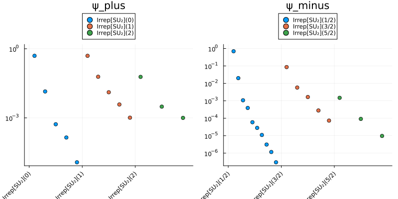
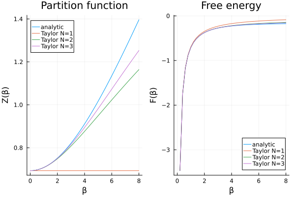
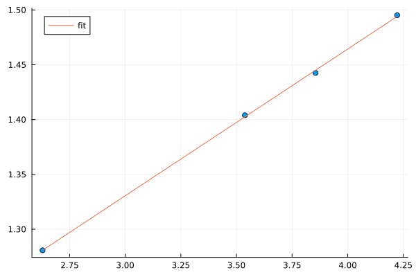

# Examples

This gallery collects the full worked examples that ship with MPSKit.jl.
Each one is a complete, runnable script (also available as a Jupyter notebook, linked from the example page itself) that goes well beyond the short snippets in the how-to guides.

Within each physics grouping below, the examples are listed roughly in order of increasing difficulty: start at the top if you are new to MPSKit, and work down as you get comfortable with symmetries, infinite systems, and the less common algorithms.

## Quantum (1+1)d

### [The Ising CFT spectrum](quantum1d/1.ising-cft/index.md)

Extracts the finite-size conformal spectrum of the critical transverse-field Ising chain, first by brute-force `exact_diagonalization` on a small periodic chain, then by extending to larger sizes with finite `DMRG` and the `QuasiparticleAnsatz`, using a translation MPO to assign a momentum label to each state.
No symmetries are used, which makes this a good entry point into the finite-MPS workflow.
**Level: introductory.**

### [DQPT in the Ising model](quantum1d/3.ising-dqpt/index.md)

Quenches the transverse-field Ising chain across its critical point and tracks the Loschmidt echo in search of non-analyticities (dynamical quantum phase transitions), on both a finite chain (`TDVP2`/`TDVP`) and directly in the thermodynamic limit (`changebonds` with `OptimalExpand`, then `TDVP`).
A compact introduction to real-time evolution and environment reuse, still without symmetries.
**Level: introductory/intermediate.**

### [The Haldane gap](quantum1d/2.haldane/index.md)

Computes the Haldane gap of the spin-1 Heisenberg antiferromagnet in two complementary ways: finite-size `DMRG` with the `QuasiparticleAnsatz`, extrapolated over system size, and a direct infinite-chain `VUMPS` calculation with a momentum-resolved excitation scan.
Introduces `SU2Irrep`/`SU2Space` symmetric tensors for both `FiniteMPS` and `InfiniteMPS`.
**Level: intermediate.**

### [The XXZ model](quantum1d/4.xxz-heisenberg/index.md)

Walks through a ground-state search that first goes wrong: single-site `VUMPS` and `GradientGrassmann` stall on the spin-1/2 Heisenberg antiferromagnet, and `transferplot`/`entanglementplot` reveal a near-non-injective state with several almost-degenerate transfer-matrix eigenvalues.
The fix is a two-site unit cell together with the `SU2Irrep`-symmetric Hamiltonian, after which `IDMRG2` and `VUMPS` converge cleanly.
A useful, diagnostic-driven example for recognizing and debugging convergence failures.
**Level: intermediate.**

### [Spin 1 Heisenberg model](quantum1d/5.haldane-spt/index.md)

Distinguishes the two symmetry-protected topological phases of the SU(2)-symmetric spin-1 Heisenberg chain by restricting the virtual `SU2Space` to integer or half-integer charges, then compares the two resulting ground states through their energy, transfer-matrix spectrum (`transferplot`), entanglement spectrum (`entanglementplot`), and entanglement entropy (`entropy`).
Builds directly on the symmetry machinery introduced in the Haldane gap example.
<!-- REVIEW: double-check that "symmetry-protected topological order" and the integer/half-integer grading argument are presented with the right level of rigor for a non-specialist reader. -->
**Level: intermediate/advanced.**

### [Hubbard chain at half filling](quantum1d/6.hubbard/index.md)

Studies the 1D Hubbard model at half filling with fermionic `InfiniteMPS`, first benchmarking a plain `VUMPS`/`GradientGrassmann` ground-state search against the exact Bethe-ansatz integral for the energy, then imposing the full particle-number and spin symmetry (`U1Irrep`, `SU2Irrep`, with `MPSKit.add_physical_charge` to pin the filling) and constructing the spinon/holon excitation spectrum with the `QuasiparticleAnsatz`.
Combines fermionic symmetry sectors with a more elaborate ground-state recipe (staged bond-dimension growth via `changebonds`/`OptimalExpand`, `SvdCut`, and mixed `VUMPS`/`GradientGrassmann` refinement).
**Level: advanced.**

### [Finite temperature XY model](quantum1d/7.xy-finiteT/index.md)

Simulates the finite-temperature XY chain by purifying the infinite-temperature density matrix and evolving it in imaginary time, then compares the resulting partition function and free energy against exact diagonalization and, via BenchmarkFreeFermions.jl, the exact free-fermion solution.
A technical, comparison-heavy example built around `MPSKit.infinite_temperature_density_matrix` and imaginary-time evolution rather than ground-state search.
**Level: advanced.**

### [1D Bose-Hubbard model](quantum1d/8.bose-hubbard/index.md)

The most comprehensive example in the gallery: works directly in the thermodynamic limit with a truncated bosonic local Hilbert space, extracts correlation functions and the correlation length as a function of bond dimension, computes the momentum distribution, and maps out the Mott-insulator/superfluid structure of the phase diagram from the ground-state response to an applied phase twist.
Touches most of the ground-state toolbox (`InfiniteMPS`, `find_groundstate`, bond-dimension control, `expectation_value`-based observables) in a single, longer study.
<!-- REVIEW: confirm that describing the final heatmap as mapping out "Mott-insulator/superfluid structure" is an accurate summary of what the order-parameter plot shows. -->
**Level: advanced.**

## Classical (2+0)d

### [The Hard Hexagon model](classic2d/1.hard-hexagon/index.md)

Extracts the central charge of the hard hexagon lattice gas by finding the leading boundary MPS of its transfer matrix with `VUMPS` (using Fibonacci-anyon virtual spaces), then fitting the CFT-predicted scaling relation between entanglement entropy and correlation length as the bond dimension is increased.
The only classical statistical-mechanics example in the gallery, and the only one demonstrating non-abelian anyonic symmetries (`FibonacciAnyon`) in MPSKit.
**Level: advanced.**
