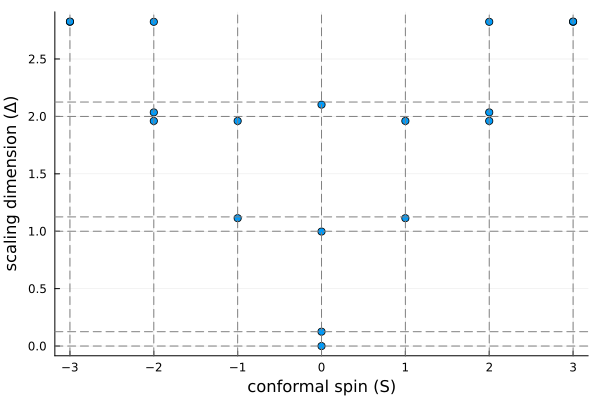
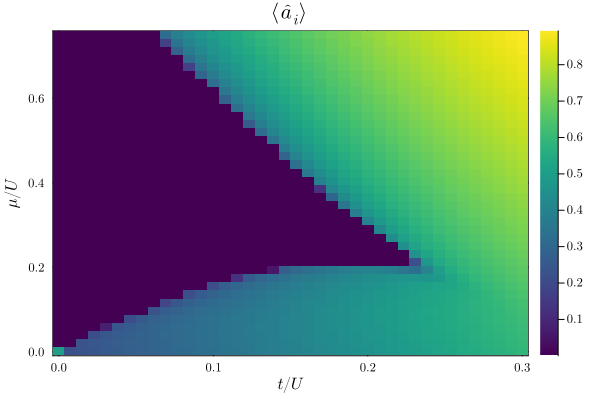
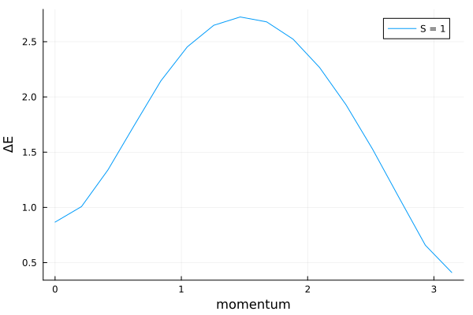
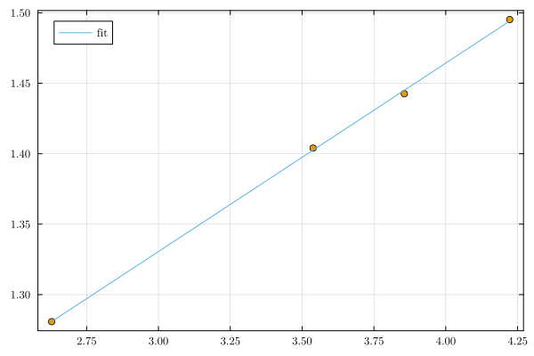

# [Examples](@id examples_index)

This gallery collects the full worked examples that ship with MPSKit.jl.
Each one is a complete, runnable script (also available as a Jupyter notebook, linked from the example page itself) that goes well beyond the short snippets in the how-to guides.

The examples are grouped by the kind of computation they demonstrate rather than by the physical system.
Every summary states the complexity of the example, so you can begin with an introductory one and move on to those that combine symmetries, infinite systems, and the less common algorithms.
The sidebar lists the same pages alphabetically.

## Ground states

### [The Ising CFT spectrum](groundstates/ising-cft/index.md)

Extracts the finite-size conformal spectrum of the critical transverse-field Ising chain, first by brute-force exact diagonalization on a small periodic chain, then by extending to larger sizes with finite DMRG and the quasiparticle ansatz, using a translation MPO to assign a momentum label to each state.
It works without any symmetries, which makes it a good entry point into the finite-MPS workflow.
**Complexity: introductory.**

### [The XXZ model](groundstates/xxz-heisenberg/index.md)

Shows how to pick a unit cell and a symmetry that suit the state you are after, using the spin-1/2 Heisenberg antiferromagnet as the case study.
The transfer-matrix and entanglement spectra serve as diagnostics: they reveal several almost-degenerate transfer-matrix eigenvalues, which is the signature of a state that a single-site ansatz cannot represent.
A two-site unit cell together with the SU(2)-symmetric Hamiltonian resolves this, after which both two-site IDMRG and VUMPS converge cleanly.
A good example for learning to read these diagnostics and act on them.
**Complexity: intermediate.**

### [Spin 1 Heisenberg model](groundstates/haldane-spt/index.md)

Distinguishes the two symmetry-protected topological phases of the SU(2)-symmetric spin-1 Heisenberg chain by restricting the virtual space to integer or half-integer charges, then compares the two resulting ground states through their energy, transfer-matrix spectrum, entanglement spectrum, and entanglement entropy.
Builds directly on the symmetry machinery introduced in the Haldane gap example.
**Complexity: intermediate to advanced.**

### [Hubbard chain at half filling](groundstates/hubbard/index.md)

Studies the one-dimensional Hubbard model at half filling with a fermionic infinite MPS.
It first benchmarks a plain ground-state search against the exact Bethe-ansatz integral for the energy, then imposes the full particle-number and spin symmetry, pinning the filling by adding a charge to the physical space, and finally constructs the spinon and holon excitation spectrum with the quasiparticle ansatz.
Combines fermionic symmetry sectors with a more elaborate ground-state recipe, growing the bond dimension in stages before refining.
**Complexity: advanced.**

### [1D Bose-Hubbard model](groundstates/bose-hubbard/index.md)

The most comprehensive ground-state example in the gallery: it works directly in the thermodynamic limit with a truncated bosonic local Hilbert space, extracts correlation functions and the correlation length as a function of bond dimension, computes the momentum distribution, and maps out the Mott-insulator and superfluid structure of the phase diagram from the ground-state response to an applied phase twist.
Touches most of the ground-state toolbox in a single, longer study.
**Complexity: advanced.**

## Excitations & dispersions

### [The Haldane gap](excitations/haldane/index.md)

Computes the Haldane gap of the spin-1 Heisenberg antiferromagnet in two complementary ways: finite-size DMRG with the quasiparticle ansatz, extrapolated over system size, and a direct infinite-chain VUMPS calculation with a momentum-resolved excitation scan.
Introduces SU(2)-symmetric tensors for both finite and infinite MPS.
**Complexity: intermediate.**

## Dynamics & finite temperature

### [DQPT in the Ising model](dynamics/ising-dqpt/index.md)

Quenches the transverse-field Ising chain across its critical point and tracks the Loschmidt echo in search of non-analyticities, the dynamical quantum phase transitions of the title.
This is done both on a finite chain, with two-site and then single-site TDVP, and directly in the thermodynamic limit, where the bond dimension is grown explicitly before evolving.
A compact introduction to real-time evolution and environment reuse, still without symmetries.
**Complexity: introductory to intermediate.**

### [Finite temperature XY model](dynamics/xy-finiteT/index.md)

Simulates the finite-temperature XY chain by purifying the infinite-temperature density matrix and evolving it in imaginary time, then compares the resulting partition function and free energy against exact diagonalization and, via BenchmarkFreeFermions.jl, the exact free-fermion solution.
A technical, comparison-heavy example built around imaginary-time evolution of a density matrix rather than a ground-state search.
**Complexity: advanced.**

## Statistical mechanics

### [The Hard Hexagon model](statmech/hard-hexagon/index.md)

Extracts the central charge of the hard hexagon lattice gas by finding the leading boundary MPS of its transfer matrix with VUMPS, using Fibonacci-anyon virtual spaces, then fitting the CFT-predicted scaling relation between entanglement entropy and correlation length as the bond dimension is increased.
The only classical statistical-mechanics example in the gallery, and the only one demonstrating non-abelian anyonic symmetries in MPSKit.
**Complexity: advanced.**
