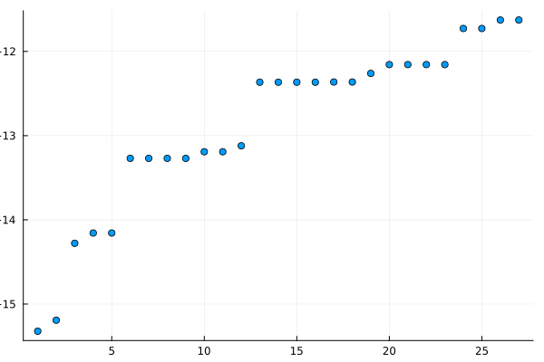
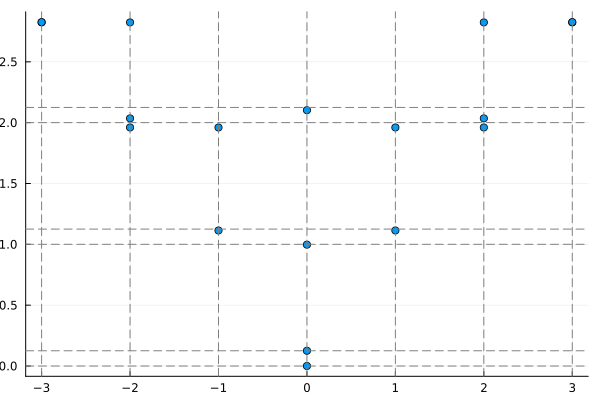
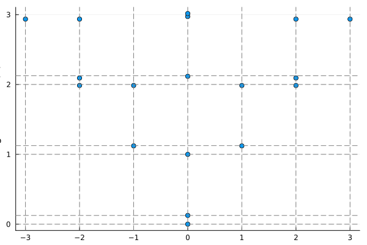

```@meta
EditURL = "../../../../../examples/quantum1d/1.ising-cft/main.jl"
```

[](https://mybinder.org/v2/gh/QuantumKitHub/MPSKit.jl/gh-pages?filepath=dev/examples/quantum1d/1.ising-cft/main.ipynb)
[](https://nbviewer.jupyter.org/github/QuantumKitHub/MPSKit.jl/blob/gh-pages/dev/examples/quantum1d/1.ising-cft/main.ipynb)
[](https://minhaskamal.github.io/DownGit/#/home?url=https://github.com/QuantumKitHub/MPSKit.jl/examples/tree/gh-pages/dev/examples/quantum1d/1.ising-cft)

# The Ising CFT spectrum

This tutorial is meant to show the finite size CFT spectrum for the quantum Ising model. We
do this by first employing an exact diagonalization technique, and then extending the
analysis to larger system sizes through the use of MPS techniques.

````julia
using MPSKit, MPSKitModels, TensorKit, Plots, KrylovKit
using LinearAlgebra: eigvals, diagm, Hermitian
````

The Hamiltonian is defined on a finite lattice with periodic boundary conditions,
which can be implemented as follows:

````julia
L = 12
H = periodic_boundary_conditions(transverse_field_ising(), L)
````

````
12-site FiniteMPOHamiltonian(ComplexF64, TensorKit.ComplexSpace) with maximal dimension 6:
┬─[12]─ ℂ^2
│ (ℂ^1 ⊞ ℂ^1 ⊞ ℂ^1 ⊞ ⋯ ⊞ ℂ^1 ⊞ ℂ^1 ⊞ ℂ^1)
┼─[11]─ ℂ^2
│ (ℂ^1 ⊞ ℂ^1 ⊞ ℂ^1 ⊞ ⋯ ⊞ ℂ^1 ⊞ ℂ^1 ⊞ ℂ^1)
┼─[10]─ ℂ^2
│ (ℂ^1 ⊞ ℂ^1 ⊞ ℂ^1 ⊞ ⋯ ⊞ ℂ^1 ⊞ ℂ^1 ⊞ ℂ^1)
┼─[9]─ ℂ^2
│ (ℂ^1 ⊞ ℂ^1 ⊞ ℂ^1 ⊞ ⋯ ⊞ ℂ^1 ⊞ ℂ^1 ⊞ ℂ^1)
│ ⋮
│ (ℂ^1 ⊞ ℂ^1 ⊞ ℂ^1 ⊞ ⋯ ⊞ ℂ^1 ⊞ ℂ^1 ⊞ ℂ^1)
┼─[3]─ ℂ^2
│ (ℂ^1 ⊞ ℂ^1 ⊞ ℂ^1 ⊞ ⋯ ⊞ ℂ^1 ⊞ ℂ^1 ⊞ ℂ^1)
┼─[2]─ ℂ^2
│ (ℂ^1 ⊞ ℂ^1 ⊞ ℂ^1 ⊞ ⋯ ⊞ ℂ^1 ⊞ ℂ^1 ⊞ ℂ^1)
┴─[1]─ ℂ^2

````

## Exact diagonalisation

In MPSKit, there is support for exact diagonalisation by leveraging the fact that applying
the Hamiltonian to an untruncated MPS will result in an effective Hamiltonian on the center
site which implements the action of the entire Hamiltonian. Thus, optimizing the middle
tensor is equivalent to optimixing a state in the entire Hilbert space, as all other tensors
are just unitary matrices that mix the basis.

````julia
energies, states = exact_diagonalization(H; num = 18, alg = Lanczos(; krylovdim = 200));
plot(
    real.(energies);
    seriestype = :scatter, legend = false, ylabel = "energy", xlabel = "#eigenvalue"
)
````



!!! note "Krylov dimension"
    Note that we have specified a large Krylov dimension as degenerate eigenvalues are
    notoriously difficult for iterative methods.

## Extracting momentum

Given a state, it is possible to assign a momentum label
through the use of the translation operator. This operator can be defined in MPO language
either diagramatically as

```@raw html

```

or in the code as:

````julia
function O_shift(L)
    I = id(ComplexF64, ℂ^2)
    @tensor O[W S; N E] := I[W; N] * I[S; E]
    return periodic_boundary_conditions(InfiniteMPO([O]), L)
end
````

````
O_shift (generic function with 1 method)
````

We can then calculate the momentum of the ground state as the expectation value of this
operator. However, there is a subtlety because of the degeneracies in the energy
eigenvalues. The eigensolver will find an orthonormal basis within each energy subspace, but
this basis is not necessarily a basis of eigenstates of the translation operator. In order
to fix this, we diagonalize the translation operator within each energy subspace.
The resulting energy levels have one-to-one correspondence to the operators in CFT, where
the momentum is related to their conformal spin as $P_n = \frac{2\pi}{L}S_n$.

````julia
function fix_degeneracies(basis)
    L = length(basis[1])
    M = zeros(ComplexF64, length(basis), length(basis))
    T = O_shift(L)
    for j in eachindex(basis), i in eachindex(basis)
        M[i, j] = dot(basis[i], T, basis[j])
    end

    vals = eigvals(M)
    return angle.(vals)
end

momenta = Float64[]
append!(momenta, fix_degeneracies(states[1:1]))
append!(momenta, fix_degeneracies(states[2:2]))
append!(momenta, fix_degeneracies(states[3:3]))
append!(momenta, fix_degeneracies(states[4:5]))
append!(momenta, fix_degeneracies(states[6:9]))
append!(momenta, fix_degeneracies(states[10:11]))
append!(momenta, fix_degeneracies(states[12:12]))
append!(momenta, fix_degeneracies(states[13:16]))
append!(momenta, fix_degeneracies(states[17:18]))
````

````
18-element Vector{Float64}:
 -3.369480642089346e-17
  3.9966961823263104e-17
 -2.4201642794270328e-17
  0.5235987755982987
 -0.5235987755982985
  1.0471975511965979
 -1.047197551196598
 -0.5235987755982991
  0.5235987755982989
 -1.0471975511965974
  1.0471975511965979
 -1.4167067287245392e-18
 -1.570796326794897
  1.5707963267948968
 -1.0471975511965979
  1.0471975511965979
  1.5707963267948966
 -1.5707963267948966
````

We can compute the scaling dimensions $\Delta_n$ of the operators in the CFT from the
energy gap of the corresponding excitations as $E_n - E_0 = \frac{2\pi v}{L} \Delta_n$,
where $v = 2$. If we plot these scaling dimensions against the conformal spin $S_n$ from
above, we retrieve the familiar spectrum of the Ising CFT.

````julia
v = 2.0
Δ = real.(energies[1:18] .- energies[1]) ./ (2π * v / L)
S = momenta ./ (2π / L)

p = plot(
    S, real.(Δ);
    seriestype = :scatter, xlabel = "conformal spin (S)", ylabel = "scaling dimension (Δ)",
    legend = false
)
vline!(p, -3:3; color = "gray", linestyle = :dash)
hline!(p, [0, 1 / 8, 1, 9 / 8, 2, 17 / 8]; color = "gray", linestyle = :dash)
p
````



## Finite bond dimension

If we limit the maximum bond dimension of the MPS, we get an approximate solution, but we
can reach higher system sizes.

````julia
L_mps = 20
H_mps = periodic_boundary_conditions(transverse_field_ising(), L_mps)
D = 64
ψ, envs, δ = find_groundstate(FiniteMPS(L_mps, ℂ^2, ℂ^D), H_mps, DMRG());
````

````
[ Info: DMRG init:	obj = -1.947519345847e+01	err = 7.5797e-02
[ Info: DMRG   1:	obj = -2.549098874118e+01	err = 9.1376055611e-03	time = 3.54 sec
[ Info: DMRG   2:	obj = -2.549098968631e+01	err = 1.1687746206e-06	time = 0.99 sec
[ Info: DMRG   3:	obj = -2.549098968636e+01	err = 1.5592263716e-07	time = 1.21 sec
[ Info: DMRG   4:	obj = -2.549098968636e+01	err = 1.3434579843e-08	time = 0.62 sec
[ Info: DMRG   5:	obj = -2.549098968636e+01	err = 5.9955426595e-09	time = 0.69 sec
[ Info: DMRG   6:	obj = -2.549098968636e+01	err = 4.4303868458e-09	time = 0.62 sec
[ Info: DMRG   7:	obj = -2.549098968636e+01	err = 3.2709219988e-09	time = 0.62 sec
[ Info: DMRG   8:	obj = -2.549098968636e+01	err = 2.3764855423e-09	time = 0.63 sec
[ Info: DMRG   9:	obj = -2.549098968636e+01	err = 1.7190997617e-09	time = 0.55 sec
[ Info: DMRG  10:	obj = -2.549098968636e+01	err = 1.2467309044e-09	time = 0.55 sec
[ Info: DMRG  11:	obj = -2.549098968636e+01	err = 9.1015412118e-10	time = 0.59 sec
[ Info: DMRG  12:	obj = -2.549098968636e+01	err = 7.7947998405e-10	time = 0.61 sec
[ Info: DMRG  13:	obj = -2.549098968636e+01	err = 6.8300434048e-10	time = 0.61 sec
[ Info: DMRG  14:	obj = -2.549098968636e+01	err = 5.9682764775e-10	time = 0.67 sec
[ Info: DMRG  15:	obj = -2.549098968636e+01	err = 5.2006815587e-10	time = 0.75 sec
[ Info: DMRG  16:	obj = -2.549098968636e+01	err = 4.5212003413e-10	time = 1.13 sec
[ Info: DMRG  17:	obj = -2.549098968636e+01	err = 3.9234738860e-10	time = 0.67 sec
[ Info: DMRG  18:	obj = -2.549098968636e+01	err = 3.4004240572e-10	time = 0.56 sec
[ Info: DMRG  19:	obj = -2.549098968636e+01	err = 2.9445818985e-10	time = 0.59 sec
[ Info: DMRG  20:	obj = -2.549098968636e+01	err = 2.5485045197e-10	time = 0.62 sec
[ Info: DMRG  21:	obj = -2.549098968636e+01	err = 2.2050912081e-10	time = 0.59 sec
[ Info: DMRG  22:	obj = -2.549098968636e+01	err = 1.9077747364e-10	time = 0.60 sec
[ Info: DMRG  23:	obj = -2.549098968636e+01	err = 1.6506123889e-10	time = 0.59 sec
[ Info: DMRG  24:	obj = -2.549098968636e+01	err = 1.4283083882e-10	time = 0.59 sec
[ Info: DMRG  25:	obj = -2.549098968636e+01	err = 1.2361940779e-10	time = 0.65 sec
[ Info: DMRG  26:	obj = -2.549098968636e+01	err = 1.0701848483e-10	time = 0.59 sec
[ Info: DMRG conv 27:	obj = -2.549098968636e+01	err = 9.2672581484e-11	time = 21.17 sec

````

Excitations on top of the ground state can be found through the use of the quasiparticle
ansatz. This returns quasiparticle states, which can be converted to regular `FiniteMPS`
objects.

````julia
E_ex, qps = excitations(H_mps, QuasiparticleAnsatz(), ψ, envs; num = 18)
states_mps = vcat(ψ, map(qp -> convert(FiniteMPS, qp), qps))
energies_mps = map(x -> expectation_value(x, H_mps), states_mps)

momenta_mps = Float64[]
append!(momenta_mps, fix_degeneracies(states_mps[1:1]))
append!(momenta_mps, fix_degeneracies(states_mps[2:2]))
append!(momenta_mps, fix_degeneracies(states_mps[3:3]))
append!(momenta_mps, fix_degeneracies(states_mps[4:5]))
append!(momenta_mps, fix_degeneracies(states_mps[6:9]))
append!(momenta_mps, fix_degeneracies(states_mps[10:11]))
append!(momenta_mps, fix_degeneracies(states_mps[12:12]))
append!(momenta_mps, fix_degeneracies(states_mps[13:16]))
append!(momenta_mps, fix_degeneracies(states_mps[17:18]))

v = 2.0
Δ_mps = real.(energies_mps[1:18] .- energies_mps[1]) ./ (2π * v / L_mps)
S_mps = momenta_mps ./ (2π / L_mps)

p_mps = plot(
    S_mps, real.(Δ_mps);
    seriestype = :scatter, xlabel = "conformal spin (S)",
    ylabel = "scaling dimension (Δ)", legend = false
)
vline!(p_mps, -3:3; color = "gray", linestyle = :dash)
hline!(p_mps, [0, 1 / 8, 1, 9 / 8, 2, 17 / 8]; color = "gray", linestyle = :dash)
p_mps
````



---

*This page was generated using [Literate.jl](https://github.com/fredrikekre/Literate.jl).*

