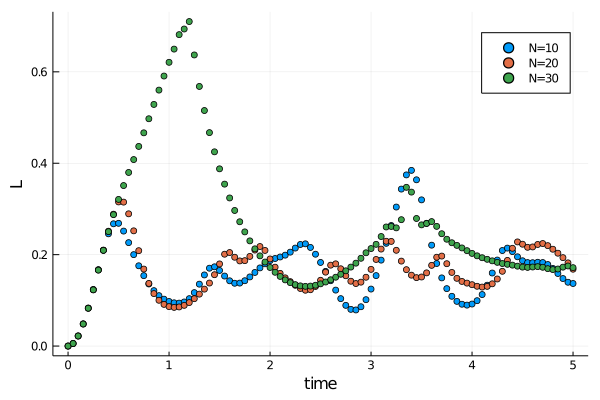
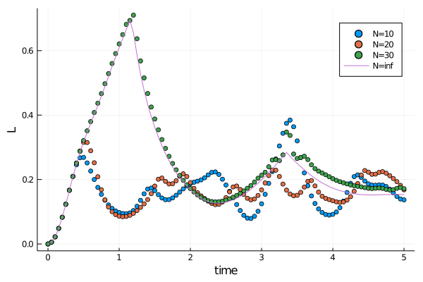

```@meta
EditURL = "../../../../../examples/quantum1d/3.ising-dqpt/main.jl"
```

[](https://mybinder.org/v2/gh/QuantumKitHub/MPSKit.jl/gh-pages?filepath=dev/examples/quantum1d/3.ising-dqpt/main.ipynb)
[](https://nbviewer.jupyter.org/github/QuantumKitHub/MPSKit.jl/blob/gh-pages/dev/examples/quantum1d/3.ising-dqpt/main.ipynb)
[](https://minhaskamal.github.io/DownGit/#/home?url=https://github.com/QuantumKitHub/MPSKit.jl/examples/tree/gh-pages/dev/examples/quantum1d/3.ising-dqpt)

# DQPT in the Ising model

In this tutorial we will try to reproduce the results from
[this paper](https://arxiv.org/pdf/1206.2505.pdf). The needed packages are

````julia
using MPSKit, MPSKitModels, TensorKit
````

Dynamical quantum phase transitions (DQPT in short) are signatures of equilibrium phase transitions in a dynamical quantity - the Loschmidt echo.
This quantity is given by ``L(t) = \frac{-2}{N} ln(| < \psi(t) | \psi(0) > |) `` where ``N`` is the system size.
One typically starts from a ground state and then quenches the Hamiltonian to a different point.
Non analycities in the Loschmidt echo are called 'dynamical quantum phase transitions'.

In the mentioned paper they work with

``H(g) = - \sum^{N-1}_{i=1} \sigma^z_i \sigma^z_{i+1} + g \sum_{i=1}^N \sigma^x_i``

and show that divergences occur when quenching across the critical point (g₀ → g₁) for ``t^*_n = t^*(n+\frac{1}{2})`` with ``t^* = \pi/e(g_1,k^*)``, ``cos(k^*) = (1+g_0 g_1) / (g_0 + g_1)``, `` e(g,k) = \sqrt{(g-cos k)^2 + sin^2 k}``.

The outline of the tutorial is as follows. We will pick ``g₀ = 0.5``, ``g₁ = 2.0``, and perform the time evolution at different system sizes and compare with the thermodynamic limit.
For those ``g`` we expect non-analyticities to occur at ``t_n ≈ 2.35 (n + 1/2)``.

First we construct the Hamiltonian in MPO form, and obtain the pre-quenched ground state:

````julia
L = 20
H₀ = transverse_field_ising(FiniteChain(L); g = -0.5)
ψ₀ = FiniteMPS(L, ℂ^2, ℂ^10)
ψ₀, _ = find_groundstate(ψ₀, H₀, DMRG());
````

````
[ Info: DMRG init:	obj = +9.979013604153e+00	err = 1.4988e-01
[ Info: DMRG   1:	obj = -2.040021714911e+01	err = 6.6274818897e-04	time = 4.21 sec
[ Info: DMRG   2:	obj = -2.040021715179e+01	err = 4.7025708686e-07	time = 0.30 sec
[ Info: DMRG   3:	obj = -2.040021786572e+01	err = 3.1050733385e-05	time = 0.09 sec
[ Info: DMRG   4:	obj = -2.040021786702e+01	err = 1.7208246127e-06	time = 0.04 sec
[ Info: DMRG   5:	obj = -2.040021786703e+01	err = 3.5080300899e-08	time = 0.04 sec
[ Info: DMRG conv 6:	obj = -2.040021786703e+01	err = 3.6868374475e-11	time = 4.71 sec

````

## Finite MPS quenching

We can define a helper function that measures the loschmith echo

````julia
echo(ψ₀::FiniteMPS, ψₜ::FiniteMPS) = -2 * log(abs(dot(ψ₀, ψₜ))) / length(ψ₀)
@assert isapprox(echo(ψ₀, ψ₀), 0, atol = 1.0e-10)
````

We will initially use a two-site TDVP scheme to dynamically increase the bond dimension while time evolving, and later on switch to a faster one-site scheme. A single timestep can be done using

````julia
H₁ = transverse_field_ising(FiniteChain(L); g = -2.0)
ψₜ = deepcopy(ψ₀)
dt = 0.01
ψₜ, envs = timestep(ψₜ, H₁, 0, dt, TDVP2(; trscheme = truncrank(20)));
````

"envs" is a kind of cache object that keeps track of all environments in `ψ`. It is often advantageous to re-use the environment, so that MPSKit doesn't need to recalculate everything.

Putting it all together, we get

````julia
function finite_sim(L; dt = 0.05, finaltime = 5.0)
    ψ₀ = FiniteMPS(L, ℂ^2, ℂ^10)
    H₀ = transverse_field_ising(FiniteChain(L); g = -0.5)
    ψ₀, _ = find_groundstate(ψ₀, H₀, DMRG())

    H₁ = transverse_field_ising(FiniteChain(L); g = -2.0)
    ψₜ = deepcopy(ψ₀)
    envs = environments(ψₜ, H₁, ψₜ)

    echos = [echo(ψₜ, ψ₀)]
    times = collect(0:dt:finaltime)

    for t in times[2:end]
        alg = t > 3 * dt ? TDVP() : TDVP2(; trscheme = truncrank(50))
        ψₜ, envs = timestep(ψₜ, H₁, 0, dt, alg, envs)
        push!(echos, echo(ψₜ, ψ₀))
    end

    return times, echos
end
````

````
finite_sim (generic function with 1 method)
````



## Infinite MPS quenching

Similarly we could start with an initial infinite state and find the pre-quench ground state:

````julia
ψ₀ = InfiniteMPS([ℂ^2], [ℂ^10])
H₀ = transverse_field_ising(; g = -0.5)
ψ₀, _ = find_groundstate(ψ₀, H₀, VUMPS());
````

````
[ Info: VUMPS init:	obj = +4.970192050239e-01	err = 3.8858e-01
[ Info: VUMPS   1:	obj = -1.049521519045e+00	err = 9.6762771022e-02	time = 1.62 sec
[ Info: VUMPS   2:	obj = -1.063544398670e+00	err = 1.0462983506e-04	time = 0.02 sec
[ Info: VUMPS   3:	obj = -1.063544409966e+00	err = 3.0128180222e-06	time = 0.01 sec
[ Info: VUMPS   4:	obj = -1.063544409973e+00	err = 5.4785900416e-08	time = 0.01 sec
[ Info: VUMPS   5:	obj = -1.063544409973e+00	err = 3.5329191510e-09	time = 0.01 sec
[ Info: VUMPS   6:	obj = -1.063544409973e+00	err = 3.7796484550e-10	time = 0.01 sec
[ Info: VUMPS conv 7:	obj = -1.063544409973e+00	err = 2.9001138645e-11	time = 1.69 sec

````

The dot product of two infinite matrix product states scales as  ``\alpha ^N`` where ``α`` is the dominant eigenvalue of the transfer matrix.
It is this ``α`` that is returned when calling

````julia
dot(ψ₀, ψ₀)
````

````
0.9999999999999996 + 3.8955006105253705e-16im
````

so the Loschmidt echo takes on the pleasant form

````julia
echo(ψ₀::InfiniteMPS, ψₜ::InfiniteMPS) = -2 * log(abs(dot(ψ₀, ψₜ)))
@assert isapprox(echo(ψ₀, ψ₀), 0, atol = 1.0e-10)
````

We make use of the `changebonds` machinery to grow the bond dimension. This can also be achieved through a two-site scheme.
Multiple algorithms are available, but we will only focus on `OptimalExpand()`.
Growing the bond dimension by ``5`` can be done by calling:

````julia
ψₜ = deepcopy(ψ₀)
H₁ = transverse_field_ising(; g = -2.0)
ψₜ, envs = changebonds(ψₜ, H₁, OptimalExpand(; trscheme = truncrank(5)));
````

a single timestep is easy

````julia
dt = 0.01
ψₜ, envs = timestep(ψₜ, H₁, 0, dt, TDVP(), envs);
````

With performance in mind we should once again try to re-use these "envs" cache objects.
The final code is

````julia
function infinite_sim(dt = 0.05, finaltime = 5.0)
    ψ₀ = InfiniteMPS([ℂ^2], [ℂ^10])
    ψ₀, _ = find_groundstate(ψ₀, H₀, VUMPS())

    ψₜ = deepcopy(ψ₀)
    envs = environments(ψₜ, H₁, ψₜ)

    echos = [echo(ψₜ, ψ₀)]
    times = collect(0:dt:finaltime)

    for t in times[2:end]
        if t < 50dt # if t is sufficiently small, we increase the bond dimension
            ψₜ, envs = changebonds(ψₜ, H₁, OptimalExpand(; trscheme = truncrank(1)), envs)
        end
        ψₜ, envs = timestep(ψₜ, H₁, 0, dt, TDVP(), envs)
        push!(echos, echo(ψₜ, ψ₀))
    end

    return times, echos
end
````

````
infinite_sim (generic function with 3 methods)
````



---

*This page was generated using [Literate.jl](https://github.com/fredrikekre/Literate.jl).*

