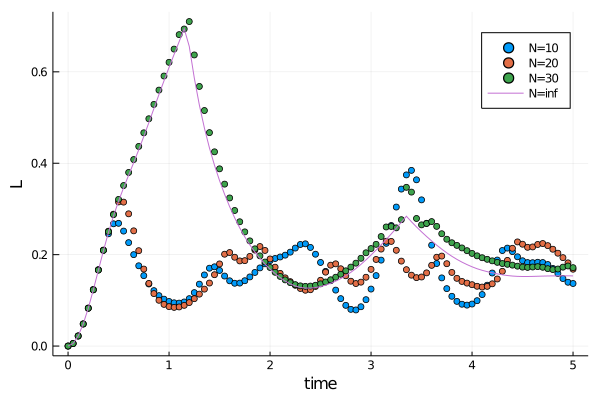

```@meta
EditURL = "../../../../../examples/quantum1d/3.ising-dqpt/main.jl"
```

[](https://mybinder.org/v2/gh/maartenvd/MPSKit.jl/gh-pages?filepath=dev/examples/quantum1d/3.ising-dqpt/main.ipynb)
[](https://nbviewer.jupyter.org/github/maartenvd/MPSKit.jl/blob/gh-pages/dev/examples/quantum1d/3.ising-dqpt/main.ipynb)
[](https://minhaskamal.github.io/DownGit/#/home?url=https://github.com/maartenvd/MPSKit.jl/examples/tree/gh-pages/dev/examples/quantum1d/3.ising-dqpt)

# DQPT in the Ising model(@id demo_dqpt)

In this tutorial we will try to reproduce the results from
[this paper](https://arxiv.org/pdf/1206.2505.pdf). The needed packages are

````julia
using MPSKit, MPSKitModels, TensorKit
````

Dynamical quantum phase transitions (DQPT in short) are signatures of equilibrium phase transitions in a dynamical quantity - the loschmidth echo.
This quantity is given by ``L(t) = \frac{-2}{N} ln(| < \psi(t) | \psi(0) > |) `` where ``N`` is the system size.
One typically starts from a groundstate and then quenches the hamiltonian to a different point.
Non analycities in the loschmidth echo are called 'dynamical quantum phase transitions'.

In the mentioned paper they work with

``H(g) = - \sum^{N-1}_{i=1} \sigma^z_i \sigma^z_{i+1} + g \sum_{i=1}^N \sigma^x_i``

and show that divergences occur when quenching across the critical point (g₀ → g₁) for ``t^*_n = t^*(n+\frac{1}{2})`` with ``t^* = \pi/e(g_1,k^*)``, ``cos(k^*) = (1+g_0 g_1) / (g_0 + g_1)``, `` e(g,k) = \sqrt{(g-cos k)^2 + sin^2 k}``.

The outline of the tutorial is as follows. We will pick ``g₀ = 0.5``, ``g₁ = 2.0``, and perform the time evolution at different system sizes and compare with the thermodynamic limit.
For those ``g`` we expect non-analicities to occur at ``t_n ≈ 2.35 (n + 1/2)``.

First we construct the hamiltonian in mpo form, and obtain the pre-quenched groundstate:

````julia
H₀ = transverse_field_ising(; g=-0.5)

L = 20
ψ₀ = FiniteMPS(rand, ComplexF64, L, ℂ^2, ℂ^10)
ψ₀, _ = find_groundstate(ψ₀, H₀, DMRG());
````

````
┌ Info: DMRG iteration:
│   iter = 1
│   ϵ = 0.000986581366103938
│   λ = -20.400217170648297 - 3.168634085421589e-15im
└   Δt = 0.891745848
┌ Info: DMRG iteration:
│   iter = 2
│   ϵ = 1.0302019066076028e-5
│   λ = -20.40021786677464 + 1.1314072818445028e-15im
└   Δt = 0.373864515
┌ Info: DMRG iteration:
│   iter = 3
│   ϵ = 7.655141645756606e-7
│   λ = -20.400217867025653 - 1.6186860775512322e-16im
└   Δt = 0.134836957
┌ Info: DMRG iteration:
│   iter = 4
│   ϵ = 7.796231826409096e-9
│   λ = -20.400217867025656 - 3.9867116548144814e-16im
└   Δt = 0.025223178
┌ Info: DMRG iteration:
│   iter = 5
│   ϵ = 6.253453665716561e-12
│   λ = -20.40021786702568 - 9.448923056217946e-16im
└   Δt = 0.013589451
┌ Info: DMRG iteration:
│   iter = 6
│   ϵ = 4.161558433348755e-14
│   λ = -20.400217867025656 + 1.461979599077922e-15im
└   Δt = 0.010311725
┌ Info: DMRG summary:
│   ϵ = 2.0e-12
│   λ = -20.400217867025656 + 1.461979599077922e-15im
└   Δt = 1.56215533

````

## Finite MPS quenching

We can define a helper function that measures the loschmith echo

````julia
echo(ψ₀::FiniteMPS, ψₜ::FiniteMPS) = -2 * log(abs(dot(ψ₀, ψₜ))) / length(ψ₀)
@assert isapprox(echo(ψ₀, ψ₀), 0, atol=1e-10)
````

We will initially use a two-site TDVP scheme to dynamically increase the bond dimension while time evolving, and later on switch to a faster one-site scheme. A single timestep can be done using

````julia
H₁ = transverse_field_ising(; g=-2.0)
ψₜ = deepcopy(ψ₀)
dt = 0.01
ψₜ, envs = timestep(ψₜ, H₁, 0, dt, TDVP2(; trscheme=truncdim(20)));
````

"envs" is a kind of cache object that keeps track of all environments in `ψ`. It is often advantageous to re-use the environment, so that mpskit doesn't need to recalculate everything.

Putting it all together, we get

````julia
function finite_sim(L; dt=0.05, finaltime=5.0)
    ψ₀ = FiniteMPS(rand, ComplexF64, L, ℂ^2, ℂ^10)
    ψ₀, _ = find_groundstate(ψ₀, H₀, DMRG())

    ψₜ = deepcopy(ψ₀)
    envs = environments(ψₜ, H₁)

    echos = [echo(ψₜ, ψ₀)]
    times = collect(0:dt:finaltime)

    for t in times[2:end]
        alg = t > 3 * dt ? TDVP() : TDVP2(; trscheme=truncdim(50))
        ψₜ, envs = timestep(ψₜ, H₁, 0, dt, alg, envs)
        push!(echos, echo(ψₜ, ψ₀))
    end

    return times, echos
end
````

````
finite_sim (generic function with 1 method)
````


## Infinite MPS quenching

Similarly we could start with an initial infinite state and find the pre-quench groundstate:

````julia
ψ₀ = InfiniteMPS([ℂ^2], [ℂ^10])
ψ₀, _ = find_groundstate(ψ₀, H₀, VUMPS());
````

````
┌ Info: VUMPS iteration:
│   iter = 1
│   ϵ = 0.14268710013122207
│   λ = -1.0209145922951772 + 9.991387030849971e-17im
└   Δt = 1.070392728
┌ Info: VUMPS iteration:
│   iter = 2
│   ϵ = 0.0001323445140205622
│   λ = -1.063544389907846 + 1.7529869058289294e-16im
└   Δt = 0.010547746
┌ Info: VUMPS iteration:
│   iter = 3
│   ϵ = 6.600943337497948e-8
│   λ = -1.0635444099733606 + 5.4275790669926637e-17im
└   Δt = 0.005207092
┌ Info: VUMPS iteration:
│   iter = 4
│   ϵ = 8.080849989048835e-10
│   λ = -1.0635444099733635 + 9.829080374548786e-17im
└   Δt = 0.005190921
┌ Info: VUMPS iteration:
│   iter = 5
│   ϵ = 6.729233551755392e-11
│   λ = -1.063544409973364 + 2.346264070487328e-16im
└   Δt = 0.004084553
┌ Info: VUMPS iteration:
│   iter = 6
│   ϵ = 6.673997223834296e-12
│   λ = -1.0635444099733653 - 1.0773883768913336e-16im
└   Δt = 0.002106011
┌ Info: VUMPS iteration:
│   iter = 7
│   ϵ = 6.780795832238809e-13
│   λ = -1.0635444099733649 + 9.146560782361139e-17im
└   Δt = 0.001714082
┌ Info: VUMPS summary:
│   ϵ = 6.780795832238809e-13
│   λ = -1.0635444099733649 + 9.146560782361139e-17im
└   Δt = 1.96748098

````

The dot product of two infinite matrix product states scales as  ``\alpha ^N`` where ``α`` is the dominant eigenvalue of the transfer matrix.
It is this ``α`` that is returned when calling

````julia
dot(ψ₀, ψ₀)
````

````
1.0 - 5.165343773088765e-16im
````

so the loschmidth echo takes on the pleasant form

````julia
echo(ψ₀::InfiniteMPS, ψₜ::InfiniteMPS) = -2 * log(abs(dot(ψ₀, ψₜ)))
@assert isapprox(echo(ψ₀, ψ₀), 0, atol=1e-10)
````

This time we cannot use a two-site scheme to grow the bond dimension, as this isn't implemented (yet).
Instead, we have to make use of the changebonds machinery.
Multiple algorithms are available, but we will only focus on `OptimalEpand()`.
Growing the bond dimension by ``5`` can be done by calling:

````julia
ψₜ = deepcopy(ψ₀)
ψₜ, envs = changebonds(ψₜ, H₁, OptimalExpand(; trscheme=truncdim(5)));
````

a single timestep is easy

````julia
dt = 0.01
ψₜ, envs = timestep(ψₜ, H₁, 0, dt, TDVP(), envs);
````

With performance in mind we should once again try to re-use these "envs" cache objects.
The final code is

````julia
function infinite_sim(dt=0.05, finaltime=5.0)
    ψ₀ = InfiniteMPS([ℂ^2], [ℂ^10])
    ψ₀, _ = find_groundstate(ψ₀, H₀, VUMPS())

    ψₜ = deepcopy(ψ₀)
    envs = environments(ψₜ, H₁)

    echos = [echo(ψₜ, ψ₀)]
    times = collect(0:dt:finaltime)

    for t in times[2:end]
        if t < 50dt # if t is sufficiently small, we increase the bond dimension
            ψₜ, envs = changebonds(ψₜ, H₁, OptimalExpand(; trscheme=truncdim(1)), envs)
        end
        (ψₜ, envs) = timestep(ψₜ, H₁, 0, dt, TDVP(), envs)
        push!(echos, echo(ψₜ, ψ₀))
    end

    return times, echos
end
````

````
infinite_sim (generic function with 3 methods)
````



---

*This page was generated using [Literate.jl](https://github.com/fredrikekre/Literate.jl).*

