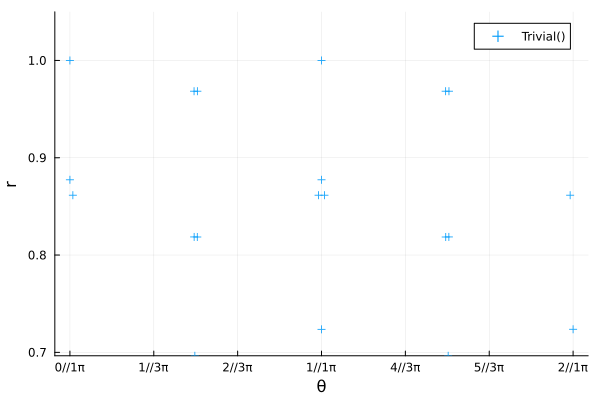
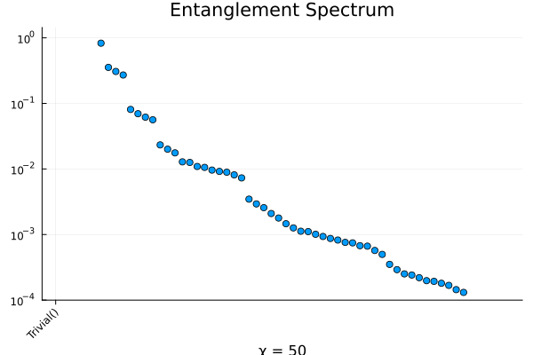

```@meta
EditURL = "../../../../../examples/quantum1d/4.xxz-heisenberg/main.jl"
```

[](https://mybinder.org/v2/gh/QuantumKitHub/MPSKit.jl/gh-pages?filepath=dev/examples/quantum1d/4.xxz-heisenberg/main.ipynb)
[](https://nbviewer.jupyter.org/github/QuantumKitHub/MPSKit.jl/blob/gh-pages/dev/examples/quantum1d/4.xxz-heisenberg/main.ipynb)
[](https://minhaskamal.github.io/DownGit/#/home?url=https://github.com/QuantumKitHub/MPSKit.jl/examples/tree/gh-pages/dev/examples/quantum1d/4.xxz-heisenberg)

# The XXZ model

In this file we will give step by step instructions on how to analyze the spin 1/2 XXZ model.
The necessary packages to follow this tutorial are:

````julia
using MPSKit, MPSKitModels, TensorKit, Plots
````

For reproducibility of this page, we fix the seed of the random number generator:

````julia
using Random
Random.seed!(123);
````

## Failure

First we should define the Hamiltonian we want to work with.
Then we specify an initial guess, which we then further optimize.
Working directly in the thermodynamic limit, this is achieved as follows:

````julia
H = heisenberg_XXX(; spin = 1 // 2)
````

````
1-site InfiniteMPOHamiltonian(ComplexF64, TensorKit.ComplexSpace) with maximal dimension 5:
| ⋮
| (ℂ^1 ⊞ ℂ^3 ⊞ ℂ^1)
┼─[1]─ ℂ^2
│ (ℂ^1 ⊞ ℂ^3 ⊞ ℂ^1)
| ⋮

````

We then need an initial state, which we shall later optimize. In this example we work directly in the thermodynamic limit.

````julia
state = InfiniteMPS(2, 20)
````

````
1-site InfiniteMPS(ComplexF64, TensorKit.ComplexSpace) with maximal dimension 20:
| ⋮
| ℂ^20
├─[1]─ ℂ^2
│ ℂ^20
| ⋮

````

The ground state can then be found by calling `find_groundstate`.

````julia
groundstate, cache, delta = find_groundstate(state, H, VUMPS(; verbosity = 1));
````

````
┌ Warning: VUMPS cancel 200:	obj = +3.378309339760e-02	err = 3.6686092746e-01	time = 17.68 sec
└ @ MPSKit ~/Projects/MPSKit.jl/.claude/worktrees/docs-improvement-plan/src/algorithms/groundstate/vumps.jl:87

````

As you can see, VUMPS struggles to converge.
On its own, that is already quite curious.
Maybe we can do better using another algorithm, such as gradient descent.

````julia
groundstate, cache, delta = find_groundstate(state, H, GradientGrassmann(; maxiter = 20, verbosity = 1));
````

````
┌ Warning: CG: not converged to requested tol after 20 iterations and time  6.96 s: f = -4.425861871014e-01, ‖∇f‖ = 6.7091e-03
└ @ OptimKit ~/.julia/packages/OptimKit/S0cVY/src/cg.jl:174

````

Convergence is quite slow and even fails after sufficiently many iterations.
To understand why, we can look at the transfer matrix spectrum.

````julia
transferplot(groundstate, groundstate)
````



We can clearly see multiple eigenvalues close to the unit circle.
Our state is close to being non-injective, and represents the sum of multiple injective states.
This is numerically very problematic, but also indicates that we used an incorrect ansatz to approximate the groundstate.
We should retry with a larger unit cell.

## Success

Let's initialize a different initial state, this time with a 2-site unit cell:

````julia
state = InfiniteMPS(fill(2, 2), fill(20, 2))
````

````
2-site InfiniteMPS(ComplexF64, TensorKit.ComplexSpace) with maximal dimension 20:
| ⋮
| ℂ^20
├─[2]─ ℂ^2
│ ℂ^20
├─[1]─ ℂ^2
│ ℂ^20
| ⋮

````

In MPSKit, we require that the periodicity of the Hamiltonian equals that of the state it is applied to.
This is not a big obstacle, you can simply repeat the original Hamiltonian.
Alternatively, the Hamiltonian can be constructed directly on a two-site unit cell by making use of MPSKitModels.jl's `@mpoham`.

````julia
# H2 = repeat(H, 2); -- copies the one-site version
H2 = heisenberg_XXX(ComplexF64, Trivial, InfiniteChain(2); spin = 1 // 2)
groundstate, envs, delta = find_groundstate(
    state, H2, VUMPS(; maxiter = 100, tol = 1.0e-12, verbosity = 1)
);
````

````
┌ Warning: VUMPS cancel 100:	obj = -8.862417624752e-01	err = 4.2010389211e-06	time = 5.10 sec
└ @ MPSKit ~/Projects/MPSKit.jl/.claude/worktrees/docs-improvement-plan/src/algorithms/groundstate/vumps.jl:87

````

We get convergence, but it takes an enormous amount of iterations.
The reason behind this becomes more obvious at higher bond dimensions:

````julia
groundstate, envs, delta = find_groundstate(
    state, H2, IDMRG2(; trscheme = truncrank(50), maxiter = 20, tol = 1.0e-12, verbosity = 1)
);
entanglementplot(groundstate)
````



We see that some eigenvalues clearly belong to a group, and are almost degenerate.
This implies 2 things:
- there is superfluous information, if those eigenvalues are the same anyway
- poor convergence if we cut off within such a subspace

It are precisely those problems that we can solve by using symmetries.

## Symmetries

The XXZ Heisenberg Hamiltonian is SU(2) symmetric and we can exploit this to greatly speed up the simulation.

It is cumbersome to construct symmetric Hamiltonians, but luckily SU(2) symmetric XXZ is already implemented:

````julia
H2 = heisenberg_XXX(ComplexF64, SU2Irrep, InfiniteChain(2); spin = 1 // 2);
````

Our initial state should also be SU(2) symmetric.
It now becomes apparent why we have to use a two-site periodic state.
The physical space carries a half-integer charge and the first tensor maps the first `virtual_space ⊗ the physical_space` to the second `virtual_space`.
Half-integer virtual charges will therefore map only to integer charges, and vice versa.
The staggering thus happens on the virtual level.

An alternative constructor for the initial state is

````julia
P = Rep[SU₂](1 // 2 => 1)
V1 = Rep[SU₂](1 // 2 => 10, 3 // 2 => 5, 5 // 2 => 2)
V2 = Rep[SU₂](0 => 15, 1 => 10, 2 => 5)
state = InfiniteMPS([P, P], [V1, V2]);
````

````
┌ Warning: Constructing an MPS from tensors that are not full rank
└ @ MPSKit ~/Projects/MPSKit.jl/.claude/worktrees/docs-improvement-plan/src/states/infinitemps.jl:162

````

Even though the bond dimension is higher than in the example without symmetry, convergence is reached much faster:

````julia
println(dim(V1))
println(dim(V2))
groundstate, cache, delta = find_groundstate(state, H2, VUMPS(; maxiter = 400, tol = 1.0e-12, verbosity = 1));
````

````
52
70

````

---

*This page was generated using [Literate.jl](https://github.com/fredrikekre/Literate.jl).*

