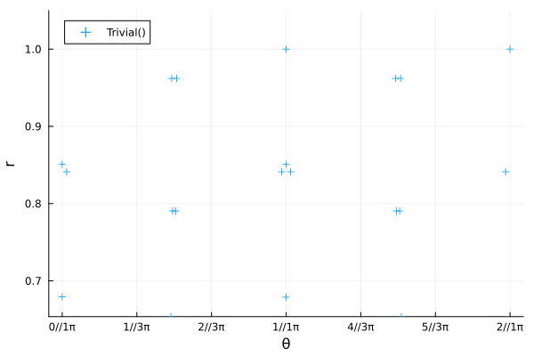
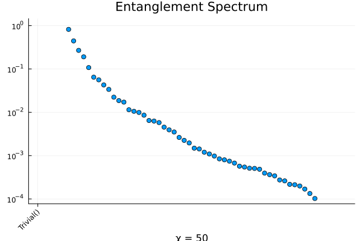

```@meta
EditURL = "../../../../../examples/quantum1d/4.xxz-heisenberg/main.jl"
```

[](https://mybinder.org/v2/gh/QuantumKitHub/MPSKit.jl/gh-pages?filepath=dev/examples/quantum1d/4.xxz-heisenberg/main.ipynb)
[](https://nbviewer.jupyter.org/github/QuantumKitHub/MPSKit.jl/blob/gh-pages/dev/examples/quantum1d/4.xxz-heisenberg/main.ipynb)
[](https://minhaskamal.github.io/DownGit/#/home?url=https://github.com/QuantumKitHub/MPSKit.jl/examples/tree/gh-pages/dev/examples/quantum1d/4.xxz-heisenberg)

# The XXZ model

In this file we will give step by step instructions on how to analyze the spin 1/2 XXZ model.
The necessary packages to follow this tutorial are:

````julia
using MPSKit, TensorKit, Plots
using .ExampleModels
````

## Failure

First we should define the Hamiltonian we want to work with.
Then we specify an initial guess, which we then further optimize.
Working directly in the thermodynamic limit, this is achieved as follows:

````julia
H = heisenberg_XXX(; spin = 1 // 2)
````

````
1-site InfiniteMPOHamiltonian(ComplexF64, TensorKit.ComplexSpace) with maximal dimension 5:
| ⋮
| (ℂ^1 ⊞ ℂ^3 ⊞ ℂ^1)
┼─[1]─ ℂ^2
│ (ℂ^1 ⊞ ℂ^3 ⊞ ℂ^1)
| ⋮

````

We then need an initial state, which we shall later optimize. In this example we work directly in the thermodynamic limit.

````julia
state = InfiniteMPS(2, 20)
````

````
1-site InfiniteMPS(ComplexF64, TensorKit.ComplexSpace) with maximal dimension 20:
| ⋮
| ℂ^20
├─[1]─ ℂ^2
│ ℂ^20
| ⋮

````

The ground state can then be found by calling `find_groundstate`.

````julia
groundstate, cache, info = find_groundstate(state, H, VUMPS());
info
````

````
AlgorithmInfo:
  converged          = false after 200 iterations
  galerkin           = 0.362154

````

As you can see, VUMPS struggles to converge.
On its own, that is already quite curious.
Maybe we can do better using another algorithm, such as gradient descent.

````julia
groundstate, cache, info = find_groundstate(state, H, GradientGrassmann(; maxiter = 20));
info
````

````
AlgorithmInfo:
  converged          = false after 20 iterations
  gradientnorm       = 0.0112804

````

Convergence is quite slow and even fails after sufficiently many iterations.
To understand why, we can look at the transfer matrix spectrum.

````julia
transferplot(groundstate, groundstate)
````



We can clearly see multiple eigenvalues close to the unit circle.
Our state is close to being non-injective, and represents the sum of multiple injective states.
This is numerically very problematic, but also indicates that we used an incorrect ansatz to approximate the groundstate.
We should retry with a larger unit cell.

## Success

Let's initialize a different initial state, this time with a 2-site unit cell:

````julia
state = InfiniteMPS(fill(2, 2), fill(20, 2))
````

````
2-site InfiniteMPS(ComplexF64, TensorKit.ComplexSpace) with maximal dimension 20:
| ⋮
| ℂ^20
├─[2]─ ℂ^2
│ ℂ^20
├─[1]─ ℂ^2
│ ℂ^20
| ⋮

````

In MPSKit, we require that the periodicity of the Hamiltonian equals that of the state it is applied to.
This is not a big obstacle, you can simply repeat the original Hamiltonian.
Alternatively, our model helper can construct the Hamiltonian directly on a two-site unit cell.

````julia
# H2 = repeat(H, 2); -- copies the one-site version
H2 = heisenberg_XXX(ComplexF64, Trivial; unitcell = 2, spin = 1 // 2)
groundstate, envs, info = find_groundstate(
    state, H2, VUMPS(; maxiter = 100, tol = 1.0e-12)
);
````

````
[ Info: VUMPS init:	obj = +4.997527111444e-01	err = 3.2696e-02
[ Info: VUMPS   1:	obj = -4.467165998476e-01	err = 3.1609479029e-01	time = 0.02 sec
[ Info: VUMPS   2:	obj = -8.771683852570e-01	err = 6.2050493215e-02	time = 0.01 sec
[ Info: VUMPS   3:	obj = -8.851498316480e-01	err = 1.1961437282e-02	time = 0.01 sec
[ Info: VUMPS   4:	obj = -8.859041509393e-01	err = 6.3855220428e-03	time = 0.01 sec
[ Info: VUMPS   5:	obj = -8.861046661398e-01	err = 4.2618759637e-03	time = 0.01 sec
[ Info: VUMPS   6:	obj = -8.861780680439e-01	err = 2.8925460191e-03	time = 0.13 sec
[ Info: VUMPS   7:	obj = -8.862081622654e-01	err = 2.2292422649e-03	time = 0.02 sec
[ Info: VUMPS   8:	obj = -8.862224756657e-01	err = 1.6435394411e-03	time = 0.02 sec
[ Info: VUMPS   9:	obj = -8.862294034930e-01	err = 1.3092870547e-03	time = 0.02 sec
[ Info: VUMPS  10:	obj = -8.862329064156e-01	err = 9.9464595759e-04	time = 0.02 sec
[ Info: VUMPS  11:	obj = -8.862346804992e-01	err = 8.0850406574e-04	time = 0.02 sec
[ Info: VUMPS  12:	obj = -8.862355904749e-01	err = 6.4946824659e-04	time = 0.02 sec
[ Info: VUMPS  13:	obj = -8.862360590666e-01	err = 5.4465159459e-04	time = 0.02 sec
[ Info: VUMPS  14:	obj = -8.862363024838e-01	err = 4.6490637106e-04	time = 0.02 sec
[ Info: VUMPS  15:	obj = -8.862364302780e-01	err = 4.0282057210e-04	time = 0.02 sec
[ Info: VUMPS  16:	obj = -8.862364987557e-01	err = 3.5830647316e-04	time = 0.02 sec
[ Info: VUMPS  17:	obj = -8.862365362487e-01	err = 3.1735310901e-04	time = 0.02 sec
[ Info: VUMPS  18:	obj = -8.862365577473e-01	err = 2.8785456855e-04	time = 0.02 sec
[ Info: VUMPS  19:	obj = -8.862365705090e-01	err = 2.5781877596e-04	time = 0.02 sec
[ Info: VUMPS  20:	obj = -8.862365786770e-01	err = 2.3555411931e-04	time = 0.02 sec
[ Info: VUMPS  21:	obj = -8.862365840895e-01	err = 2.1202440035e-04	time = 0.02 sec
[ Info: VUMPS  22:	obj = -8.862365879952e-01	err = 1.9412564250e-04	time = 0.02 sec
[ Info: VUMPS  23:	obj = -8.862365908485e-01	err = 1.7507326697e-04	time = 0.02 sec
[ Info: VUMPS  24:	obj = -8.862365930912e-01	err = 1.6034513739e-04	time = 0.02 sec
[ Info: VUMPS  25:	obj = -8.862365948285e-01	err = 1.4470698602e-04	time = 0.10 sec
[ Info: VUMPS  26:	obj = -8.862365962571e-01	err = 1.3251239826e-04	time = 0.02 sec
[ Info: VUMPS  27:	obj = -8.862365973948e-01	err = 1.1960733073e-04	time = 0.02 sec
[ Info: VUMPS  28:	obj = -8.862365983500e-01	err = 1.0950376923e-04	time = 0.02 sec
[ Info: VUMPS  29:	obj = -8.862365991198e-01	err = 9.8841277504e-05	time = 0.02 sec
[ Info: VUMPS  30:	obj = -8.862365997728e-01	err = 9.0477029620e-05	time = 0.02 sec
[ Info: VUMPS  31:	obj = -8.862366003020e-01	err = 8.1667414680e-05	time = 0.02 sec
[ Info: VUMPS  32:	obj = -8.862366007537e-01	err = 7.4749996341e-05	time = 0.02 sec
[ Info: VUMPS  33:	obj = -8.862366011212e-01	err = 6.7475286046e-05	time = 0.02 sec
[ Info: VUMPS  34:	obj = -8.862366014364e-01	err = 6.1759302086e-05	time = 0.02 sec
[ Info: VUMPS  35:	obj = -8.862366016936e-01	err = 5.5756232982e-05	time = 0.02 sec
[ Info: VUMPS  36:	obj = -8.862366019155e-01	err = 5.1036052619e-05	time = 0.02 sec
[ Info: VUMPS  37:	obj = -8.862366020972e-01	err = 4.6085571441e-05	time = 0.02 sec
[ Info: VUMPS  38:	obj = -8.862366022548e-01	err = 4.2189530975e-05	time = 0.02 sec
[ Info: VUMPS  39:	obj = -8.862366023846e-01	err = 3.8109078449e-05	time = 0.02 sec
[ Info: VUMPS  40:	obj = -8.862366024978e-01	err = 3.4894596256e-05	time = 0.02 sec
[ Info: VUMPS  41:	obj = -8.862366025917e-01	err = 3.1532851418e-05	time = 0.02 sec
[ Info: VUMPS  42:	obj = -8.862366026742e-01	err = 2.8881208593e-05	time = 0.05 sec
[ Info: VUMPS  43:	obj = -8.862366027431e-01	err = 2.6112378900e-05	time = 0.02 sec
[ Info: VUMPS  44:	obj = -8.862366028041e-01	err = 2.3925599243e-05	time = 0.02 sec
[ Info: VUMPS  45:	obj = -8.862366028556e-01	err = 2.1645498079e-05	time = 0.02 sec
[ Info: VUMPS  46:	obj = -8.862366029016e-01	err = 1.9842772827e-05	time = 0.02 sec
[ Info: VUMPS  47:	obj = -8.862366029409e-01	err = 1.7965352398e-05	time = 0.02 sec
[ Info: VUMPS  48:	obj = -8.862366029763e-01	err = 1.6479776112e-05	time = 0.02 sec
[ Info: VUMPS  49:	obj = -8.862366030070e-01	err = 1.4934164897e-05	time = 0.02 sec
[ Info: VUMPS  50:	obj = -8.862366030349e-01	err = 1.3711041185e-05	time = 0.02 sec
[ Info: VUMPS  51:	obj = -8.862366030594e-01	err = 1.2438715217e-05	time = 0.02 sec
[ Info: VUMPS  52:	obj = -8.862366030820e-01	err = 1.1432932435e-05	time = 0.02 sec
[ Info: VUMPS  53:	obj = -8.862366031022e-01	err = 1.0385875308e-05	time = 0.02 sec
[ Info: VUMPS  54:	obj = -8.862366031209e-01	err = 9.5604213133e-06	time = 0.02 sec
[ Info: VUMPS  55:	obj = -8.862366031379e-01	err = 8.6992460003e-06	time = 0.04 sec
[ Info: VUMPS  56:	obj = -8.862366031539e-01	err = 8.0238879246e-06	time = 0.02 sec
[ Info: VUMPS  57:	obj = -8.862366031686e-01	err = 7.3163045808e-06	time = 0.02 sec
[ Info: VUMPS  58:	obj = -8.862366031826e-01	err = 6.7662395359e-06	time = 0.02 sec
[ Info: VUMPS  59:	obj = -8.862366031957e-01	err = 6.1858182842e-06	time = 0.02 sec
[ Info: VUMPS  60:	obj = -8.862366032082e-01	err = 5.7405851073e-06	time = 0.02 sec
[ Info: VUMPS  61:	obj = -8.862366032201e-01	err = 5.2657759313e-06	time = 0.02 sec
[ Info: VUMPS  62:	obj = -8.862366032316e-01	err = 4.9086532906e-06	time = 0.02 sec
[ Info: VUMPS  63:	obj = -8.862366032426e-01	err = 4.5216221699e-06	time = 0.02 sec
[ Info: VUMPS  64:	obj = -8.862366032533e-01	err = 4.2388065454e-06	time = 0.02 sec
[ Info: VUMPS  65:	obj = -8.862366032637e-01	err = 3.9249530862e-06	time = 0.02 sec
[ Info: VUMPS  66:	obj = -8.862366032738e-01	err = 3.7047993738e-06	time = 0.04 sec
[ Info: VUMPS  67:	obj = -8.862366032837e-01	err = 3.4517513192e-06	time = 0.02 sec
[ Info: VUMPS  68:	obj = -8.862366032935e-01	err = 3.2843770942e-06	time = 0.02 sec
[ Info: VUMPS  69:	obj = -8.862366033031e-01	err = 3.0817221596e-06	time = 0.02 sec
[ Info: VUMPS  70:	obj = -8.862366033126e-01	err = 2.9584112144e-06	time = 0.02 sec
[ Info: VUMPS  71:	obj = -8.862366033220e-01	err = 2.7971587484e-06	time = 0.02 sec
[ Info: VUMPS  72:	obj = -8.862366033313e-01	err = 2.7102153339e-06	time = 0.02 sec
[ Info: VUMPS  73:	obj = -8.862366033406e-01	err = 2.5825604765e-06	time = 0.02 sec
[ Info: VUMPS  74:	obj = -8.862366033498e-01	err = 2.5250442735e-06	time = 0.02 sec
[ Info: VUMPS  75:	obj = -8.862366033589e-01	err = 2.4242363359e-06	time = 0.04 sec
[ Info: VUMPS  76:	obj = -8.862366033681e-01	err = 2.3900277294e-06	time = 0.02 sec
[ Info: VUMPS  77:	obj = -8.862366033772e-01	err = 2.3102610808e-06	time = 0.02 sec
[ Info: VUMPS  78:	obj = -8.862366033863e-01	err = 2.2940867965e-06	time = 0.02 sec
[ Info: VUMPS  79:	obj = -8.862366033954e-01	err = 2.2305152062e-06	time = 0.02 sec
[ Info: VUMPS  80:	obj = -8.862366034046e-01	err = 2.2279952080e-06	time = 0.02 sec
[ Info: VUMPS  81:	obj = -8.862366034137e-01	err = 2.1766874277e-06	time = 0.02 sec
[ Info: VUMPS  82:	obj = -8.862366034229e-01	err = 2.1843045604e-06	time = 0.02 sec
[ Info: VUMPS  83:	obj = -8.862366034321e-01	err = 2.1421521997e-06	time = 0.02 sec
[ Info: VUMPS  84:	obj = -8.862366034413e-01	err = 2.1571782976e-06	time = 0.02 sec
[ Info: VUMPS  85:	obj = -8.862366034506e-01	err = 2.1217886209e-06	time = 0.04 sec
[ Info: VUMPS  86:	obj = -8.862366034599e-01	err = 2.1421645111e-06	time = 0.02 sec
[ Info: VUMPS  87:	obj = -8.862366034693e-01	err = 2.1117287888e-06	time = 0.02 sec
[ Info: VUMPS  88:	obj = -8.862366034787e-01	err = 2.1359334516e-06	time = 0.02 sec
[ Info: VUMPS  89:	obj = -8.862366034881e-01	err = 2.1182010907e-06	time = 0.02 sec
[ Info: VUMPS  90:	obj = -8.862366034976e-01	err = 2.1360357707e-06	time = 0.02 sec
[ Info: VUMPS  91:	obj = -8.862366035072e-01	err = 2.1293906978e-06	time = 0.02 sec
[ Info: VUMPS  92:	obj = -8.862366035168e-01	err = 2.1406884482e-06	time = 0.02 sec
[ Info: VUMPS  93:	obj = -8.862366035265e-01	err = 2.1413862999e-06	time = 0.02 sec
[ Info: VUMPS  94:	obj = -8.862366035362e-01	err = 2.1486037196e-06	time = 0.04 sec
[ Info: VUMPS  95:	obj = -8.862366035460e-01	err = 2.1540387251e-06	time = 0.02 sec
[ Info: VUMPS  96:	obj = -8.862366035558e-01	err = 2.1588561110e-06	time = 0.02 sec
[ Info: VUMPS  97:	obj = -8.862366035657e-01	err = 2.1672377887e-06	time = 0.02 sec
[ Info: VUMPS  98:	obj = -8.862366035757e-01	err = 2.1707822036e-06	time = 0.02 sec
[ Info: VUMPS  99:	obj = -8.862366035858e-01	err = 2.1808977510e-06	time = 0.02 sec
┌ Warning: VUMPS cancel 100:	obj = -8.862366035959e-01	err = 2.1839074149e-06	time = 2.16 sec
└ @ MPSKit ~/Projects/MPSKit.jl/ld-release/src/algorithms/groundstate/vumps.jl:96

````

We get convergence, but it takes an enormous amount of iterations.
The reason behind this becomes more obvious at higher bond dimensions:

````julia
groundstate, envs, info = find_groundstate(
    state, H2, IDMRG2(; trunc = truncrank(50), maxiter = 20, tol = 1.0e-12)
);
entanglementplot(groundstate)
````



We see that some eigenvalues clearly belong to a group, and are almost degenerate.
This implies 2 things:
- there is superfluous information, if those eigenvalues are the same anyway
- poor convergence if we cut off within such a subspace

It are precisely those problems that we can solve by using symmetries.

## Symmetries

The XXZ Heisenberg Hamiltonian is SU(2) symmetric and we can exploit this to greatly speed up the simulation.

It is cumbersome to construct symmetric Hamiltonians, but luckily SU(2) symmetric XXZ is already implemented:

````julia
H2 = heisenberg_XXX(ComplexF64, SU2Irrep; unitcell = 2, spin = 1 // 2);
````

Our initial state should also be SU(2) symmetric.
It now becomes apparent why we have to use a two-site periodic state.
The physical space carries a half-integer charge and the first tensor maps the first `virtual_space ⊗ the physical_space` to the second `virtual_space`.
Half-integer virtual charges will therefore map only to integer charges, and vice versa.
The staggering thus happens on the virtual level.

An alternative constructor for the initial state is

````julia
P = Rep[SU₂](1 // 2 => 1)
V1 = Rep[SU₂](1 // 2 => 10, 3 // 2 => 5, 5 // 2 => 2)
V2 = Rep[SU₂](0 => 15, 1 => 10, 2 => 5)
state = InfiniteMPS([P, P], [V1, V2]);
````

````
┌ Warning: Constructing an MPS from tensors that are not full rank
└ @ MPSKit ~/Projects/MPSKit.jl/ld-release/src/states/infinitemps.jl:188

````

Even though the bond dimension is higher than in the example without symmetry, convergence is reached much faster:

````julia
println(dim(V1))
println(dim(V2))
groundstate, cache, info = find_groundstate(state, H2, VUMPS(; maxiter = 400, tol = 1.0e-12));
````

````
52
70
[ Info: VUMPS init:	obj = +1.095066760899e-02	err = 3.8232e-01
[ Info: VUMPS   1:	obj = -8.684099588789e-01	err = 1.4192144156e-01	time = 0.04 sec
[ Info: VUMPS   2:	obj = -8.856573419610e-01	err = 9.8872106961e-03	time = 0.03 sec
[ Info: VUMPS   3:	obj = -8.861205883550e-01	err = 3.1733701748e-03	time = 0.02 sec
[ Info: VUMPS   4:	obj = -8.862275964002e-01	err = 1.5516807918e-03	time = 0.02 sec
[ Info: VUMPS   5:	obj = -8.862625967019e-01	err = 1.0267980767e-03	time = 0.03 sec
[ Info: VUMPS   6:	obj = -8.862756220945e-01	err = 1.1282651615e-03	time = 0.03 sec
[ Info: VUMPS   7:	obj = -8.862824937091e-01	err = 6.9628740468e-04	time = 0.04 sec
[ Info: VUMPS   8:	obj = -8.862853415694e-01	err = 5.0842789444e-04	time = 0.04 sec
[ Info: VUMPS   9:	obj = -8.862866503123e-01	err = 3.8421438111e-04	time = 0.04 sec
[ Info: VUMPS  10:	obj = -8.862872825540e-01	err = 2.8867805561e-04	time = 0.04 sec
[ Info: VUMPS  11:	obj = -8.862875933596e-01	err = 2.1457518770e-04	time = 0.04 sec
[ Info: VUMPS  12:	obj = -8.862877471486e-01	err = 1.5782954819e-04	time = 0.04 sec
[ Info: VUMPS  13:	obj = -8.862878233469e-01	err = 1.1508389249e-04	time = 0.04 sec
[ Info: VUMPS  14:	obj = -8.862878610880e-01	err = 8.3336988600e-05	time = 0.04 sec
[ Info: VUMPS  15:	obj = -8.862878797702e-01	err = 6.0038192052e-05	time = 0.04 sec
[ Info: VUMPS  16:	obj = -8.862878890168e-01	err = 4.3094839313e-05	time = 0.04 sec
[ Info: VUMPS  17:	obj = -8.862878935931e-01	err = 3.0849559494e-05	time = 0.04 sec
[ Info: VUMPS  18:	obj = -8.862878958589e-01	err = 2.2040393489e-05	time = 0.04 sec
[ Info: VUMPS  19:	obj = -8.862878969816e-01	err = 1.5724344210e-05	time = 0.04 sec
[ Info: VUMPS  20:	obj = -8.862878975383e-01	err = 1.1207061829e-05	time = 0.04 sec
[ Info: VUMPS  21:	obj = -8.862878978145e-01	err = 7.9802923961e-06	time = 0.05 sec
[ Info: VUMPS  22:	obj = -8.862878979518e-01	err = 5.6786905881e-06	time = 0.04 sec
[ Info: VUMPS  23:	obj = -8.862878980200e-01	err = 4.0384681808e-06	time = 0.04 sec
[ Info: VUMPS  24:	obj = -8.862878980539e-01	err = 2.8706728032e-06	time = 0.05 sec
[ Info: VUMPS  25:	obj = -8.862878980708e-01	err = 2.0396825400e-06	time = 0.04 sec
[ Info: VUMPS  26:	obj = -8.862878980792e-01	err = 1.4486713999e-06	time = 0.04 sec
[ Info: VUMPS  27:	obj = -8.862878980834e-01	err = 1.0285324661e-06	time = 0.04 sec
[ Info: VUMPS  28:	obj = -8.862878980855e-01	err = 7.2999868426e-07	time = 0.04 sec
[ Info: VUMPS  29:	obj = -8.862878980866e-01	err = 5.1797460190e-07	time = 0.04 sec
[ Info: VUMPS  30:	obj = -8.862878980871e-01	err = 3.6739836299e-07	time = 0.25 sec
[ Info: VUMPS  31:	obj = -8.862878980874e-01	err = 2.6052111260e-07	time = 0.04 sec
[ Info: VUMPS  32:	obj = -8.862878980875e-01	err = 1.8468688278e-07	time = 0.04 sec
[ Info: VUMPS  33:	obj = -8.862878980876e-01	err = 1.3089495633e-07	time = 0.04 sec
[ Info: VUMPS  34:	obj = -8.862878980876e-01	err = 9.2749261799e-08	time = 0.04 sec
[ Info: VUMPS  35:	obj = -8.862878980876e-01	err = 6.5706029833e-08	time = 0.04 sec
[ Info: VUMPS  36:	obj = -8.862878980877e-01	err = 4.6538615080e-08	time = 0.04 sec
[ Info: VUMPS  37:	obj = -8.862878980877e-01	err = 3.2956500195e-08	time = 0.04 sec
[ Info: VUMPS  38:	obj = -8.862878980877e-01	err = 2.3334242105e-08	time = 0.04 sec
[ Info: VUMPS  39:	obj = -8.862878980877e-01	err = 1.6518729926e-08	time = 0.04 sec
[ Info: VUMPS  40:	obj = -8.862878980877e-01	err = 1.1691719289e-08	time = 0.04 sec
[ Info: VUMPS  41:	obj = -8.862878980877e-01	err = 8.2744103020e-09	time = 0.04 sec
[ Info: VUMPS  42:	obj = -8.862878980877e-01	err = 5.8551948016e-09	time = 0.04 sec
[ Info: VUMPS  43:	obj = -8.862878980877e-01	err = 4.1428084059e-09	time = 0.04 sec
[ Info: VUMPS  44:	obj = -8.862878980877e-01	err = 2.9308969106e-09	time = 0.04 sec
[ Info: VUMPS  45:	obj = -8.862878980877e-01	err = 2.0733038404e-09	time = 0.04 sec
[ Info: VUMPS  46:	obj = -8.862878980877e-01	err = 1.4665094165e-09	time = 0.04 sec
[ Info: VUMPS  47:	obj = -8.862878980877e-01	err = 1.0372149373e-09	time = 0.04 sec
[ Info: VUMPS  48:	obj = -8.862878980877e-01	err = 7.3354405997e-10	time = 0.04 sec
[ Info: VUMPS  49:	obj = -8.862878980877e-01	err = 5.1872860630e-10	time = 0.04 sec
[ Info: VUMPS  50:	obj = -8.862878980877e-01	err = 3.6679629721e-10	time = 0.04 sec
[ Info: VUMPS  51:	obj = -8.862878980878e-01	err = 2.5934803265e-10	time = 0.04 sec
[ Info: VUMPS  52:	obj = -8.862878980878e-01	err = 1.8336362201e-10	time = 0.04 sec
[ Info: VUMPS  53:	obj = -8.862878980878e-01	err = 1.2963594600e-10	time = 0.04 sec
[ Info: VUMPS  54:	obj = -8.862878980878e-01	err = 9.1643274941e-11	time = 0.04 sec
[ Info: VUMPS  55:	obj = -8.862878980878e-01	err = 6.4784009585e-11	time = 0.04 sec
[ Info: VUMPS  56:	obj = -8.862878980878e-01	err = 4.5794931902e-11	time = 0.04 sec
[ Info: VUMPS  57:	obj = -8.862878980878e-01	err = 3.2368796597e-11	time = 0.04 sec
[ Info: VUMPS  58:	obj = -8.862878980878e-01	err = 2.2877874652e-11	time = 0.04 sec
[ Info: VUMPS  59:	obj = -8.862878980878e-01	err = 1.6173234498e-11	time = 0.18 sec
[ Info: VUMPS  60:	obj = -8.862878980878e-01	err = 1.1431584803e-11	time = 0.03 sec
[ Info: VUMPS  61:	obj = -8.862878980878e-01	err = 8.0783379889e-12	time = 0.03 sec
[ Info: VUMPS  62:	obj = -8.862878980878e-01	err = 5.7086349534e-12	time = 0.03 sec
[ Info: VUMPS  63:	obj = -8.862878980878e-01	err = 4.0356697275e-12	time = 0.03 sec
[ Info: VUMPS  64:	obj = -8.862878980878e-01	err = 2.8491662815e-12	time = 0.03 sec
[ Info: VUMPS  65:	obj = -8.862878980878e-01	err = 2.0151560945e-12	time = 0.03 sec
[ Info: VUMPS  66:	obj = -8.862878980878e-01	err = 1.4247184277e-12	time = 0.03 sec
[ Info: VUMPS  67:	obj = -8.862878980878e-01	err = 1.0046235154e-12	time = 0.02 sec
[ Info: VUMPS conv 68:	obj = -8.862878980879e-01	err = 7.1313164474e-13	time = 2.95 sec

````

---

*This page was generated using [Literate.jl](https://github.com/fredrikekre/Literate.jl).*

