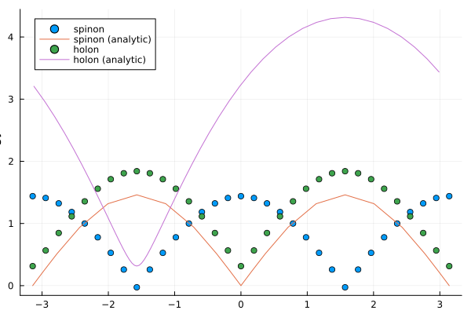
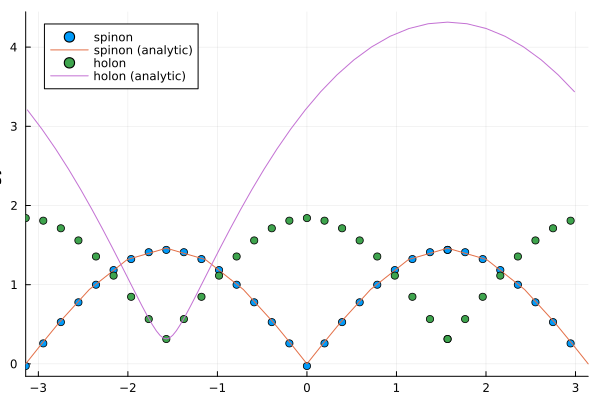
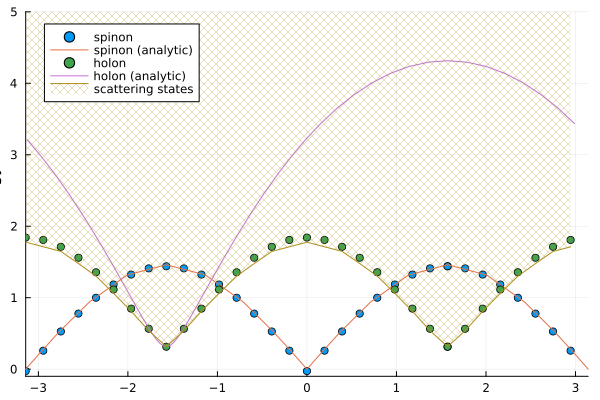

```@meta
EditURL = "../../../../../examples/quantum1d/6.hubbard/main.jl"
```

[](https://mybinder.org/v2/gh/QuantumKitHub/MPSKit.jl/gh-pages?filepath=dev/examples/quantum1d/6.hubbard/main.ipynb)
[](https://nbviewer.jupyter.org/github/QuantumKitHub/MPSKit.jl/blob/gh-pages/dev/examples/quantum1d/6.hubbard/main.ipynb)
[](https://minhaskamal.github.io/DownGit/#/home?url=https://github.com/QuantumKitHub/MPSKit.jl/examples/tree/gh-pages/dev/examples/quantum1d/6.hubbard)

````julia
using Markdown
````

# Hubbard chain at half filling

The Hubbard model is a model of interacting fermions on a lattice, which is often used as a somewhat realistic model for electrons in a solid.
The Hamiltonian consists of two terms that describe competing forces of each electron:
a kinetic term that allows electrons to hop between neighboring sites, and a potential term reflecting on-site interactions between electrons.
Often, a third term is included which serves as a chemical potential to control the number of electrons in the system.

```math
H = -t \sum_{\langle i, j \rangle, \sigma} c^{\dagger}_{i,\sigma} c_{j,\sigma} + U \sum_i n_{i,\uparrow} n_{i,\downarrow} - \mu \sum_{i,\sigma} n_{i,\sigma}
```

At half-filling, the system exhibits particle-hole symmetry, which can be made explicit by rewriting the Hamiltonian slightly.
First, we fix the overall energy scale by setting `t = 1`, and then shift the total energy by adding a constant `U / 4`, as well as shifting the chemical potential to `N U / 2`.
This results in the following Hamiltonian:

```math
H = - \sum_{\langle i, j \rangle, \sigma} c^{\dagger}_{i,\sigma} c_{j,\sigma} + U / 4 \sum_i (1 - 2 n_{i,\uparrow}) (1 - 2 n_{i,\downarrow}) - \mu \sum_{i,\sigma} n_{i,\sigma}
```

Finally, setting `\mu = 0` and defining `u = U / 4` we obtain the Hubbard model at half-filling.

```math
H = - \sum_{\langle i, j \rangle, \sigma} c^{\dagger}_{i,\sigma} c_{j,\sigma} + u \sum_i (1 - 2 n_{i,\uparrow}) (1 - 2 n_{i,\downarrow})
```

````julia
using TensorKit
using MPSKit
using MPSKitModels
using SpecialFunctions: besselj0, besselj1
using QuadGK: quadgk
using Plots
using Interpolations
using Optim


const t = 1.0
const mu = 0.0
const U = 3.0
````

````
3.0
````

For this case, the ground state energy has an analytic solution, which can be used to benchmark the numerical results.
It follows from Eq. (6.82) in []().

```math
e(u) = - u - 4 \int_0^{\infty} \frac{d\omega}{\omega} \frac{J_0(\omega) J_1(\omega)}{1 + \exp(2u \omega)}
```

We can easily verify this by comparing the numerical results to the analytic solution.

````julia
function hubbard_energy(u; rtol = 1.0e-12)
    integrandum(ω) = besselj0(ω) * besselj1(ω) / (1 + exp(2u * ω)) / ω
    int, err = quadgk(integrandum, 0, Inf; rtol = rtol)
    return -u - 4 * int
end

function compute_groundstate(
        psi, H;
        svalue = 1.0e-3,
        expansionfactor = (1 / 10),
        expansioniter = 20
    )
    verbosity = 2
    psi, = find_groundstate(psi, H; tol = svalue * 10, verbosity)
    for _ in 1:expansioniter
        D = maximum(x -> dim(left_virtualspace(psi, x)), 1:length(psi))
        D′ = max(5, round(Int, D * expansionfactor))
        trscheme = trunctol(; atol = svalue / 10) & truncrank(D′)
        psi′, = changebonds(psi, H, OptimalExpand(; trscheme = trscheme))
        all(
            left_virtualspace.(Ref(psi), 1:length(psi)) .==
                left_virtualspace.(Ref(psi′), 1:length(psi))
        ) && break
        psi, = find_groundstate(psi′, H, VUMPS(; tol = svalue / 5, maxiter = 10, verbosity))
    end

    # convergence steps
    psi, = changebonds(psi, H, SvdCut(; trscheme = trunctol(; atol = svalue)))
    psi, = find_groundstate(
        psi, H,
        VUMPS(; tol = svalue / 100, verbosity, maxiter = 100) &
            GradientGrassmann(; tol = svalue / 1000)
    )

    return psi
end

H = hubbard_model(InfiniteChain(2); U, t, mu = U / 2)
Vspaces = fill(Vect[fℤ₂](0 => 10, 1 => 10), 2)
psi = InfiniteMPS(physicalspace(H), Vspaces)
psi = compute_groundstate(psi, H)
E = real(expectation_value(psi, H)) / 2
@info """
Groundstate energy:
    * numerical: $E
    * analytic: $(hubbard_energy(U / 4) - U / 4)
"""
````

````
[ Info: VUMPS init:	obj = -1.472548758147e+00	err = 5.1344e-01
[ Info: VUMPS conv 6:	obj = -4.376626743591e+00	err = 9.9886660196e-03	time = 4.42 sec
[ Info: VUMPS init:	obj = -4.376626743590e+00	err = 2.1408e-02
[ Info: VUMPS conv 8:	obj = -4.378746003112e+00	err = 1.5955449521e-04	time = 0.42 sec
[ Info: VUMPS init:	obj = -4.378746003112e+00	err = 8.1588e-03
[ Info: VUMPS conv 6:	obj = -4.379161057076e+00	err = 1.5466178028e-04	time = 0.43 sec
[ Info: VUMPS init:	obj = -4.379161057076e+00	err = 6.1185e-03
[ Info: VUMPS conv 5:	obj = -4.379452137265e+00	err = 1.6793132081e-04	time = 0.42 sec
[ Info: VUMPS init:	obj = -4.379452137265e+00	err = 5.6949e-03
[ Info: VUMPS conv 4:	obj = -4.379651664636e+00	err = 1.6997715633e-04	time = 0.51 sec
[ Info: VUMPS init:	obj = -4.379651664636e+00	err = 4.1040e-03
[ Info: VUMPS conv 3:	obj = -4.379734890151e+00	err = 1.9458349625e-04	time = 0.43 sec
[ Info: VUMPS init:	obj = -4.379734890151e+00	err = 3.5568e-03
[ Info: VUMPS conv 3:	obj = -4.379797732181e+00	err = 1.3874790123e-04	time = 0.49 sec
[ Info: VUMPS init:	obj = -4.379797732181e+00	err = 2.7580e-03
[ Info: VUMPS conv 2:	obj = -4.379838437704e+00	err = 1.7903427058e-04	time = 0.37 sec
[ Info: VUMPS init:	obj = -4.379838437704e+00	err = 2.7247e-03
[ Info: VUMPS conv 3:	obj = -4.379878817727e+00	err = 1.9890160987e-04	time = 0.86 sec
[ Info: VUMPS init:	obj = -4.379878817727e+00	err = 2.6892e-03
[ Info: VUMPS conv 3:	obj = -4.379929192662e+00	err = 1.7735649634e-04	time = 1.10 sec
[ Info: VUMPS init:	obj = -4.379929192662e+00	err = 2.5531e-03
[ Info: VUMPS conv 3:	obj = -4.379968013458e+00	err = 1.8131482590e-04	time = 2.36 sec
[ Info: VUMPS init:	obj = -4.379968013458e+00	err = 1.7666e-03
[ Info: VUMPS conv 2:	obj = -4.379986848440e+00	err = 1.8697865996e-04	time = 1.01 sec
[ Info: VUMPS init:	obj = -4.379986848440e+00	err = 1.5825e-03
[ Info: VUMPS conv 2:	obj = -4.380000756174e+00	err = 1.9154925356e-04	time = 1.54 sec
[ Info: VUMPS init:	obj = -4.380000756174e+00	err = 1.5051e-03
[ Info: VUMPS conv 2:	obj = -4.380013136300e+00	err = 1.5515231683e-04	time = 1.88 sec
[ Info: VUMPS init:	obj = -4.380013136300e+00	err = 1.4208e-03
[ Info: VUMPS conv 2:	obj = -4.380024381179e+00	err = 1.7768123800e-04	time = 2.03 sec
[ Info: VUMPS init:	obj = -4.380024381179e+00	err = 1.3308e-03
[ Info: VUMPS conv 2:	obj = -4.380038135198e+00	err = 1.5610887648e-04	time = 2.47 sec
[ Info: VUMPS init:	obj = -4.380038135198e+00	err = 1.0025e-03
[ Info: VUMPS conv 1:	obj = -4.380043663927e+00	err = 1.6686329927e-04	time = 1.29 sec
[ Info: VUMPS init:	obj = -4.380043663928e+00	err = 9.0871e-04
[ Info: VUMPS conv 1:	obj = -4.380048620164e+00	err = 1.8550404960e-04	time = 1.73 sec
[ Info: VUMPS init:	obj = -4.380048620164e+00	err = 8.3016e-04
[ Info: VUMPS conv 1:	obj = -4.380053179097e+00	err = 1.8078418705e-04	time = 1.88 sec
[ Info: VUMPS init:	obj = -4.380053179097e+00	err = 6.8103e-04
[ Info: VUMPS conv 1:	obj = -4.380057119334e+00	err = 1.9088736457e-04	time = 3.48 sec
[ Info: VUMPS init:	obj = -4.380057119334e+00	err = 6.0308e-04
[ Info: VUMPS conv 1:	obj = -4.380060522532e+00	err = 1.8437058341e-04	time = 3.48 sec
[ Info: VUMPS init:	obj = -4.379610294430e+00	err = 4.0923e-03
[ Info: VUMPS conv 19:	obj = -4.379763567395e+00	err = 9.9309403645e-06	time = 11.96 sec
[ Info: CG: initializing with f = -4.379763567040e+00, ‖∇f‖ = 3.1464e-05
[ Info: CG: converged after 154 iterations and time  1.64 m: f = -4.379763577686e+00, ‖∇f‖ = 9.2421e-07
┌ Info: Groundstate energy:
│     * numerical: -2.1899960610249782
└     * analytic: -2.190038374277775

````

## Symmetries

The Hubbard model has a rich symmetry structure, which can be exploited to speed up simulations.
Apart from the fermionic parity, the model also has a $U(1)$ particle number symmetry, along with a $SU(2)$ spin symmetry.
Explicitly imposing these symmetries on the tensors can greatly reduce the computational cost of the simulation.

Naively imposing these symmetries however, is not compatible with our desire to work at half-filling.
By construction, imposing symmetries restricts the optimization procedure to a single symmetry sector, which is the trivial sector.
In order to work at half-filling, we need to effectively inject one particle per site.
In MPSKit, this is achieved by the `add_physical_charge` function, which shifts the physical spaces of the tensors to the desired charge sector.

````julia
H_u1_su2 = hubbard_model(ComplexF64, U1Irrep, SU2Irrep, InfiniteChain(2); U, t, mu = U / 2);
charges = fill(FermionParity(1) ⊠ U1Irrep(1) ⊠ SU2Irrep(0), 2);
H_u1_su2 = MPSKit.add_physical_charge(H_u1_su2, charges);

pspaces = physicalspace.(Ref(H_u1_su2), 1:2)
vspaces = [oneunit(eltype(pspaces)), first(pspaces)]
psi = InfiniteMPS(pspaces, vspaces)
psi = compute_groundstate(psi, H_u1_su2; expansionfactor = 1 / 3)
E = real(expectation_value(psi, H_u1_su2)) / 2
@info """
Groundstate energy:
    * numerical: $E
    * analytic: $(hubbard_energy(U / 4) - U / 4)
"""
````

````
[ Info: VUMPS init:	obj = -5.588042682004e-02	err = 9.2053e-01
[ Info: VUMPS conv 1:	obj = -4.000000000000e+00	err = 2.1240270466e-15	time = 2.96 sec
[ Info: VUMPS init:	obj = -4.000000000000e+00	err = 3.3634e-01
[ Info: VUMPS conv 4:	obj = -4.289650419749e+00	err = 1.8514003381e-04	time = 0.05 sec
[ Info: VUMPS init:	obj = -4.289650419749e+00	err = 1.1203e-01
[ Info: VUMPS conv 6:	obj = -4.359865567620e+00	err = 1.0046942911e-04	time = 0.14 sec
[ Info: VUMPS init:	obj = -4.359865567619e+00	err = 4.3643e-02
[ Info: VUMPS conv 6:	obj = -4.372880928482e+00	err = 1.3025843115e-04	time = 2.31 sec
[ Info: VUMPS init:	obj = -4.372880928482e+00	err = 3.2693e-02
[ Info: VUMPS conv 4:	obj = -4.375236954488e+00	err = 1.1814239608e-04	time = 0.17 sec
[ Info: VUMPS init:	obj = -4.375236954488e+00	err = 2.9487e-02
[ Info: VUMPS conv 7:	obj = -4.378159084364e+00	err = 1.1896740056e-04	time = 0.51 sec
[ Info: VUMPS init:	obj = -4.378159084364e+00	err = 1.9312e-02
[ Info: VUMPS conv 5:	obj = -4.379272966040e+00	err = 1.5785413165e-04	time = 0.34 sec
[ Info: VUMPS init:	obj = -4.379272966040e+00	err = 9.9128e-03
[ Info: VUMPS conv 4:	obj = -4.379592229143e+00	err = 1.5550378745e-04	time = 0.21 sec
[ Info: VUMPS init:	obj = -4.379592229143e+00	err = 6.4841e-03
[ Info: VUMPS conv 4:	obj = -4.379819377264e+00	err = 1.7492038571e-04	time = 0.27 sec
[ Info: VUMPS init:	obj = -4.379819377264e+00	err = 3.8754e-03
┌ Warning: VUMPS cancel 10:	obj = -4.379964033305e+00	err = 2.1228930049e-04	time = 1.29 sec
└ @ MPSKit /home/ldevos/LocalProjects/MPSKit.jl/src/algorithms/groundstate/vumps.jl:76
[ Info: VUMPS init:	obj = -4.379964033305e+00	err = 2.8978e-03
[ Info: VUMPS conv 3:	obj = -4.380010384710e+00	err = 1.4775284542e-04	time = 0.52 sec
[ Info: VUMPS init:	obj = -4.380010384710e+00	err = 2.0609e-03
[ Info: VUMPS conv 3:	obj = -4.380041751503e+00	err = 1.6327798118e-04	time = 0.86 sec
[ Info: VUMPS init:	obj = -4.380041751502e+00	err = 1.2364e-03
[ Info: VUMPS conv 2:	obj = -4.380055778759e+00	err = 1.8366845284e-04	time = 0.53 sec
[ Info: VUMPS init:	obj = -4.380055778759e+00	err = 8.5857e-04
[ Info: VUMPS conv 2:	obj = -4.380064749427e+00	err = 1.3905442267e-04	time = 0.96 sec
[ Info: VUMPS init:	obj = -4.380064749427e+00	err = 5.2502e-04
[ Info: VUMPS conv 1:	obj = -4.380067974777e+00	err = 1.5646700070e-04	time = 0.51 sec
[ Info: VUMPS init:	obj = -4.380067974777e+00	err = 3.3275e-04
[ Info: VUMPS conv 1:	obj = -4.380070351418e+00	err = 1.3123916502e-04	time = 1.05 sec
[ Info: VUMPS init:	obj = -4.380070351418e+00	err = 2.0348e-04
[ Info: VUMPS conv 1:	obj = -4.380072125256e+00	err = 1.1119707628e-04	time = 1.50 sec
[ Info: VUMPS init:	obj = -4.380072125256e+00	err = 1.3635e-04
[ Info: VUMPS conv 1:	obj = -4.380073467830e+00	err = 8.5045032312e-05	time = 2.38 sec
[ Info: VUMPS init:	obj = -4.380073467830e+00	err = 9.7226e-05
[ Info: VUMPS conv 1:	obj = -4.380074455763e+00	err = 6.4430026630e-05	time = 3.97 sec
[ Info: VUMPS init:	obj = -4.380074455763e+00	err = 7.3787e-05
[ Info: VUMPS conv 1:	obj = -4.380075159887e+00	err = 6.2144398837e-05	time = 6.74 sec
[ Info: VUMPS init:	obj = -4.380075159887e+00	err = 5.9899e-05
[ Info: VUMPS conv 1:	obj = -4.380075661721e+00	err = 4.2515939995e-05	time = 11.38 sec
[ Info: VUMPS init:	obj = -4.379308795201e+00	err = 7.9930e-03
┌ Warning: VUMPS cancel 100:	obj = -4.379692711472e+00	err = 1.5979764630e-05	time = 17.26 sec
└ @ MPSKit /home/ldevos/LocalProjects/MPSKit.jl/src/algorithms/groundstate/vumps.jl:76
[ Info: CG: initializing with f = -4.379692711471e+00, ‖∇f‖ = 5.7923e-05
[ Info: CG: converged after 13 iterations and time  5.38 s: f = -4.379692712392e+00, ‖∇f‖ = 6.2087e-07
┌ Info: Groundstate energy:
│     * numerical: -2.190015347514449
└     * analytic: -2.190038374277775

````

## Excitations

Because of the integrability, it is known that the Hubbard model has a rich excitation spectrum.
The elementary excitations are known as spinons and holons, which are domain walls in the spin and charge sectors, respectively.
The fact that the spin and charge sectors are separate is a phenomenon known as spin-charge separation.

The domain walls can be constructed by noticing that there are two equivalent groundstates, which differ by a translation over a single site.
In other words, the groundstates are ``\psi_{AB}` and ``\psi_{BA}``, where ``A`` and ``B`` are the two sites.
These excitations can be constructed as follows:

````julia
alg = QuasiparticleAnsatz(; tol = 1.0e-3)
momenta = range(-π, π; length = 33)
psi_AB = psi
envs_AB = environments(psi_AB, H_u1_su2);
psi_BA = circshift(psi, 1)
envs_BA = environments(psi_BA, H_u1_su2);

spinon_charge = FermionParity(0) ⊠ U1Irrep(0) ⊠ SU2Irrep(1 // 2)
E_spinon, ϕ_spinon = excitations(
    H_u1_su2, alg, momenta, psi_AB, envs_AB, psi_BA, envs_BA;
    sector = spinon_charge, num = 1
);

holon_charge = FermionParity(1) ⊠ U1Irrep(-1) ⊠ SU2Irrep(0)
E_holon, ϕ_holon = excitations(
    H_u1_su2, alg, momenta, psi_AB, envs_AB, psi_BA, envs_BA;
    sector = holon_charge, num = 1
);
````

````
[ Info: Found excitations for momentum = 2.945243112740431
[ Info: Found excitations for momentum = -3.141592653589793
[ Info: Found excitations for momentum = 0.0
[ Info: Found excitations for momentum = 0.19634954084936207
[ Info: Found excitations for momentum = -0.19634954084936207
[ Info: Found excitations for momentum = -2.552544031041707
[ Info: Found excitations for momentum = -2.748893571891069
[ Info: Found excitations for momentum = -2.945243112740431
[ Info: Found excitations for momentum = -0.39269908169872414
[ Info: Found excitations for momentum = 0.39269908169872414
[ Info: Found excitations for momentum = 2.552544031041707
[ Info: Found excitations for momentum = 2.748893571891069
[ Info: Found excitations for momentum = -0.5890486225480862
[ Info: Found excitations for momentum = 0.5890486225480862
[ Info: Found excitations for momentum = -0.7853981633974483
[ Info: Found excitations for momentum = 0.7853981633974483
[ Info: Found excitations for momentum = 2.356194490192345
[ Info: Found excitations for momentum = -2.356194490192345
[ Info: Found excitations for momentum = 1.5707963267948966
[ Info: Found excitations for momentum = -1.5707963267948966
[ Info: Found excitations for momentum = 0.9817477042468103
[ Info: Found excitations for momentum = 2.1598449493429825
[ Info: Found excitations for momentum = -0.9817477042468103
[ Info: Found excitations for momentum = -2.1598449493429825
[ Info: Found excitations for momentum = -1.1780972450961724
[ Info: Found excitations for momentum = 1.7671458676442586
[ Info: Found excitations for momentum = 1.9634954084936207
[ Info: Found excitations for momentum = 1.3744467859455345
[ Info: Found excitations for momentum = -1.7671458676442586
[ Info: Found excitations for momentum = -1.3744467859455345
[ Info: Found excitations for momentum = -1.9634954084936207
[ Info: Found excitations for momentum = 3.141592653589793
[ Info: Found excitations for momentum = 1.1780972450961724
[ Info: Found excitations for momentum = -1.7671458676442586
[ Info: Found excitations for momentum = 1.5707963267948966
[ Info: Found excitations for momentum = 1.3744467859455345
[ Info: Found excitations for momentum = -1.3744467859455345
[ Info: Found excitations for momentum = 1.7671458676442586
[ Info: Found excitations for momentum = 1.9634954084936207
[ Info: Found excitations for momentum = -1.5707963267948966
[ Info: Found excitations for momentum = -1.9634954084936207
[ Info: Found excitations for momentum = 1.1780972450961724
[ Info: Found excitations for momentum = 2.1598449493429825
[ Info: Found excitations for momentum = 0.0
[ Info: Found excitations for momentum = -2.1598449493429825
[ Info: Found excitations for momentum = 0.9817477042468103
[ Info: Found excitations for momentum = -1.1780972450961724
[ Info: Found excitations for momentum = -3.141592653589793
[ Info: Found excitations for momentum = -2.356194490192345
[ Info: Found excitations for momentum = 2.552544031041707
[ Info: Found excitations for momentum = 0.7853981633974483
[ Info: Found excitations for momentum = 2.356194490192345
[ Info: Found excitations for momentum = -0.9817477042468103
[ Info: Found excitations for momentum = -0.7853981633974483
[ Info: Found excitations for momentum = -0.5890486225480862
[ Info: Found excitations for momentum = 2.748893571891069
[ Info: Found excitations for momentum = -2.748893571891069
[ Info: Found excitations for momentum = 0.5890486225480862
[ Info: Found excitations for momentum = 0.39269908169872414
[ Info: Found excitations for momentum = -2.552544031041707
[ Info: Found excitations for momentum = -0.39269908169872414
[ Info: Found excitations for momentum = -0.19634954084936207
[ Info: Found excitations for momentum = 2.945243112740431
[ Info: Found excitations for momentum = 0.19634954084936207
[ Info: Found excitations for momentum = -2.945243112740431
[ Info: Found excitations for momentum = 3.141592653589793

````

Again, we can compare the numerical results to the analytic solution.
Here, the formulae for the excitation energies are expressed in terms of dressed momenta:

````julia
function spinon_momentum(Λ, u; rtol = 1.0e-12)
    integrandum(ω) = besselj0(ω) * sin(ω * Λ) / ω / cosh(ω * u)
    return π / 2 - quadgk(integrandum, 0, Inf; rtol = rtol)[1]
end
function spinon_energy(Λ, u; rtol = 1.0e-12)
    integrandum(ω) = besselj1(ω) * cos(ω * Λ) / ω / cosh(ω * u)
    return 2 * quadgk(integrandum, 0, Inf; rtol = rtol)[1]
end

function holon_momentum(k, u; rtol = 1.0e-12)
    integrandum(ω) = besselj0(ω) * sin(ω * sin(k)) / ω / (1 + exp(2u * abs(ω)))
    return π / 2 - k - 2 * quadgk(integrandum, 0, Inf; rtol = rtol)[1]
end
function holon_energy(k, u; rtol = 1.0e-12)
    integrandum(ω) = besselj1(ω) * cos(ω * sin(k)) * exp(-ω * u) / ω / cosh(ω * u)
    return 2 * cos(k) + 2u + 2 * quadgk(integrandum, 0, Inf; rtol = rtol)[1]
end

Λs = range(-10, 10; length = 51)
P_spinon_analytic = rem2pi.(spinon_momentum.(Λs, U / 4), RoundNearest)
E_spinon_analytic = spinon_energy.(Λs, U / 4)
I_spinon = sortperm(P_spinon_analytic)
P_spinon_analytic = P_spinon_analytic[I_spinon]
E_spinon_analytic = E_spinon_analytic[I_spinon]
P_spinon_analytic = [reverse(-P_spinon_analytic); P_spinon_analytic]
E_spinon_analytic = [reverse(E_spinon_analytic); E_spinon_analytic];

ks = range(0, 2π; length = 51)
P_holon_analytic = rem2pi.(holon_momentum.(ks, U / 4), RoundNearest)
E_holon_analytic = holon_energy.(ks, U / 4)
I_holon = sortperm(P_holon_analytic)
P_holon_analytic = P_holon_analytic[I_holon]
E_holon_analytic = E_holon_analytic[I_holon];

p = let p_excitations = plot(; xaxis = "momentum", yaxis = "energy")
    scatter!(p_excitations, momenta, real(E_spinon); label = "spinon")
    plot!(p_excitations, P_spinon_analytic, E_spinon_analytic; label = "spinon (analytic)")

    scatter!(p_excitations, momenta, real(E_holon); label = "holon")
    plot!(p_excitations, P_holon_analytic, E_holon_analytic; label = "holon (analytic)")

    p_excitations
end
````



The plot shows some discrepancies between the numerical and analytic results.
First and foremost, we must realize that in the thermodynamic limit, the momentum of a domain wall is actually not well-defined.
Concretely, only the difference in momentum between the two groundstates is well-defined, as we can always shift the momentum by multiplying one of the groundstates by a phase.
Here, we can fix this shift by realizing that our choice of shifting the groundstates by a single site, differs from the formula by a factor ``\pi/2``.

````julia
momenta_shifted = rem2pi.(momenta .- π / 2, RoundNearest)
p = let p_excitations = plot(; xaxis = "momentum", yaxis = "energy", xlims = (-π, π))
    scatter!(p_excitations, momenta_shifted, real(E_spinon); label = "spinon")
    plot!(p_excitations, P_spinon_analytic, E_spinon_analytic; label = "spinon (analytic)")

    scatter!(p_excitations, momenta_shifted, real(E_holon); label = "holon")
    plot!(p_excitations, P_holon_analytic, E_holon_analytic; label = "holon (analytic)")

    p_excitations
end
````



The second discrepancy is that while the spinon dispersion is well-reproduced, the holon dispersion is not.
This is due to the fact that the excitation ansatz captures the lowest-energy excitation, and not the elementary single-particle excitation.
To make this explicit, we can consider the scattering states comprising of a holon and two spinons.
If these are truly scattering states, the energy of the scattering state should be the sum of the energies of the individual excitations, and the momentum is the sum of the momenta.
Thus, we can find the lowest-energy scattering states by minimizing the energy over the combination of momenta for the constituent elementary excitations.

````julia
holon_dispersion_itp = linear_interpolation(
    P_holon_analytic, E_holon_analytic;
    extrapolation_bc = Line()
)
spinon_dispersion_itp = linear_interpolation(
    P_spinon_analytic, E_spinon_analytic;
    extrapolation_bc = Line()
)
function scattering_energy(p1, p2, p3)
    p1, p2, p3 = rem2pi.((p1, p2, p3), RoundNearest)
    return holon_dispersion_itp(p1) + spinon_dispersion_itp(p2) + spinon_dispersion_itp(p3)
end;

E_scattering_min = map(momenta_shifted) do p
    e = Inf
    for i in 1:10 # repeat for stability
        res = optimize((rand(2) .* (2π) .- π)) do (p₁, p₂)
            p₃ = p - p₁ - p₂
            return scattering_energy(p₁, p₂, p₃)
        end

        e = min(Optim.minimum(res), e)
    end
    return e
end
E_scattering_max = map(momenta_shifted) do p
    e = -Inf
    for i in 1:10 # repeat for stability
        res = optimize((rand(Float64, 2) .* (2π) .- π)) do (p₁, p₂)
            p₃ = p - p₁ - p₂
            return -scattering_energy(p₁, p₂, p₃)
        end

        e = max(-Optim.minimum(res), e)
    end
    return e
end;

p = let p_excitations = plot(;
        xaxis = "momentum", yaxis = "energy", xlims = (-π, π), ylims = (-0.1, 5)
    )
    scatter!(p_excitations, momenta_shifted, real(E_spinon); label = "spinon")
    plot!(p_excitations, P_spinon_analytic, E_spinon_analytic; label = "spinon (analytic)")

    scatter!(p_excitations, momenta_shifted, real(E_holon); label = "holon")
    plot!(p_excitations, P_holon_analytic, E_holon_analytic; label = "holon (analytic)")

    I = sortperm(momenta_shifted)
    plot!(
        p_excitations, momenta_shifted[I], E_scattering_min[I]; label = "scattering states",
        fillrange = E_scattering_max[I], fillalpha = 0.3, fillstyle = :x
    )

    p_excitations
end
````



---

*This page was generated using [Literate.jl](https://github.com/fredrikekre/Literate.jl).*

