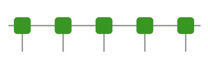

```@raw html
---
# https://vitepress.dev/reference/default-theme-home-page
layout: home

hero:
  name: MPSKit.jl
  text: Matrix product states in Julia
  tagline: Finite and infinite systems through one interface, with abelian, non-abelian, fermionic, and anyonic symmetries built in.
  image:
    src: /logo.svg
    alt: MPSKit.jl
  actions:
    - theme: brand
      text: Get started
      link: /tutorials/installation
    - theme: alt
      text: Examples
      link: /examples/
    - theme: alt
      text: View on GitHub
      link: https://github.com/QuantumKitHub/MPSKit.jl

features:
  - icon:
      src: /assets/icons/finite-infinite.svg
      alt: A finite chain above an infinite one
    title: Finite & infinite, one interface
    details: Run the same calculation on a finite chain or directly in the thermodynamic limit. FiniteMPS and InfiniteMPS share an API, so switching between them is a one-line change.
  - icon:
      src: /assets/icons/symmetry.svg
      alt: A symmetric hexagon
    title: Every symmetry
    details: Abelian, non-Abelian, fermionic, and anyonic symmetries out of the box via the TensorKit backend — smaller bond dimensions and exact quantum numbers.
  - icon:
      src: /assets/icons/algorithms.svg
      alt: An energy minimum
    title: A complete algorithm suite
    details: Ground states with DMRG, VUMPS, and IDMRG; real- and imaginary-time evolution with TDVP; and momentum-resolved excitations via the quasiparticle ansatz.
  # REVIEW: make the "faster than ITensors" comparison explicit here once the benchmark results are published.
  - icon:
      src: /assets/icons/fast.svg
      alt: A lightning bolt
    title: Fast by design
    details: Type-stable code paths and deliberate allocation strategies keep calculations quick out of the box, and non-Abelian symmetries such as SU(2) shrink the tensors you store and contract.
---
```

MPSKit.jl simulates one-dimensional quantum many-body systems with matrix product states and operators, at finite size or directly in the thermodynamic limit.
Built on the [TensorKit.jl](https://github.com/Jutho/TensorKit.jl) tensor backend, it is aimed at researchers and students who want tensor-network calculations without reimplementing the underlying machinery.

## Installation

MPSKit.jl is a part of the general registry.
Together with the packages used throughout this documentation, it can be installed via the
package manager as:
```
pkg> add MPSKit TensorKit MPSKitModels TensorKitTensors Plots
```
- `MPSKit` provides the matrix product state and operator types, together with the
  ground-state, time-evolution, and bond-dimension algorithms.
- `TensorKit` supplies the tensor backend (`TensorMap`s and vector spaces) that MPSKit is
  built on; it also re-exports the `@tensor` macro for contracting tensors by hand, along
  with truncation-scheme constructors such as `truncrank` (from MatrixAlgebraKit).
- `MPSKitModels` collects pre-defined Hamiltonians and local operators for common physical
  models.
- `TensorKitTensors` provides ready-made local operators, such as the Pauli operators used throughout the documentation.
- `Plots` is used to visualize results in several of the how-to guides and examples.

For a step-by-step walkthrough that sets up a dedicated environment and verifies the installation, see [Installation](@ref tutorial_installation).

## A first calculation

Almost every MPSKit calculation follows the same three steps: build a Hamiltonian, optimize a state, and read off observables.
The transverse-field Ising chain (TFIM) makes each step concrete in a few lines.

```@raw html

```

A matrix product state is a chain of tensors: the horizontal bonds carry the virtual indices, and the leg hanging off each site is its physical index.

### 1. Build a Hamiltonian

MPO Hamiltonians are assembled directly from local operators, so an arbitrary model — not just the built-in ones — takes only a couple of lines.
Here the single-site Pauli operators come from TensorKitTensors, and the TFIM is a nearest-neighbour `σᶻσᶻ` coupling plus a transverse `σˣ` field:

```@example index
using MPSKit, TensorKit
using TensorKitTensors.SpinOperators: σˣ, σᶻ

L = 16
g = 0.5
lattice = fill(ℂ^2, L)
H = FiniteMPOHamiltonian(lattice, (i, i + 1) => -(σᶻ() ⊗ σᶻ()) for i in 1:(L - 1)) +
    FiniteMPOHamiltonian(lattice, (i,) => -g * σˣ() for i in 1:L)
```

See [Building Hamiltonians](@ref howto_hamiltonians) for infinite lattices, longer-range terms, and boundary conditions.

### 2. Optimize a state

Start from an initial [`FiniteMPS`](@ref) of bond dimension 16 and pass it, together with the Hamiltonian, to [`find_groundstate`](@ref).
The algorithm — here [`DMRG`](@ref) — is an ordinary argument, and its keywords (tolerance, iteration count, verbosity) tune the optimization:

```@example index
ψ₀ = FiniteMPS(L, ℂ^2, ℂ^16)
ψ, envs, ϵ = find_groundstate(ψ₀, H, DMRG(; tol = 1e-10, verbosity = 0))
ϵ   # final convergence error
```

Choosing a different optimizer such as [`VUMPS`](@ref), or raising the bond dimension, is a one-line change; see [Ground-state algorithms](@ref howto_groundstate_algorithms).

### 3. Read off observables

Expectation values are a single call.
The ground-state energy is just the Hamiltonian evaluated on the state:

```@example index
E = expectation_value(ψ, H)
```

Local operators, correlators, and entanglement measures work the same way.
For instance, the von Neumann [`entropy`](@ref) across each bond traces out the entanglement profile of the chain:

```@example index
using Plots
S = [real(entropy(ψ, i)) for i in 1:(L - 1)]
plot(
    1:(L - 1), S; xlabel = "cut position", ylabel = "entanglement entropy",
    marker = :circle, legend = false, title = "Entanglement across the chain"
)
```

See [Computing observables](@ref howto_observables) and [Entanglement entropy and spectrum](@ref howto_entanglement) for the full set, and [Your first ground state](@ref tutorial_first_groundstate) for a guided walkthrough of this calculation.

## Beyond this example

The same three steps carry over to harder problems, usually by changing only the vector spaces or the state type:

- [**The thermodynamic limit**](@ref tutorial_thermodynamic_limit) works at infinite system size: replace `FiniteMPS` with an [`InfiniteMPS`](@ref) and `DMRG` with [`VUMPS`](@ref), and the rest of the code is unchanged.
- [**Using symmetries**](@ref tutorial_using_symmetries) imposes abelian or non-abelian symmetries by swapping the plain `ℂ^2` spaces for symmetric ones (for example an `SU2Space`), which also shrinks the bond dimension; see also the [Haldane gap](examples/quantum1d/2.haldane/index.md) example.
- [**The Hubbard model**](examples/quantum1d/6.hubbard/index.md) treats fermions with the same machinery, through TensorKit's graded vector spaces.

## Where next

- [**Installation**](@ref tutorial_installation) and [**Your first ground state**](@ref tutorial_first_groundstate) open the tutorial track, walking through complete calculations from scratch.
- [**How-to guides**](@ref howto_index) are focused recipes for a known task, such as [constructing states](@ref howto_states), [building Hamiltonians](@ref howto_hamiltonians), and [computing observables](@ref howto_observables).
- [**Concepts**](@ref concept_vector_spaces) explain the ideas behind the library, from [vector spaces and TensorKit](@ref concept_vector_spaces) through [matrix product states](@ref concept_matrix_product_states), [operators and Hamiltonians](@ref concept_operators_and_hamiltonians), and [the algorithm landscape](@ref concept_algorithm_landscape).
- [**The examples gallery**](examples/index.md) collects longer, fully worked case studies across symmetries, infinite systems, and less common algorithms.
- [**The public API**](@ref public_api) is the curated, stable entry point to the full library reference.

## Ecosystem

MPSKit builds on [TensorKit.jl](https://github.com/Jutho/TensorKit.jl), which supplies the tensors and vector spaces and handles the symmetries.
Models and ready-made operators come from [MPSKitModels.jl](https://github.com/QuantumKitHub/MPSKitModels.jl) and [TensorKitTensors.jl](https://github.com/QuantumKitHub/TensorKitTensors.jl).
All of these are part of the [QuantumKitHub](https://github.com/QuantumKitHub) organization; the TensorKit documentation is available [here](https://quantumkithub.github.io/TensorKit.jl/stable/).

## Community and support

Questions and general discussion are welcome on [GitHub Discussions](https://github.com/QuantumKitHub/MPSKit.jl/discussions); bug reports belong on the [issue tracker](https://github.com/QuantumKitHub/MPSKit.jl/issues).
If you would like to contribute, see [CONTRIBUTING.md](https://github.com/QuantumKitHub/MPSKit.jl/blob/main/CONTRIBUTING.md) on GitHub.

## Citing MPSKit

If MPSKit.jl is useful for your research, please consider citing it — a citation is the most direct way to support the project and helps others find it.
The package is archived on Zenodo under the DOI [10.5281/zenodo.10654900](https://doi.org/10.5281/zenodo.10654900).
The [`CITATION.cff`](https://github.com/QuantumKitHub/MPSKit.jl/blob/main/CITATION.cff) file in the repository always holds the up-to-date metadata, or you can use the BibTeX entry below:

```bibtex
@software{mpskitjl,
  author  = {Devos, Lukas and Van Damme, Maarten and Haegeman, Jutho},
  title   = {{MPSKit.jl}},
  version = {v0.13.13},
  doi     = {10.5281/zenodo.10654900},
  url     = {https://github.com/QuantumKitHub/MPSKit.jl},
  year    = {2026}
}
```
