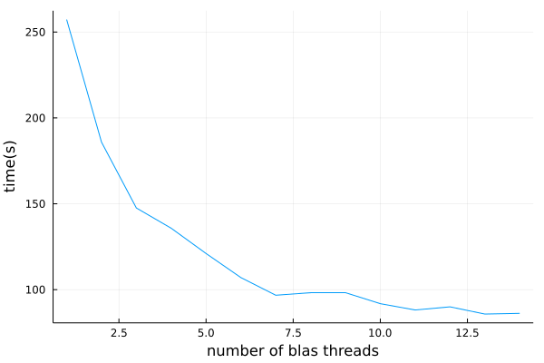

# Parallelism in julia

Julia has [really great parallelism infrastructure](https://julialang.org/blog/2019/07/multithreading/), but there is a caveat that is relevant for all algorithms implemented in mpskit. The julia threads do not play nicely together with the BLAS threads, which are the threads used for matrix matrix multiplications (amongst other things).


## The problem

The default behaviour is to have some BLAS threads running, which accept multiplication jobs, to which the julia threads can then submit jobs. These jobs are in turn sequentially executed over the BLAS threads. This means that if your program is waiting on a matrix multiplication to finish, it can not in parallel do other matrix multiplications!

The behaviour can be demonstrated using the following bit of code:
```
function parallelworker(As,Bs)
   temp = similar.(As);
   @sync for i in 1:length(As)
       Threads.@spawn mul!($temp[i], $As[i],$Bs[i])
   end
   sum(temp);
end

function serialworker(As,Bs)
    temp = similar.(As);
    for i in 1:length(As)
        mul!(temp[i], As[i],Bs[i])
    end
    sum(temp);
end

As = [rand(1000,1000) for a in 1:50];
Bs = [rand(1000,1000) for b in 1:50];

@btime parallelworker($As,$Bs);
@btime serialworker($As,$Bs);
```

running this on my laptop with 4 julia threads and 4 BLAS threads, I see the following:
```
998.506 ms (513 allocations: 755.34 MiB)
1.080 s (199 allocations: 755.32 MiB)
```

The julia threads give next to no speedup! Despite mpskit trying to implement parallel code, you will most likely not be able to exploit this to the fullest when running julia with the default settings.

## The possible solution

The short term 'solution' is to disable BLAS threads altogether. Multiplication jobs are then run in the julia thread that call them. Individual multiplication jobs will be slower, but they can be done in parallel.
```
using LinearAlgebra
BLAS.set_num_threads(1);
@btime parallelworker($As,$Bs);
```
outputs:
```
681.954 ms (514 allocations: 755.34 MiB)
```

This has some drawbacks: BLAS is also responsible for matrix factorizations, which will now run single threaded. If your program only needs to spawn 10 jobs then you will also not see any further improvement when running the code with even more julia threads, as those other threads have nothing to do. A possible solution to this is given by [Strided.jl](https://github.com/Jutho/Strided.jl), which is internally used by [TensorKit.jl](https://github.com/Jutho/TensorKit.jl) and consequently also MPSKit. Strided has an option to subdivide multiplication jobs into smaller multiplication jobs distributed over julia threads. When BLAS is single threaded, those jobs will be done in parallel, and you may be able to further speed up your code! Controlling the number of threads over which strided will distribute the matrix multiplications can be done by calling:

```
Strided.enable_threaded_mul(); # enable the subdivision of jobs
Strided.set_num_threads(N); # set the number of threads strided will use
```

In an ideal world we would have a julia implemention of BLAS, or some way to make the BLAS scheduler collaborate with the julia scheduler. Now however, the best performance can usually be achieved by experimenting with the number of julia and strided threads after disabling the BLAS threading.

## In practice

Real world performance is dependent on the particular problem, and one typically needs to do some experimentation to get optimal settings. As an illustration I have benchmarked the time it takes to get environments of the second order time evolution operator for ising, with an mps of bond dimension 500.

I always took 50 samples and used the median timing. This may not be enough to do proper statistics, and there is even further randomness in the initial conditions, but it should be enough to get some kind of idea.



BLAS scales really well initially. The bond dimension is pretty big, which translates to fairly large blocks being multiplied. However, after a certain point, we start to see diminishing returns. Nothing is gained from further parallization.

If we just take the last point (14 threads) and set BLAS threading to 1, we can fully leverage julia multithreading. The only variable to play with is in how many jobs every matrix multiplication should be subdivided.


We clearly see that already by disabling BLAS multithreading we were able to get faster simulations, and allowing strided to further subdivide mutiplications iallows us to push the simulation even further! The optimal amount of strided jobs is very problem and architecture dependent. Below I remade the same plot at bond dimension 100. Because of the smaller bond dimension we don't benefit from having a large amount of jobs per multiplication. In fact, we are probably seeing all but numerical noise.


