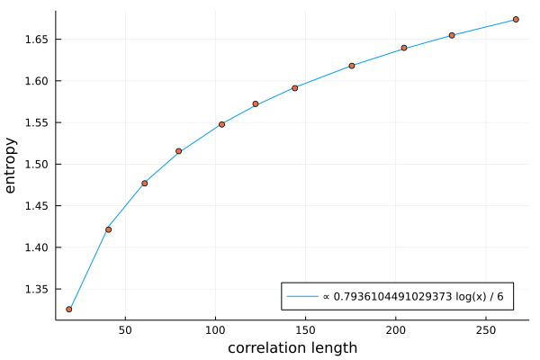

# [The hard hexagon model](@id tut_hardhex)

Tensor networks are a natural way to do statistical mechanics on a lattice. As an example of this we will extract the central charge of the hard hexagon model. This model is known to have central charge 0.8, and has very peculiar non-local (anyonic) symmetries. Because TensorKit supports anyonic symmetries, so does MPSKit. To follow the tutorial you need the following packages.

```julia
using MPSKit,TensorKit,Polynomials
```

The hard hexagon mpo is given by

```julia
physical = Vect[FibonacciAnyon](:τ => 1);
t = TensorMap(ones,ComplexF64,physical*physical,physical*physical);
blocks(t)[FibonacciAnyon(:I)] *= 0;

mpo = DenseMPO(t);
```

## The leading boundary

One way to do statmech in infinite systems with tensor networks is by approximating the dominant eigenvector of the transfer matrix by an mps. In MPSKit one should first define an initial guess for this eigenvector:

```julia
virtual = Vect[FibonacciAnyon](:τ => 5, :I => 5);
init = InfiniteMPS([physical],[virtual]);
```

and then pass it on to "leading_boundary":
```julia
(dominant,_) = leading_boundary(init,mpo,VUMPS());
```

This dominant eigenvector contains a lot of hidden information, for example the following calculates the free energy:
```julia
expectation_value(dominant,mpo)
```

In this tutorial we will be focussing on the entanglement entropy and the correlation length:
```julia
S = entropy(dominant);
cor_len = correlation_length(dominant);
```

## The scaling hypothesis

The dominant eigenvector is of course only an approximation. The finite bond dimension enforces a finite correlation length, which effectively introduces a length scale in the system. This can be exploited to formulate a [scaling hypothesis](https://arxiv.org/pdf/0812.2903.pdf), which in turn allows you to extract the central charge!

First we need to know the entropy and correlation length at a bunch of different bond dimensions. Our approach will be to re-use the previous approximated dominant eigenvector, by simply expanding its bond dimension and re-running vumps.

```julia
entropies = [real(S[1])];
corlens = [cor_len];
envs = environments(dominant,mpo);

#this will take a fairly long time
for Ds in 5:5:50
    (dominant,envs) = changebonds(dominant,mpo,OptimalExpand(trscheme = truncdim(5)),envs);
    (dominant,envs) = leading_boundary(dominant,mpo,VUMPS(maxiter=200));
    push!(entropies,real(entropy(dominant)[1]));
    push!(corlens,correlation_length(dominant));
end
```

According to the scaling hypothesis we should have ``S \propto \frac{c}{6} log(corlen)``. Therefore we should find c using
```julia
f = fit(log.(corlens),6*entropies,1);
f.coeffs[2]
```

Which indeed nicely agrees with the known result of 0.8.


