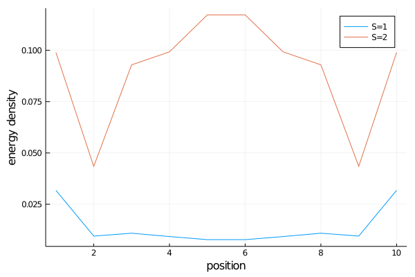

# [The haldane gap](@id tut_haldane)

In this tutorial we will calculate the haldane gap (the energy gap in spin 1 heisenberg) in 2 different ways. To follow the tutorial you need the following packages.

```julia
using MPSKit,MPSKitModels,TensorKit,Plots
```

We will enforce the su(2) symmetry, our hamiltonian will therefore be

```julia
ham = su2_xxx_ham(spin=1);
```

## Finite size extrapolation

The first step is always the same, we want to find the groundstate of our system.
```julia
len = 10;
physical_space = Rep[SU₂](1=>1);
virtual_space = Rep[SU₂](0=>20,1=>20,2=>10,3=>10,4=>5);

initial_state = FiniteMPS(rand,ComplexF64,len,physical_space,virtual_space);
(gs,envs,delta) = find_groundstate(initial_state,ham,Dmrg());
```

The typical way to find excited states is to minmize the energy while adding an error term ``lambda | gs > < gs | ``. Here we will instead use the [quasiparticle ansatz](https://journals.aps.org/prl/abstract/10.1103/PhysRevLett.111.080401).

In steven white's original DMRG paper it was remarked that the S=1 excitations correspond to edge states, and that one should define the haldane gap as the difference in energy between the S=2 and S=1 states. This can be done as follows.

```julia
(En_1,st_1) = excitations(ham,QuasiparticleAnsatz(),gs,envs,sector = SU₂(1))
(En_2,st_2) = excitations(ham,QuasiparticleAnsatz(),gs,envs,sector = SU₂(2))
finite_haldane_gap = En_2[1]-En_1[1]
```

We can go even further and doublecheck the claim that S=1 is an edge excitation, by plotting the energy density.
```julia
pl = plot(xaxis="position",yaxis="energy density")
plot!(pl,real.(expectation_value(st_1[1],ham)-expectation_value(gs,ham)),label = "S=1")
plot!(pl,real.(expectation_value(st_2[1],ham)-expectation_value(gs,ham)),label = "S=2")
```


Extrapolating for different len gives an approximate haldane gap.


## Thermodynamic limit

A much nicer way of obtaining the haldane gap is by working directly in the thermodynamic limit. We must be careful in selecting the symmetry sectors, the only correct choice is to work with half-integer charges (this is an SPT phase).

```julia
virtual_space = Rep[SU₂](1//2=>20,3//2=>20,5//2=>10,7//2=>10,9//2=>5); # this is bond dimension 300!
initial_state = InfiniteMPS([physical_space],[virtual_space]);
(gs,envs,delta) = find_groundstate(initial_state,ham,Vumps());
```

One difference with the finite size case is that we not only can - but also have to - specify a momentum label. We can scan for k = 0 to pi by calling:

```julia
kspace = 0:0.1:pi
(Energies,_) = excitations(ham,QuasiparticleAnsatz(),kspace,gs,envs,sector=SU₂(1));
```


The minimima sits at k = pi, with corresponding value

```julia
(En,_) = excitations(ham,QuasiparticleAnsatz(),Float64(pi),gs,envs,sector=SU₂(1));
@assert En[1]  ≈ 0.41047925 atol=1e-4
```
