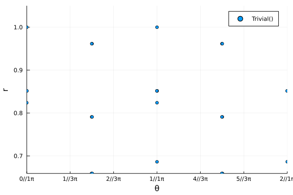

# Analyzing the xxz model

In this file we will give step by step instructions on how to analyze the spin 1/2 xxz model.
The necessary packages to follow this tutorial are :
```julia
using MPSKit, MPSKitModels, TensorKit, Plots
```

## Failure

First we should define the hamiltonian we want to work with. The following code does so in the mpo representation of the hamiltonian.
```julia
(sx,sy,sz,id) = nonsym_spintensors(1//2);
ham_data = fill(zero(id),1,5,5);
ham_data[1,1,1] = id; ham_data[1,end,end] = id;
ham_data[1,1,2] = sx; ham_data[1,2,end] = sx;
ham_data[1,1,3] = sy; ham_data[1,3,end] = sy;
ham_data[1,1,4] = sz; ham_data[1,4,end] = sz;
ham = MPOHamiltonian(ham_data);
```


We then need an intial state, which we shall later optimize. In this example we work directly in the thermodynamic limit.
```julia
random_data = TensorMap(rand,ComplexF64,ℂ^20*ℂ^2,ℂ^20);
state = InfiniteMPS([random_data]);
```

The groundstate can then be found by calling find_groundstate.
```julia
(groundstate,cache,delta) = find_groundstate(state,ham,VUMPS());
```

As you can see, vumps strugles to converge. On it's own, that is already quite curious.
Maybe we can do better using another algorithm, such as gradient descent.
```julia
(groundstate,cache,delta) = find_groundstate(state,ham,GradientGrassmann(maxiter=20));
```
Convergence is quite slow and even fails after sufficiently many iterations. To understand why, we can look at the transfer matrix spectrum.

```julia
    transferplot(groundstate,groundstate)
```



We can clearly see multiple eigenvalues close to the unit circle. Our state is close to being non-injective, and represents the sum of multiple injective states. This is numerically very problematic, but also indicates that we used an incorrect ansatz to approximate the groundstate. We should retry with a larger unit cell.

## Success

Let's initialize a different initial state, this time with a 2-site unit cell:
```julia
A = TensorMap(rand,ComplexF64,ℂ^20*ℂ^2,ℂ^20);
B = TensorMap(rand,ComplexF64,ℂ^20*ℂ^2,ℂ^20);
state = InfiniteMPS([A,B]);
```

In MPSKit, we require that the periodicity of the hamiltonian equals that of the state it is applied to. This is not a big obstacle, you can simply repeat the original hamiltonian:
```julia
ham = repeat(ham,2);
```

Running vumps
```julia
(groundstate,cache,delta) = find_groundstate(state,ham,VUMPS(maxiter=100,tol_galerkin=1e-12));
```
we get convergence, but it takes an enormous amount of iterations. The reason behind this becomes more obvious at higher bond dimensions

```julia
(groundstate,cache,delta) = find_groundstate(state,ham,IDMRG2(trscheme=truncdim(100),maxiter=100,tol_galerkin=1e-12));

entanglementplot(groundstate)
```


We see that some eigenvalues clearly belong to a group, and are almost degenerate. This implies 2 things:
    - there is superfluous information, if those eigenvalues are the same anyway
    - poor convergence if we cut off within such a subspace

It are precisely those problems that we can solve by using symmetries.

## Symmetries

The xxz hamiltonian is su(2) symmetric and we can exploit this to greatly speed up the simulation.

It is cumbersome to construct symmetric hamiltonians, but luckily su(2) symmetric xxz is already implemented:
```julia
ham = repeat(su2_xxx_ham(spin=1//2),2);
```
Our initial state should also be su(2) symmetric. It now becomes apparent why we have to use a 2 site periodic state. The physical space carries a half-integer charge and the first tensor maps the first virtual space ⊗ the physical space to the second virtual space. Half integer virtual charges will therefore map only to integer charges, and vice versa. The staggering happens on the virtual level!

An alternative constructor for the initial state is
```julia
D1 = Rep[SU₂](1//2 => 10,3//2=>5,5//2=>2);
D2 = Rep[SU₂](0=>15,1=>10,2=>5);
state = InfiniteMPS([Rep[SU₂](1//2 => 1),Rep[SU₂](1//2 => 1)],[D1,D2])
```

Even though the bond dimension is higher then in the non symmetric example:
```julia
@assert dim(D1) == 52;
@assert dim(D2) == 70;
```

Vumps converges much much faster
```julia
(groundstate,cache,delta) = find_groundstate(state,ham,VUMPS(maxiter=400,tol_galerkin=1e-12));
```
